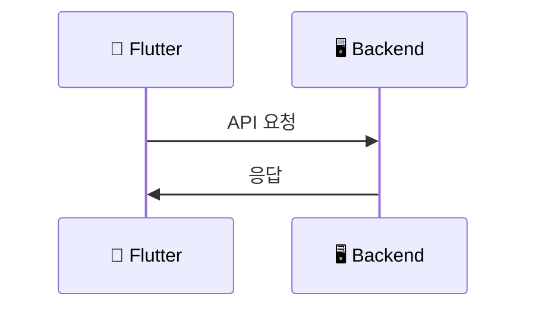

# CLAUDE.md - timingle 프로젝트 Claude 협업 가이드

## 📌 프로젝트 컨텍스트

### 프로젝트명
**timingle** (Time + Mingle: 시간 + 만남)

### 핵심 철학
> "약속이 대화가 되는 앱 - 약속 없이는 대화 불가"

timingle은 **약속 중심 커뮤니케이션 플랫폼**입니다.
- 모든 대화는 약속(이벤트)에 종속
- 약속마다 독립적인 채팅방
- 변경/확정 이력 자동 기록
- 노쇼 방지 및 책임 추적

### 프로젝트 상태
- **현재 단계**: 문서화 및 초기 설정
- **목표**: MVP 4주 내 완성
- **최종 목표**: 첫 50명 사용자 확보

---

## 🎯 Claude와 작업할 때 중요한 원칙

### 1. 아키텍처 원칙
- **Backend**: Go + Clean Architecture
- **Frontend**: Flutter + Clean Architecture + SOLID + Riverpod
- **Database**: PostgreSQL (트랜잭션) + ScyllaDB (로그/채팅)
- **Real-time**: WebSocket + NATS JetStream

### 2. 코드 작성 원칙
#### Backend (Go)
- 레이어 분리: handlers → services → repositories
- 에러 처리 일관성 유지
- JWT 인증 필수
- 모든 API는 `/api/v1/` prefix 사용

#### Frontend (Flutter)
- Clean Architecture 3-layer 엄격 준수
  - Presentation (UI) → Domain (비즈니스 로직) → Data (데이터 접근)
- SOLID 원칙 적용
- Riverpod Provider 사용 (GetIt 사용 금지)
- `Either<Failure, T>` 패턴 사용 (dartz)

### 3. 네이밍 컨벤션
#### Backend (Go)
- 파일명: snake_case (예: `event_service.go`)
- 함수/메서드: PascalCase (public), camelCase (private)
- 구조체: PascalCase

#### Frontend (Flutter)
- 파일명: snake_case (예: `event_repository.dart`)
- 클래스: PascalCase (예: `EventRepository`)
- 변수/함수: camelCase (예: `getEvents`)
- 상수: lowerCamelCase with `k` prefix (예: `kPrimaryColor`)

---

## 📂 프로젝트 구조

### 루트 디렉토리
```
timingle2/
├── docs/                  # 모든 문서
│   ├── spec.md           # 원본 설계 대화 (ChatGPT 기록)
│   ├── images/           # UI 프로토타입, 로고
│   ├── phases/           # 단계별 실행 계획
│   ├── plan/             # ⭐ 작업 계획 문서 (Claude 생성)
│   ├── mermaid/          # 다이어그램 문서
│   ├── troubleshooting/  # 문제 해결 가이드
│   ├── ARCHITECTURE.md   # 아키텍처 문서
│   ├── DATABASE.md       # DB 스키마
│   ├── API.md            # API 명세
│   └── ...
├── backend/              # Go 백엔드
├── frontend/             # Flutter 앱
├── docker/               # Docker 설정
├── CLAUDE.md             # 이 파일
├── README.md             # 프로젝트 개요
└── .gitignore
```

---

## 🔑 핵심 개념 및 용어

### 1. Event (약속/이벤트)
- timingle의 핵심 엔티티
- 상태: `PROPOSED` → `CONFIRMED` → `DONE` / `CANCELED`
- 모든 채팅은 Event에 종속

### 2. Open Timingle (오픈 예약)
- 비즈니스 사용자가 시간대를 공개
- 일반 사용자가 예약 → 자동으로 Event 생성
- 광고/추천 시스템의 기반

### 3. Event History (이벤트 히스토리)
- 모든 변경사항 자동 기록
- 누가/언제/무엇을 바꿨는지 추적
- ScyllaDB에 저장 (불변, 시계열 데이터)

### 4. 5개 메인 화면
1. **Timingle (Home)** - 이벤트 목록
2. **Timeline** - 시간대별 타임라인
3. **Open** - 오픈 예약 마켓플레이스
4. **Friends** - 친구 목록
5. **Settings** - 설정

---

## 🎨 브랜드 가이드

### 로고
- 알람시계 + 말풍선 결합
- 스타일: IMG_6707.jpg (플랫하고 모던)
- 색상: 블루 그라디언트 (`#2E4A8F` → `#5EC4E8`)

### 색상 팔레트
```dart
// Primary
const kPrimaryBlue = Color(0xFF2E4A8F);      // 진한 네이비 블루
const kSecondaryBlue = Color(0xFF5EC4E8);    // 밝은 하늘색
const kAccentBlue = Color(0xFF3B82F6);       // 포인트 버튼

// Status
const kPurple = Color(0xFF8B5CF6);           // 추천
const kWarningYellow = Color(0xFFFBBF24);    // 미확정
const kGrayLight = Color(0xFFE5E7EB);        // 카드 배경
const kGrayDark = Color(0xFF374151);         // 텍스트
```

### 타이포그래피
- Title: 18px Bold
- Subtitle: 14px Medium
- Body: 12px Regular
- Badge: 10px Medium

---

## 📊 다이어그램 규칙

### 다이어그램 = Mermaid
**"다이어그램을 그려줘"** 요청 시 반드시 **Mermaid sequenceDiagram** 형식으로 작성합니다.



### 다이어그램 저장 위치
- **위치**: `docs/mermaid/` 폴더
- **형식**: `.md` 파일 (Mermaid 코드 블록 포함)
- **네이밍**: `{기능}_{세부}.md` (예: `auth_google_oauth.md`)

### 참여자 아이콘 규칙
| 아이콘 | 의미 |
|-------|------|
| 👤 | 사용자/개발자 |
| 📱 | Flutter 앱 |
| 🖥️ | Backend API |
| 🔵 | Google 서비스 |
| 🗄️ | Database |
| 📅 | Calendar API |
| 📮 | Postman |
| 🔧 | 도구/Playground |

### 기존 다이어그램
- [docs/mermaid/README.md](docs/mermaid/README.md) - 다이어그램 목록
- [docs/mermaid/auth_google_oauth.md](docs/mermaid/auth_google_oauth.md) - Google OAuth
- [docs/mermaid/auth_google_calendar.md](docs/mermaid/auth_google_calendar.md) - Calendar 로그인
- [docs/mermaid/auth_oauth_playground.md](docs/mermaid/auth_oauth_playground.md) - OAuth Playground
- [docs/mermaid/flutter_clean_architecture.md](docs/mermaid/flutter_clean_architecture.md) - Flutter 레이어

---

## 📋 Plan 문서 규칙

### ⭐ 필수: Plan 생성 시 문서화

**Claude가 작업 계획을 세울 경우, 반드시 문서로 생성해야 합니다.**

### 저장 위치
```
docs/plan/
```

### 파일명 규칙
```
{번호}.{기능명}.md

예시:
- 001.google-login-implementation.md
- 002.admin-dashboard-setup.md
- 003.calendar-sync-feature.md
- 004.websocket-chat-system.md
```

### 번호 규칙
- **3자리 숫자**: `001`, `002`, `003`, ...
- **순차적 증가**: 기존 파일 확인 후 다음 번호 사용
- **중복 금지**: 같은 번호 사용 불가

### Plan 문서 템플릿
```markdown
# {번호}. {기능명}

## 개요
- **목표**: [달성하려는 목표]
- **범위**: [영향받는 파일/모듈]
- **예상 작업량**: [예상 단계 수]

## 현재 상태
[현재 코드베이스 상태 분석]

## 구현 계획

### Phase 1: [단계명]
- [ ] Task 1
- [ ] Task 2

### Phase 2: [단계명]
- [ ] Task 1
- [ ] Task 2

## 기술적 고려사항
[아키텍처, 의존성, 제약사항 등]

## 위험 요소
[잠재적 문제점 및 대응 방안]

---
생성일: YYYY-MM-DD
상태: 계획중 | 진행중 | 완료
```

### 예시
```bash
# 기존 plan 문서 확인
ls docs/plan/

# 결과: 001.xxx.md, 002.yyy.md 있음
# → 다음 파일은 003.zzz.md로 생성
```

---

## 📝 Claude에게 작업 요청 시 가이드

### 효과적인 요청 방법

#### ✅ Good
```
"Phase 0의 docker-compose.yml을 생성해줘.
PostgreSQL, Redis, NATS를 포함하고,
docs/phases/PHASE_0_SETUP.md의 명세를 따라줘."
```

#### ❌ Bad
```
"데이터베이스 설정해줘"
(→ 너무 모호함. 어떤 DB? 어떤 설정?)
```

### 단계별 작업 요청 템플릿

```
[Phase X] [구체적 작업]을 수행해줘.

요구사항:
1. [구체적 요구사항 1]
2. [구체적 요구사항 2]

참고:
- docs/phases/PHASE_X_XXX.md
- docs/ARCHITECTURE.md (필요시)

제약사항:
- [기술 스택 제약]
- [설계 원칙]
```

### 코드 리뷰 요청

```
[파일명]의 코드를 리뷰해줘.

체크 포인트:
- SOLID 원칙 준수 여부
- Clean Architecture 레이어 분리
- 에러 처리
- 네이밍 컨벤션
```

---

## 🔄 작업 플로우

### 1. 문서 확인
먼저 해당 Phase의 문서를 읽고 이해합니다.
```bash
# 예: Phase 0 작업 전
cat docs/phases/PHASE_0_SETUP.md
```

### 2. Claude에게 작업 요청
구체적인 요청과 함께 문서 참조를 명시합니다.

### 3. 생성된 코드 검증
- 컴파일 확인
- 테스트 실행
- 문서와 일치 여부 확인

### 4. 다음 단계 진행
각 Phase는 독립적으로 실행 가능하도록 설계되어 있습니다.

---

## 📋 자주 참조할 문서

### 설계 문서
- [docs/spec.md](docs/spec.md) - 원본 설계 대화 (7,000+ 줄)
- [docs/ARCHITECTURE.md](docs/ARCHITECTURE.md) - 시스템 아키텍처
- [docs/DATABASE.md](docs/DATABASE.md) - DB 스키마

### 단계별 실행 계획
- [docs/PHASES.md](docs/PHASES.md) - 전체 단계 개요
- [docs/phases/PHASE_0_SETUP.md](docs/phases/PHASE_0_SETUP.md) - 환경 설정
- [docs/phases/PHASE_1_BACKEND_CORE.md](docs/phases/PHASE_1_BACKEND_CORE.md) - 백엔드 핵심
- [docs/phases/PHASE_2_REALTIME.md](docs/phases/PHASE_2_REALTIME.md) - 실시간 기능
- [docs/phases/PHASE_3_FLUTTER.md](docs/phases/PHASE_3_FLUTTER.md) - Flutter 앱
- [docs/phases/PHASE_4_INTEGRATION.md](docs/phases/PHASE_4_INTEGRATION.md) - 통합 테스트
- [docs/phases/PHASE_5_DEPLOYMENT.md](docs/phases/PHASE_5_DEPLOYMENT.md) - 배포

### API 및 개발 가이드
- [docs/API.md](docs/API.md) - REST API 명세
- [docs/DEVELOPMENT.md](docs/DEVELOPMENT.md) - 개발 환경 설정

---

## 🚫 하지 말아야 할 것

### Backend
1. ❌ 레이어 경계 위반 (예: handler에서 직접 DB 접근)
2. ❌ 에러 무시 (`err != nil` 체크 누락)
3. ❌ 인증 없는 엔드포인트 (public API 제외)
4. ❌ SQL Injection 취약점 (항상 Prepared Statement 사용)

### Frontend
1. ❌ GetIt 사용 (Riverpod만 사용)
2. ❌ Domain Layer에서 Flutter 패키지 import
3. ❌ StatefulWidget 남용 (가능한 한 ConsumerWidget)
4. ❌ 하드코딩된 API URL (환경변수 사용)

### 일반
1. ❌ 기밀정보 커밋 (`.env` 파일, API 키)
2. ❌ 임의로 설계 변경 (문서 먼저 업데이트)
3. ❌ 테스트 없는 PR
4. ❌ 문서화 없는 새 기능

---

## 🔧 문제 해결 및 Troubleshooting

### ⚠️ 중요: 문제 발견 시 반드시 문서화!

**문제를 발견하고 해결했다면, 반드시 Troubleshooting 문서에 기록해주세요!**

### Troubleshooting 가이드

문제가 발생하면 다음 순서로 확인하세요:

1. **[docs/troubleshooting/README.md](docs/troubleshooting/README.md)** - 전체 가이드
2. **카테고리별 문서**:
   - [WSL 문제](docs/troubleshooting/wsl.md) - Windows 개발 환경 (nftables, 네트워크)
   - [ScyllaDB 문제](docs/troubleshooting/scylladb.md)
   - [Podman 문제](docs/troubleshooting/podman.md)
   - [PostgreSQL 문제](docs/troubleshooting/postgresql.md)
   - [Go 문제](docs/troubleshooting/go.md)

### 문제 해결 후 문서화 절차

1. **문제 재현 확인**: 다시 발생할 수 있는지 확인
2. **해결 방법 정리**: 단계별로 명확하게 작성
3. **해당 카테고리 파일 수정**:
   ```bash
   # 예: ScyllaDB 문제 해결 시
   vim docs/troubleshooting/scylladb.md
   ```
4. **문서 포맷**:
   ```markdown
   ## ❌ 문제 X: [간단한 제목]

   ### 증상
   [에러 메시지 또는 현상]

   ### 원인
   [왜 발생했는지]

   ### 해결 방법
   [단계별 해결 방법]

   ### 예방
   [다시 발생하지 않도록]
   ```

### 왜 문서화가 중요한가?

- ✅ 같은 문제를 두 번 겪지 않음
- ✅ 팀원들이 빠르게 문제 해결 가능
- ✅ 프로젝트 지식 축적
- ✅ 나중에 참고할 수 있는 자료

**Claude도 이 문서를 참조하여 더 나은 도움을 제공할 수 있습니다!**

---

## 🎯 현재 상태 및 다음 단계

### 현재 완료
- ✅ 프로젝트 계획 수립
- ✅ 기술 스택 결정
- ✅ 브랜드 가이드라인 확정
- ✅ 문서 구조 설계
- ✅ **Phase 0: WSL 개발 환경 구축 완료** (2026-01-07)
  - WSL2 + AlmaLinux Kitten 10
  - Podman 5.6.0 + podman-compose 1.5.0
  - Go 1.25.5
  - 컨테이너: PostgreSQL, Redis, NATS, ScyllaDB
  - Backend API 정상 동작 확인

### 개발 환경 (Windows + WSL)

```
Windows (D:\projects\timingle2)     WSL (~/projects/timingle2)
├── frontend/ (Flutter)              ├── backend/ (Go)
└── docs/                            └── containers/ (Podman)

Flutter → localhost:8080 → Backend API
```

**서버 시작:**
```bash
wsl -d AlmaLinux-Kitten-10
bash /mnt/d/projects/timingle2/containers/setup_podman.sh
bash /mnt/d/projects/timingle2/backend/run.sh
```

### 다음 단계
1. ~~Phase 0: 환경 설정~~ ✅
2. Phase 1: 백엔드 핵심 구현
3. Phase 2: 실시간 기능
4. Phase 3: Flutter 앱
5. Phase 4: 통합 및 테스트
6. Phase 5: 배포

---

## 💡 Claude 활용 팁

### 1. 컨텍스트 유지
각 세션 시작 시 이 파일(CLAUDE.md)을 참조하여 프로젝트 컨텍스트를 로드하세요.

### 2. 문서 우선
코드 작성 전에 항상 관련 문서를 먼저 확인하세요.

### 3. 단계별 실행
각 Phase는 독립적으로 실행 가능하도록 설계되어 있습니다.
순서대로 진행하되, 필요시 특정 Phase만 실행 가능합니다.

### 4. 체크리스트 활용
각 Phase 문서에는 실행 가능한 체크리스트가 있습니다.
이를 활용하여 진행 상황을 추적하세요.

### 5. 피드백 반영
문제 발생 시 즉시 문서를 업데이트하여 다음 작업에 반영하세요.

---

## 📞 문의 및 이슈

### 문서 관련
- 문서가 불명확하거나 모순되는 경우 즉시 지적
- 개선 제안 환영

### 기술 스택 변경
- 중요한 기술 스택 변경은 문서 먼저 업데이트
- 변경 사유 명확히 기록

### 설계 변경
- 설계 변경은 docs/ARCHITECTURE.md 업데이트 후 진행
- 관련 Phase 문서도 함께 업데이트

---

## 📚 추가 리소스

### 공식 문서
- [Go](https://go.dev/doc/)
- [Gin](https://gin-gonic.com/docs/)
- [Flutter](https://flutter.dev/docs)
- [Riverpod](https://riverpod.dev/)
- [NATS](https://docs.nats.io/)
- [ScyllaDB](https://docs.scylladb.com/)

### 참고 자료
- Clean Architecture: [블로그 포스트](https://blog.cleancoder.com/uncle-bob/2012/08/13/the-clean-architecture.html)
- SOLID 원칙: [위키백과](https://en.wikipedia.org/wiki/SOLID)
- Flutter Clean Architecture: [Reso Coder](https://resocoder.com/flutter-clean-architecture-tdd/)

---

**이 문서는 Claude와의 효과적인 협업을 위한 가이드입니다.**
**프로젝트 진행 중 지속적으로 업데이트됩니다.**

마지막 업데이트: 2026-01-24
