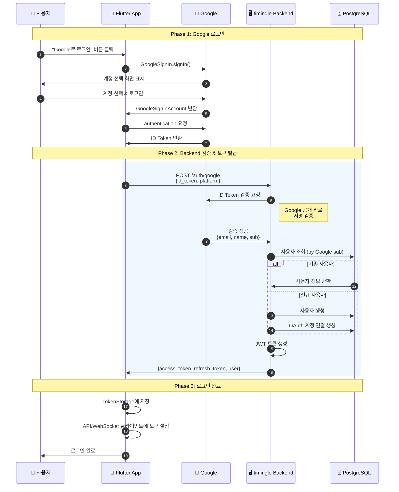
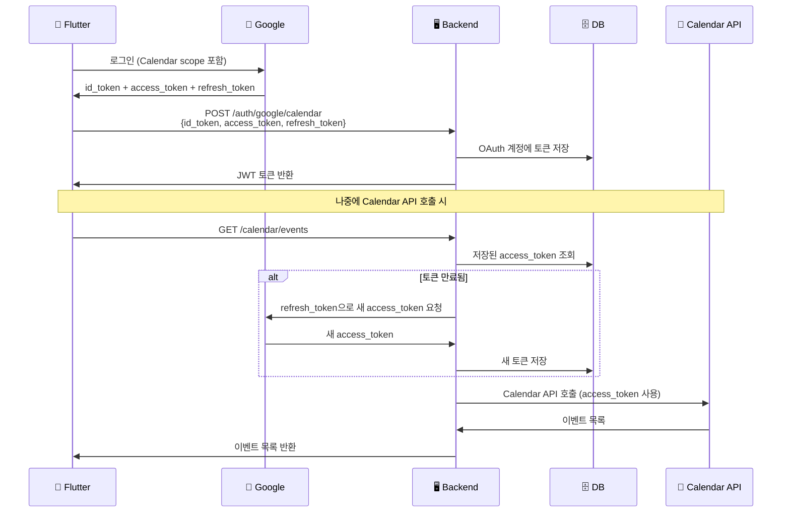
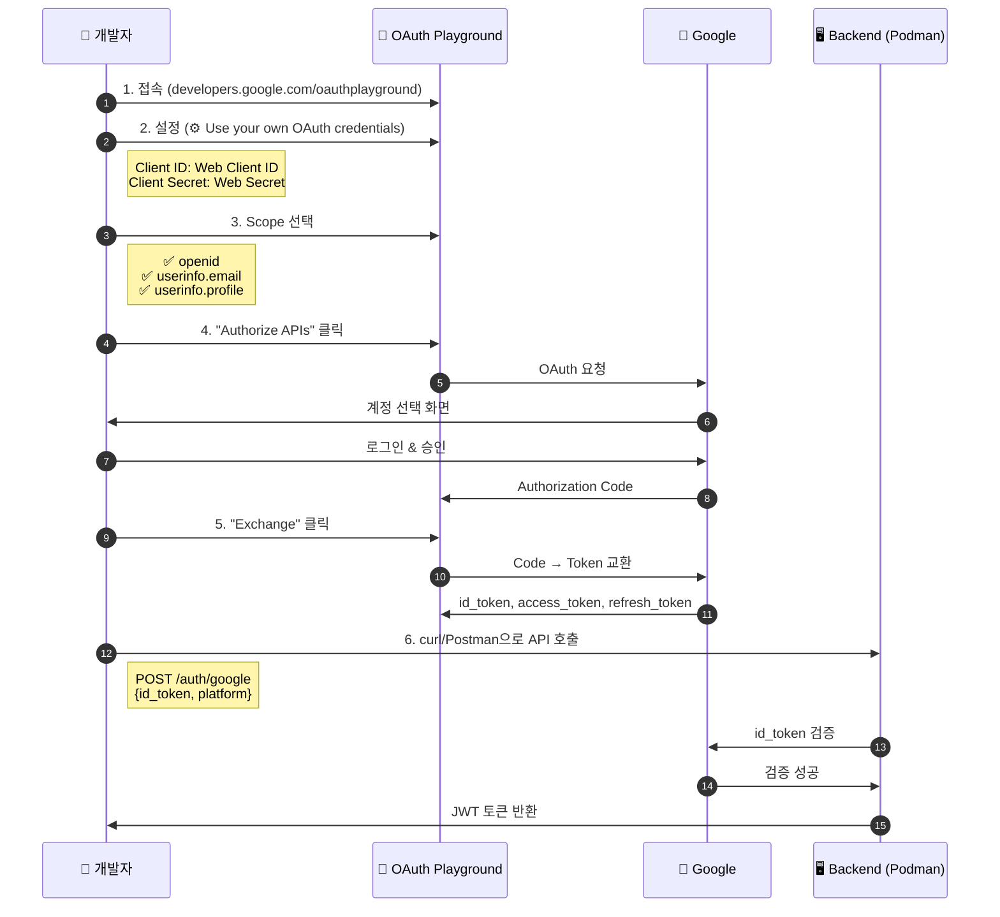

# Google 로그인 동작 원리 상세 설명

## 목차
1. [개요](#개요)
2. [토큰의 종류](#토큰의-종류)
3. [전체 흐름 다이어그램](#전체-흐름-다이어그램)
4. [단계별 상세 설명](#단계별-상세-설명)
5. [기본 로그인 vs Calendar 로그인](#기본-로그인-vs-calendar-로그인)
6. [보안 고려사항](#보안-고려사항)
7. [코드 위치](#코드-위치)

---

## 개요

timingle의 Google 로그인은 **OAuth 2.0 + OpenID Connect** 표준을 따릅니다.

핵심 원리:
1. 사용자가 Google에 직접 로그인
2. Google이 "이 사용자는 xxx@gmail.com이다"라는 **증명서(ID Token)**를 발급
3. timingle Backend가 이 증명서를 **Google에 검증 요청**
4. 검증 성공 시 timingle 자체 **JWT 토큰 발급**

> **왜 이렇게 복잡하게?**
> - 사용자 비밀번호를 timingle이 절대 알 수 없음 → 보안 강화
> - Google이 신원을 보증 → 신뢰성
> - 표준 프로토콜 → 안전하고 검증된 방식

---

## 토큰의 종류

Google 로그인에는 **3가지 종류의 토큰**이 사용됩니다:

| 토큰 | 발급자 | 용도 | 수명 | 저장 위치 |
|------|--------|------|------|-----------|
| **ID Token** | Google | 사용자 신원 증명 | ~1시간 | 사용 후 폐기 |
| **Access Token** (Google) | Google | Google API 호출 | ~1시간 | Backend DB |
| **JWT Token** (timingle) | timingle | 서비스 인증 | 설정에 따름 | 앱 로컬 |

### ID Token 상세

ID Token은 **JWT(JSON Web Token)** 형식입니다:

```
eyJhbGciOiJSUzI1NiIs...  (Header)
.
eyJpc3MiOiJodHRwczovL2FjY291bnRzLmdvb2dsZS5jb20i...  (Payload)
.
Rk8Hl1Zkla9Dp...  (Signature)
```

**Payload 내용:**
```json
{
  "iss": "https://accounts.google.com",  // 발급자 (Google)
  "sub": "1234567890123456789",          // Google 고유 사용자 ID
  "aud": "your-client-id.apps.googleusercontent.com",  // 대상 앱
  "email": "user@gmail.com",             // 이메일
  "email_verified": true,                // 이메일 인증 여부
  "name": "홍길동",                       // 이름
  "picture": "https://lh3.googleusercontent.com/...",  // 프로필 사진
  "given_name": "길동",                   // 이름(First name)
  "family_name": "홍",                    // 성(Last name)
  "locale": "ko",                        // 언어
  "iat": 1706886000,                     // 발급 시간
  "exp": 1706889600                      // 만료 시간
}
```

---

## 전체 흐름 다이어그램



---

## 단계별 상세 설명

### 1단계: 사용자 버튼 클릭

사용자가 앱에서 "Google로 로그인" 버튼을 누릅니다.

```dart
// lib/features/auth/presentation/pages/login_page.dart
ElevatedButton(
  onPressed: () => ref.read(authNotifierProvider.notifier).loginWithGoogle(),
  child: Text('Google로 로그인'),
)
```

### 2단계: Flutter의 GoogleSignIn 호출

```dart
// lib/features/auth/data/repositories/auth_repository_impl.dart:77
final googleUser = await _googleSignIn.signIn();
```

`google_sign_in` 패키지가 OS 레벨의 Google 로그인을 실행합니다.
- **Android**: Google Play Services 사용
- **iOS**: 시스템 Safari 또는 Google 앱 사용

### 3~4단계: 시스템 로그인 UI

네이티브 Google 로그인 화면이 나타납니다:
1. Google 계정 선택 (또는 새 계정 추가)
2. 비밀번호 입력 (필요시)
3. 권한 동의 (처음 로그인 시)

### 5단계: ID Token 획득

```dart
// lib/features/auth/data/repositories/auth_repository_impl.dart:86-93
final googleAuth = await googleUser.authentication;
final idToken = googleAuth.idToken;

if (idToken == null) {
  return const Left(AuthFailure(
    message: 'Google ID 토큰을 가져올 수 없습니다',
    code: 'NO_ID_TOKEN',
  ));
}
```

이 시점에서 Flutter는:
- ✅ ID Token (사용자 신원 증명)
- ✅ Access Token (Calendar 등 API용, 선택적)
- ❌ 사용자 비밀번호 (절대 알 수 없음)

### 6단계: Backend로 ID Token 전송

```dart
// lib/features/auth/data/datasources/auth_remote_datasource.dart
final response = await _apiClient.post('/auth/google', data: {
  'id_token': idToken,
  'platform': platform,  // 'android' 또는 'ios'
});
```

**요청:**
```http
POST /api/v1/auth/google HTTP/1.1
Content-Type: application/json

{
  "id_token": "eyJhbGciOiJSUzI1NiIs...",
  "platform": "android"
}
```

### 7~8단계: Backend의 ID Token 검증

```go
// pkg/utils/google_oauth.go:49-68
func (v *GoogleOAuthVerifier) VerifyIDToken(ctx context.Context, idToken string) (*models.GoogleTokenPayload, error) {
    // 각 Client ID에 대해 검증 시도
    for _, clientID := range v.clientIDs {
        payload, err := idtoken.Validate(ctx, idToken, clientID)
        if err != nil {
            continue
        }
        return v.extractPayload(payload)
    }
    return nil, fmt.Errorf("failed to verify Google ID token")
}
```

**검증 과정:**
1. Google의 공개 키 가져오기 (https://www.googleapis.com/oauth2/v3/certs)
2. ID Token의 서명(Signature) 검증
3. 발급자(iss), 대상(aud), 만료시간(exp) 확인
4. 검증 성공 시 Payload 추출

**왜 검증이 필요한가?**
```
⚠️ 만약 검증 없이 ID Token을 신뢰한다면:

해커: "나는 ceo@company.com이다" 라는 가짜 토큰 생성
      → Backend: "오, 그렇구나!" → 해킹 성공 😱

✅ 검증을 하면:
해커: 가짜 토큰 전송
      → Backend: Google에 검증 요청
      → Google: "이건 내가 발급한 게 아니야!"
      → Backend: 로그인 거부 ✅
```

### 9단계: 사용자 처리 & JWT 발급

```go
// internal/services/auth_service.go:127-197
func (s *AuthService) GoogleLogin(ctx context.Context, req *models.GoogleLoginRequest) (*models.AuthResponse, error) {
    // 1. ID Token 검증
    googlePayload, err := s.googleVerifier.VerifyIDToken(ctx, req.IDToken)
    if err != nil {
        return nil, fmt.Errorf("invalid Google ID token: %w", err)
    }

    // 2. 기존 OAuth 계정 확인 (Google sub ID로 조회)
    oauthAccount, _ := s.oauthRepo.FindByProviderUserID("google", googlePayload.Subject)

    var user *models.User

    if oauthAccount != nil {
        // 3a. 기존 사용자 - 연결된 사용자 가져오기
        user, _ = s.userRepo.FindByID(oauthAccount.UserID)

        // 프로필 정보 업데이트 (이름, 사진 변경 시)
        if needsUpdate(oauthAccount, googlePayload) {
            s.oauthRepo.Update(oauthAccount)
        }
    } else {
        // 3b. 신규 사용자
        user, _ = s.userRepo.FindByEmail(googlePayload.Email)

        if user == nil {
            // 완전히 새로운 사용자 생성
            user, _ = s.userRepo.CreateOAuthUser(
                googlePayload.Email,
                googlePayload.Name,
                googlePayload.Picture,
            )
        }

        // OAuth 계정 연결 생성
        newOAuthAccount := &models.OAuthAccount{
            UserID:         user.ID,
            Provider:       "google",
            ProviderUserID: googlePayload.Subject,
            Email:          &googlePayload.Email,
            Name:           &googlePayload.Name,
        }
        s.oauthRepo.Create(newOAuthAccount)
    }

    // 4. timingle JWT 토큰 생성
    return s.generateAuthResponse(user)
}
```

**응답:**
```json
{
  "access_token": "eyJhbGciOiJIUzI1NiIs...",  // timingle JWT
  "refresh_token": "abc123xyz...",             // 갱신용 토큰
  "expires_in": 3600,
  "user": {
    "id": 1,
    "email": "user@gmail.com",
    "name": "홍길동",
    "picture": "https://..."
  }
}
```

### 10단계: 토큰 저장 & 로그인 완료

```dart
// lib/features/auth/data/repositories/auth_repository_impl.dart:229-244
Future<void> _saveAuthState(User user, String accessToken, String refreshToken) async {
  // 토큰 저장 (Secure Storage)
  await _tokenStorage.saveTokens(
    accessToken: accessToken,
    refreshToken: refreshToken,
  );

  // 사용자 정보 저장
  await _tokenStorage.saveUserId(user.id);
  await _tokenStorage.saveUserPhone(user.phone);
  await _tokenStorage.saveUserName(user.name);

  // API/WebSocket 클라이언트에 토큰 설정
  _apiClient.setAccessToken(accessToken);
  _wsClient.setAccessToken(accessToken);
}
```

---

## 기본 로그인 vs Calendar 로그인

### 비교표

| 구분 | 기본 로그인 | Calendar 로그인 |
|------|------------|----------------|
| **엔드포인트** | `POST /auth/google` | `POST /auth/google/calendar` |
| **요청 데이터** | `{id_token, platform}` | `{id_token, access_token, refresh_token, platform}` |
| **ID Token 검증** | ✅ | ✅ |
| **Google Access Token** | ❌ 저장 안함 | ✅ DB에 저장 |
| **Google Refresh Token** | ❌ 저장 안함 | ✅ DB에 저장 |
| **용도** | 로그인만 | 로그인 + Google Calendar API |

### Calendar 로그인 흐름



### Calendar 로그인 코드

```go
// internal/services/auth_service.go:213-310
func (s *AuthService) GoogleLoginWithCalendar(ctx context.Context, req *models.GoogleCalendarLoginRequest) {
    // ID Token 검증 (기본 로그인과 동일)
    googlePayload, _ := s.googleVerifier.VerifyIDToken(ctx, req.IDToken)

    // ... 사용자 찾기/생성 ...

    // ⭐ 차이점: Access Token과 Refresh Token 저장
    err = s.oauthRepo.UpdateTokens(
        oauthAccount.ID,
        &req.AccessToken,     // Google API 호출용 토큰
        &req.RefreshToken,    // 토큰 갱신용
        &tokenExpiry,         // 만료 시간 (보통 1시간)
        scopes,               // "https://www.googleapis.com/auth/calendar"
    )
}
```

---

## 보안 고려사항

### 1. ID Token 검증 필수

```go
// ❌ 절대 하면 안 되는 것
func BadLogin(idToken string) {
    claims := parseJWT(idToken)  // 검증 없이 파싱만
    user := findUser(claims.Email)  // 해커가 가짜 토큰으로 로그인 가능!
}

// ✅ 올바른 방법
func GoodLogin(idToken string) {
    claims, err := googleVerifier.VerifyIDToken(ctx, idToken)  // Google 검증
    if err != nil {
        return // 검증 실패 시 거부
    }
    user := findUser(claims.Email)
}
```

### 2. Client ID 검증

```go
// pkg/utils/google_oauth.go
// 여러 Client ID 지원 (Android, iOS, Web)
func NewGoogleOAuthVerifier(clientIDs ...string) *GoogleOAuthVerifier {
    return &GoogleOAuthVerifier{
        clientIDs: validIDs,  // 등록된 Client ID만 허용
    }
}
```

### 3. Access Token 서버 저장

```go
// Access Token은 클라이언트에 노출하지 않고 서버에만 저장
type OAuthAccount struct {
    AccessToken  *string `json:"-"`  // JSON 응답에서 제외
    RefreshToken *string `json:"-"`  // JSON 응답에서 제외
}
```

### 4. 토큰 자동 갱신

```go
// internal/services/auth_service.go:314-368
func (s *AuthService) GetValidAccessToken(ctx context.Context, userID int64) (string, error) {
    oauthAccount, _ := s.oauthRepo.FindByUserIDAndProvider(userID, "google")

    // 토큰 만료 확인
    if oauthAccount.IsTokenExpired() {
        // 자동으로 새 토큰 발급
        tokenResp, _ := s.googleVerifier.RefreshAccessToken(ctx, *oauthAccount.RefreshToken)

        // 새 토큰 저장
        s.oauthRepo.UpdateTokens(oauthAccount.ID, &tokenResp.AccessToken, ...)

        return tokenResp.AccessToken, nil
    }

    return *oauthAccount.AccessToken, nil
}
```

---

## 코드 위치

### Frontend (Flutter)

| 파일 | 역할 |
|------|------|
| `lib/features/auth/data/repositories/auth_repository_impl.dart` | Google Sign-In 호출 및 토큰 관리 |
| `lib/features/auth/data/datasources/auth_remote_datasource.dart` | Backend API 호출 |
| `lib/features/auth/domain/usecases/login_with_google.dart` | UseCase (Clean Architecture) |
| `lib/features/auth/presentation/providers/auth_provider.dart` | UI 상태 관리 |

### Backend (Go)

| 파일 | 역할 |
|------|------|
| `pkg/utils/google_oauth.go` | ID Token 검증 & 토큰 갱신 |
| `internal/services/auth_service.go` | 인증 비즈니스 로직 |
| `internal/handlers/auth_handler.go` | HTTP 엔드포인트 |
| `internal/repositories/oauth_repository.go` | OAuth 계정 DB 접근 |
| `internal/models/oauth.go` | OAuth 모델 정의 |

### Database

| 테이블 | 역할 |
|--------|------|
| `users` | 사용자 정보 |
| `oauth_accounts` | Google 계정 연결 정보 + 토큰 |

---

## Podman 환경에서 Google Auth 테스트

### 테스트 환경 구성도

```
┌─────────────────────────────────────────────────────────────────────────┐
│                        Windows + WSL 개발 환경                           │
├─────────────────────────────────────────────────────────────────────────┤
│                                                                         │
│  ┌──────────────────────┐    ┌──────────────────────────────────────┐  │
│  │     Windows          │    │           WSL (AlmaLinux)            │  │
│  │                      │    │                                      │  │
│  │  📮 Postman          │    │  ┌─────────────────────────────────┐ │  │
│  │  📱 Flutter App      │◄──►│  │     Podman Containers          │ │  │
│  │  🌐 브라우저          │    │  │                                 │ │  │
│  │                      │    │  │  🐘 PostgreSQL (:5432)          │ │  │
│  │                      │    │  │  📮 Redis (:6379)               │ │  │
│  │                      │    │  │  📬 NATS (:4222)                │ │  │
│  │                      │    │  │  🗄️ ScyllaDB (:9042)            │ │  │
│  │                      │    │  └─────────────────────────────────┘ │  │
│  │                      │    │                                      │  │
│  │                      │    │  ┌─────────────────────────────────┐ │  │
│  │        :8080 ◄───────┼────┼──┤ 🖥️ Go Backend API               │ │  │
│  │                      │    │  │    (localhost:8080)             │ │  │
│  │                      │    │  └─────────────────────────────────┘ │  │
│  └──────────────────────┘    └──────────────────────────────────────┘  │
│                                         │                              │
│                                         ▼                              │
│                              ┌──────────────────┐                      │
│                              │  🔵 Google API   │                      │
│                              │  (인터넷 연결)    │                      │
│                              └──────────────────┘                      │
└─────────────────────────────────────────────────────────────────────────┘
```

### Step 1: Podman 컨테이너 시작

```bash
# WSL 접속
wsl -d AlmaLinux-Kitten-10

# 프로젝트 디렉토리로 이동
cd /mnt/d/projects/timingle2/containers

# Podman 컨테이너 시작
podman-compose -f podman-compose-wsl.yml up -d

# 상태 확인
podman ps
```

**예상 출력:**
```
CONTAINER ID  IMAGE                              STATUS         PORTS  NAMES
abc123...     docker.io/postgres:17-alpine       Up 2 minutes          timingle-postgres
def456...     docker.io/redis:8.4-alpine         Up 2 minutes          timingle-redis
ghi789...     docker.io/nats:2.12-alpine         Up 2 minutes          timingle-nats
jkl012...     docker.io/scylladb/scylla:2025.4   Up 2 minutes          timingle-scylla
```

### Step 2: 환경변수 설정

```bash
# backend/.env 파일 생성/수정
cd /mnt/d/projects/timingle2/backend
cp .env.example .env
```

**.env 파일 핵심 설정:**
```bash
# Server
PORT=8080
GIN_MODE=debug

# PostgreSQL (Podman 컨테이너)
POSTGRES_HOST=localhost
POSTGRES_PORT=5432
POSTGRES_USER=timingle
POSTGRES_PASSWORD=timingle_dev_password
POSTGRES_DB=timingle

# JWT
JWT_SECRET=your_jwt_secret_here_minimum_32_characters_long
JWT_ACCESS_EXPIRY=15m
JWT_REFRESH_EXPIRY=168h

# Google OAuth (Google Cloud Console에서 발급)
GOOGLE_CLIENT_ID_AND=xxx.apps.googleusercontent.com   # Android
GOOGLE_CLIENT_ID_IOS=xxx.apps.googleusercontent.com   # iOS
GOOGLE_CLIENT_ID_WEB=xxx.apps.googleusercontent.com   # Web (검증용)
GOOGLE_CLIENT_SECRET=GOCSPX-xxxx                       # Web Client Secret
```

### Step 3: Backend 서버 시작

```bash
# WSL에서 실행
cd /mnt/d/projects/timingle2/backend
./run.sh

# 또는 직접 실행
go run cmd/server/main.go
```

**정상 시작 로그:**
```
[GIN-debug] Listening and serving HTTP on :8080
Connected to PostgreSQL
Connected to Redis
Connected to NATS
```

### Step 4: OAuth Playground에서 테스트 토큰 발급

Google OAuth를 테스트하려면 **유효한 ID Token**이 필요합니다.
Flutter 앱 없이 테스트하려면 OAuth Playground를 사용합니다.



#### 4.1 OAuth Playground 접속

```
https://developers.google.com/oauthplayground
```

#### 4.2 설정 (우측 상단 ⚙️ 클릭)

```
☑️ Use your own OAuth credentials

OAuth Client ID: [Web Client ID]
OAuth Client secret: [Web Client Secret]
```

> **중요**: Google Cloud Console → Credentials → Web Client에서 복사

#### 4.3 Scope 선택 (왼쪽 패널)

**기본 로그인용:**
- `openid`
- `https://www.googleapis.com/auth/userinfo.email`
- `https://www.googleapis.com/auth/userinfo.profile`

**Calendar 로그인용 (추가):**
- `https://www.googleapis.com/auth/calendar`

#### 4.4 토큰 발급

1. **"Authorize APIs"** 클릭
2. Google 계정 로그인 & 권한 승인
3. **"Exchange authorization code for tokens"** 클릭
4. 응답에서 토큰 복사:

```json
{
  "access_token": "ya29.a0AfH6SMB...",
  "id_token": "eyJhbGciOiJSUzI1NiIs...",      // ← 이것을 복사!
  "refresh_token": "1//0eXyz...",
  "expires_in": 3599,
  "token_type": "Bearer"
}
```

### Step 5: API 테스트

#### 5.1 curl로 테스트

**기본 Google 로그인:**
```bash
# Windows PowerShell 또는 WSL에서
curl -X POST http://localhost:8080/api/v1/auth/google \
  -H "Content-Type: application/json" \
  -d '{
    "id_token": "eyJhbGciOiJSUzI1NiIs...",
    "platform": "web"
  }'
```

**Calendar 권한 포함 로그인:**
```bash
curl -X POST http://localhost:8080/api/v1/auth/google/calendar \
  -H "Content-Type: application/json" \
  -d '{
    "id_token": "eyJhbGciOiJSUzI1NiIs...",
    "access_token": "ya29.a0AfH6SMB...",
    "refresh_token": "1//0eXyz...",
    "platform": "web"
  }'
```

**성공 응답:**
```json
{
  "access_token": "eyJhbGciOiJIUzI1NiIs...",   // timingle JWT
  "refresh_token": "abc123xyz...",
  "expires_in": 900,
  "user": {
    "id": 1,
    "email": "user@gmail.com",
    "name": "홍길동",
    "phone": "",
    "profile_image": "https://lh3.googleusercontent.com/..."
  }
}
```

#### 5.2 Postman으로 테스트

1. **Collection 가져오기:**
   ```
   File > Import > docs/timingle-api.postman_collection.json
   ```

2. **Environment 가져오기:**
   ```
   File > Import > postman/timingle-local.postman_environment.json
   ```

3. **환경변수 설정:**
   | 변수명 | 값 |
   |--------|-----|
   | `base_url` | `http://localhost:8080/api/v1` |
   | `google_id_token` | OAuth Playground에서 복사한 id_token |
   | `google_access_token` | OAuth Playground에서 복사한 access_token |
   | `google_refresh_token` | OAuth Playground에서 복사한 refresh_token |

4. **요청 실행:**
   - `Auth > Google Login` 또는 `Auth > Google Calendar Login`

### Step 6: 데이터베이스 확인

로그인 성공 후 데이터가 저장되었는지 확인:

```bash
# PostgreSQL 접속
podman exec -it timingle-postgres psql -U timingle -d timingle

# 사용자 확인
SELECT id, email, name, role, created_at FROM users ORDER BY id DESC LIMIT 5;

# OAuth 계정 확인
SELECT id, user_id, provider, email, name, created_at FROM oauth_accounts ORDER BY id DESC LIMIT 5;

# 토큰 확인 (Calendar 로그인 시)
SELECT id, user_id, provider,
       CASE WHEN access_token IS NOT NULL THEN 'SET' ELSE 'NULL' END as access_token,
       CASE WHEN refresh_token IS NOT NULL THEN 'SET' ELSE 'NULL' END as refresh_token,
       token_expiry, scopes
FROM oauth_accounts WHERE provider = 'google';
```

### 문제 해결 (Troubleshooting)

#### 오류: "invalid Google ID token"

**원인 1: Client ID 불일치**
```bash
# .env 확인
cat backend/.env | grep GOOGLE

# 확인 포인트:
# - OAuth Playground의 Client ID와 .env의 GOOGLE_CLIENT_ID_WEB이 동일한가?
# - Google Cloud Console에서 Web Client ID를 사용하고 있는가?
```

**원인 2: 토큰 만료**
```
ID Token은 1시간 후 만료됩니다.
OAuth Playground에서 새 토큰을 발급받으세요.
```

**원인 3: Redirect URI 미등록**
```
Google Cloud Console → Credentials → Web Client → Authorized redirect URIs에
https://developers.google.com/oauthplayground 추가 필요
```

#### 오류: "connection refused" (localhost:8080)

```bash
# Backend 서버 실행 중인지 확인
ps aux | grep "go run"

# 포트 확인
netstat -tlnp | grep 8080

# 서버 재시작
cd /mnt/d/projects/timingle2/backend && ./run.sh
```

#### 오류: PostgreSQL 연결 실패

```bash
# 컨테이너 상태 확인
podman ps

# PostgreSQL 로그 확인
podman logs timingle-postgres

# 직접 연결 테스트
podman exec -it timingle-postgres psql -U timingle -d timingle -c "SELECT 1"
```

#### 오류: "Access blocked: This app's request is invalid"

```
OAuth 동의 화면이 "테스트" 모드이고,
로그인하려는 Google 계정이 테스트 사용자로 등록되지 않음.

해결:
1. Google Cloud Console → OAuth consent screen
2. Test users → ADD USERS
3. 테스트할 이메일 주소 추가
```

### 전체 테스트 체크리스트

```bash
# 1. Podman 컨테이너 시작
podman-compose -f podman-compose-wsl.yml up -d
podman ps  # 4개 컨테이너 실행 확인

# 2. Backend 서버 시작
cd /mnt/d/projects/timingle2/backend && ./run.sh

# 3. 헬스체크
curl http://localhost:8080/health
# 응답: {"status":"ok"}

# 4. OAuth Playground에서 id_token 발급
# https://developers.google.com/oauthplayground

# 5. Google 로그인 API 테스트
curl -X POST http://localhost:8080/api/v1/auth/google \
  -H "Content-Type: application/json" \
  -d '{"id_token": "YOUR_ID_TOKEN", "platform": "web"}'

# 6. 응답 확인
# {
#   "access_token": "eyJ...",
#   "refresh_token": "...",
#   "user": { "id": 1, "email": "..." }
# }

# 7. DB 확인
podman exec -it timingle-postgres psql -U timingle -d timingle \
  -c "SELECT id, email, name FROM users ORDER BY id DESC LIMIT 1"
```

### 테스트 시나리오

#### 시나리오 1: 신규 사용자 첫 로그인
```
1. OAuth Playground에서 새 Google 계정으로 토큰 발급
2. POST /auth/google 호출
3. 예상 결과:
   - users 테이블에 새 레코드 생성
   - oauth_accounts 테이블에 새 레코드 생성
   - JWT 토큰 반환
```

#### 시나리오 2: 기존 사용자 재로그인
```
1. 동일한 Google 계정으로 다시 로그인
2. POST /auth/google 호출
3. 예상 결과:
   - users 테이블에 새 레코드 없음
   - oauth_accounts 업데이트 (프로필 변경 시)
   - JWT 토큰 반환
```

#### 시나리오 3: Calendar 권한 추가
```
1. OAuth Playground에서 Calendar scope 추가하여 토큰 발급
2. POST /auth/google/calendar 호출 (access_token, refresh_token 포함)
3. 예상 결과:
   - oauth_accounts에 토큰 저장
   - scopes에 calendar 포함
```

---

## 관련 문서

- [GOOGLE_OAUTH_SETUP.md](GOOGLE_OAUTH_SETUP.md) - Google Cloud Console 설정
- [GOOGLE_CALENDAR_SETUP.md](GOOGLE_CALENDAR_SETUP.md) - Calendar API 설정
- [docs/mermaid/auth_google_oauth.md](mermaid/auth_google_oauth.md) - 시퀀스 다이어그램
- [docs/mermaid/auth_google_calendar.md](mermaid/auth_google_calendar.md) - Calendar 로그인 다이어그램
- [docs/mermaid/auth_oauth_playground.md](mermaid/auth_oauth_playground.md) - OAuth Playground 사용법

---

마지막 업데이트: 2026-01-31
