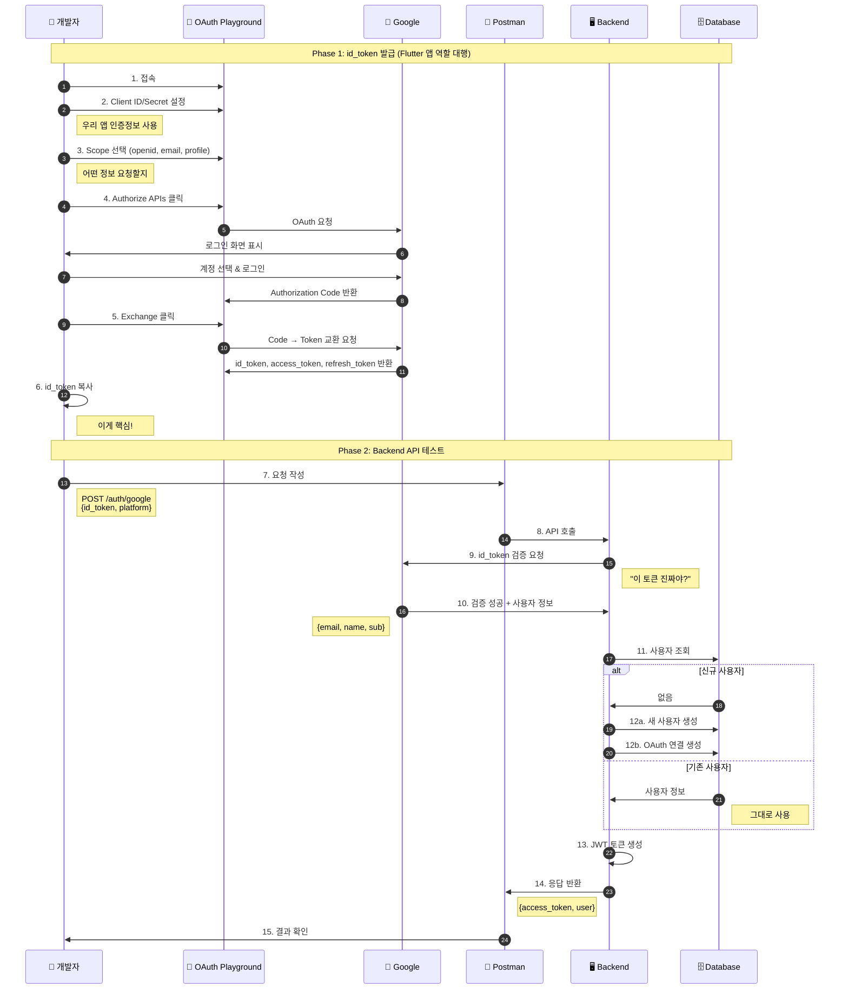

# Google 로그인 Postman 테스트 - 완벽 이해 가이드

> **이 문서의 목적**: Google 로그인을 Postman으로 테스트할 때, 각 단계가 **왜** 필요한지, 일반 회원가입/로그인과 **무엇이 다른지**를 깊이 이해합니다.

---

## 핵심 질문에 대한 답

### Q1: Google 로그인은 회원가입인가? 로그인인가?

**답: 둘 다입니다! (상황에 따라 자동으로 결정됨)**

```
┌─────────────────────────────────────────────────────────────────────────┐
│                                                                         │
│  일반 방식 (2개의 API):                                                  │
│  ─────────────────────                                                  │
│                                                                         │
│  처음 사용자:  POST /auth/register  →  계정 생성  →  토큰 발급           │
│  기존 사용자:  POST /auth/login     →  계정 조회  →  토큰 발급           │
│                                                                         │
│  ⚠️ 잘못 호출하면 에러!                                                  │
│     - 기존 사용자가 register 호출 → "이미 존재하는 계정" 에러             │
│     - 신규 사용자가 login 호출 → "계정을 찾을 수 없음" 에러               │
│                                                                         │
├─────────────────────────────────────────────────────────────────────────┤
│                                                                         │
│  Google 방식 (1개의 API):                                                │
│  ────────────────────────                                               │
│                                                                         │
│  모든 사용자:  POST /auth/google  →  ???  →  토큰 발급                   │
│                                                                         │
│  Backend가 알아서 판단:                                                  │
│  ┌─────────────────────────────────────────────────────────────────┐    │
│  │  1. Google에게 "이 사람 누구야?" 물어봄                          │    │
│  │     → "user@gmail.com입니다"                                    │    │
│  │                                                                 │    │
│  │  2. DB에서 이 이메일 찾아봄                                      │    │
│  │     │                                                           │    │
│  │     ├─ 있음 → 기존 사용자니까 로그인 처리                        │    │
│  │     │                                                           │    │
│  │     └─ 없음 → 새 사용자니까 회원가입 + 로그인 처리               │    │
│  │                                                                 │    │
│  │  3. 어느 쪽이든 JWT 토큰 발급                                    │    │
│  └─────────────────────────────────────────────────────────────────┘    │
│                                                                         │
│  ✅ 절대 에러 안남! (Google 인증만 성공하면)                             │
│                                                                         │
└─────────────────────────────────────────────────────────────────────────┘
```

### Q2: 왜 Google 로그인은 이렇게 동작하나?

```
이유: 사용자 경험(UX) 때문!

❌ 만약 일반 방식처럼 동작한다면:

   사용자: "Google로 로그인" 버튼 클릭
   앱: "이미 가입하셨나요? 아니면 처음이신가요?"
   사용자: "어... 기억이 안 나는데..."
   앱: "그럼 일단 로그인 해보세요"
   사용자: 클릭
   앱: "계정이 없습니다"
   사용자: "그럼 회원가입..."

   → 복잡하고 짜증남 😫

✅ Google 방식:

   사용자: "Google로 로그인" 버튼 클릭
   앱: (알아서 처리)
   사용자: 로그인 완료!

   → 간단! 😊
```

---

## Backend 코드로 이해하기

### 일반 회원가입 vs 일반 로그인 vs Google 로그인

```go
// ============================================================
// 1. 일반 회원가입 (POST /auth/register)
// ============================================================
func (s *AuthService) Register(req *RegisterRequest) {
    // 이미 있는지 확인
    existingUser := s.userRepo.FindByPhone(req.Phone)
    if existingUser != nil {
        return Error("이미 존재하는 계정")  // ❌ 에러!
    }

    // 새 사용자 생성
    user := s.userRepo.Create(req.Phone, req.Name)

    // 토큰 발급
    return GenerateToken(user)
}

// ============================================================
// 2. 일반 로그인 (POST /auth/login)
// ============================================================
func (s *AuthService) Login(req *LoginRequest) {
    // 사용자 찾기
    user := s.userRepo.FindByPhone(req.Phone)
    if user == nil {
        return Error("계정을 찾을 수 없음")  // ❌ 에러!
    }

    // 토큰 발급 (새 계정 생성 안함!)
    return GenerateToken(user)
}

// ============================================================
// 3. Google 로그인 (POST /auth/google)
// ============================================================
func (s *AuthService) GoogleLogin(req *GoogleLoginRequest) {
    // Step 1: Google에게 물어보기
    googleInfo := s.googleVerifier.Verify(req.IDToken)
    // → googleInfo = { email: "user@gmail.com", name: "홍길동", ... }

    // Step 2: DB에서 찾기
    oauthAccount := s.oauthRepo.FindByGoogleID(googleInfo.Sub)

    if oauthAccount != nil {
        // ✅ 있음 → 로그인 처리 (일반 로그인과 동일)
        user := s.userRepo.FindByID(oauthAccount.UserID)
        return GenerateToken(user)
    } else {
        // ✅ 없음 → 회원가입 + 로그인 처리 (일반 회원가입과 동일)
        user := s.userRepo.Create(googleInfo.Email, googleInfo.Name)
        s.oauthRepo.LinkGoogleAccount(user.ID, googleInfo)
        return GenerateToken(user)
    }

    // ❌ 에러 케이스가 없음! (Google 인증 실패 제외)
}
```

### 핵심 차이점 요약

| | 일반 회원가입 | 일반 로그인 | Google 로그인 |
|--|-------------|-----------|--------------|
| **API** | /auth/register | /auth/login | /auth/google |
| **신규 사용자** | ✅ 성공 | ❌ 에러 | ✅ 성공 (자동 가입) |
| **기존 사용자** | ❌ 에러 | ✅ 성공 | ✅ 성공 |
| **Backend 동작** | 무조건 생성 시도 | 무조건 조회만 | 조회 후 없으면 생성 |

---

## Postman 테스트: 왜 이 과정이 필요한가?

### 전체 흐름 개요

```
┌─────────────────────────────────────────────────────────────────────────┐
│                      Postman으로 Google 로그인 테스트                    │
├─────────────────────────────────────────────────────────────────────────┤
│                                                                         │
│  문제: Postman은 Google 로그인 버튼을 누를 수 없음!                       │
│                                                                         │
│  ┌─────────────────────────────────────────────────────────────────┐    │
│  │  Flutter 앱에서는...                                            │    │
│  │                                                                 │    │
│  │  [Google로 로그인] 버튼 클릭                                     │    │
│  │        │                                                        │    │
│  │        ▼                                                        │    │
│  │  Google 로그인 화면 (시스템 UI)                                  │    │
│  │        │                                                        │    │
│  │        ▼                                                        │    │
│  │  id_token 자동 획득                                             │    │
│  │        │                                                        │    │
│  │        ▼                                                        │    │
│  │  POST /auth/google { id_token } 자동 호출                       │    │
│  │                                                                 │    │
│  │  → 모든 게 자동! 😊                                             │    │
│  └─────────────────────────────────────────────────────────────────┘    │
│                                                                         │
│  ┌─────────────────────────────────────────────────────────────────┐    │
│  │  Postman에서는...                                               │    │
│  │                                                                 │    │
│  │  ❌ Google 로그인 버튼 누를 수 없음                              │    │
│  │  ❌ 시스템 UI 띄울 수 없음                                       │    │
│  │  ❌ id_token을 직접 만들 수 없음                                 │    │
│  │                                                                 │    │
│  │  → 그래서 OAuth Playground가 필요! 🔧                           │    │
│  └─────────────────────────────────────────────────────────────────┘    │
│                                                                         │
└─────────────────────────────────────────────────────────────────────────┘
```

---

## Step-by-Step: 각 단계가 왜 필요한가

### Step 1: OAuth Playground 접속

```
URL: https://developers.google.com/oauthplayground

왜 필요한가?
─────────────
OAuth Playground = "Flutter 앱 대신 Google 로그인을 해주는 도구"

Flutter 앱: GoogleSignIn.signIn() → Google 로그인 → id_token 획득
OAuth Playground: 웹에서 Google 로그인 → id_token 획득

둘 다 결과는 같음! (id_token을 얻음)
```

### Step 2: 설정 (⚙️ Use your own OAuth credentials)

```
왜 필요한가?
─────────────
OAuth Playground는 기본적으로 "Google의 테스트용 Client ID"를 사용합니다.
하지만 우리 Backend는 "우리 앱의 Client ID"만 신뢰합니다.

┌─────────────────────────────────────────────────────────────────────────┐
│                                                                         │
│  시나리오 1: 기본 설정 (Google의 Client ID)                              │
│  ───────────────────────────────────────────                            │
│                                                                         │
│  OAuth Playground → Google → id_token (Google의 Client ID로 발급)       │
│        │                                                                │
│        ▼                                                                │
│  Postman → Backend                                                      │
│        │                                                                │
│        ▼                                                                │
│  Backend: "이 id_token은 내 앱(timingle)이 아니라                        │
│            Google Playground 앱에서 발급받은 거네?                       │
│            신뢰할 수 없어!" → ❌ 에러                                    │
│                                                                         │
├─────────────────────────────────────────────────────────────────────────┤
│                                                                         │
│  시나리오 2: 우리 Client ID 설정                                         │
│  ─────────────────────────────────                                      │
│                                                                         │
│  OAuth Playground → Google → id_token (우리 Client ID로 발급)           │
│        │                                                                │
│        ▼                                                                │
│  Postman → Backend                                                      │
│        │                                                                │
│        ▼                                                                │
│  Backend: "이 id_token은 내 앱(timingle)에서 발급받은 거네!              │
│            신뢰할 수 있어!" → ✅ 성공                                    │
│                                                                         │
└─────────────────────────────────────────────────────────────────────────┘

설정 방법:
1. ⚙️ 클릭
2. ☑️ Use your own OAuth credentials 체크
3. OAuth Client ID: [Google Cloud Console의 Web Client ID]
4. OAuth Client secret: [Google Cloud Console의 Web Client Secret]
```

### Step 3: Scope 선택

```
왜 필요한가?
─────────────
Scope = "Google에게 어떤 정보를 요청할지" 지정

┌─────────────────────────────────────────────────────────────────────────┐
│                                                                         │
│  Scope 없이 요청하면?                                                    │
│  ───────────────────                                                    │
│                                                                         │
│  요청: "Google, 이 사람 로그인시켜줘"                                    │
│  Google: "OK, 근데 뭘 알려줄까?"                                         │
│  요청: "..."                                                            │
│  Google: "아무것도 안 알려줄게"                                          │
│                                                                         │
│  → id_token에 이메일, 이름 등 정보가 없음!                               │
│                                                                         │
├─────────────────────────────────────────────────────────────────────────┤
│                                                                         │
│  Scope를 지정하면?                                                       │
│  ─────────────────                                                      │
│                                                                         │
│  요청: "Google, 이 사람 로그인시켜줘.                                    │
│         openid, email, profile 정보 알려줘"                             │
│  Google: "OK, 여기 있어:                                                 │
│          - sub: 123456789 (Google 고유 ID)                              │
│          - email: user@gmail.com                                        │
│          - name: 홍길동                                                  │
│          - picture: https://..."                                        │
│                                                                         │
│  → id_token에 필요한 정보가 모두 들어있음!                               │
│                                                                         │
└─────────────────────────────────────────────────────────────────────────┘

필수 Scope:
- openid: "인증 요청입니다" (필수)
- userinfo.email: "이메일 알려줘"
- userinfo.profile: "이름, 사진 알려줘"

선택 Scope:
- calendar: "캘린더 접근 권한도 줘" (Calendar API 사용 시)
```

### Step 4: Authorize APIs 클릭

```
왜 필요한가?
─────────────
실제로 Google 로그인을 수행하는 단계입니다.

┌─────────────────────────────────────────────────────────────────────────┐
│                                                                         │
│  "Authorize APIs" 클릭하면 일어나는 일:                                  │
│                                                                         │
│  1. Google 로그인 페이지로 이동                                         │
│     ┌─────────────────────────────────────────┐                         │
│     │  Google                                 │                         │
│     │                                         │                         │
│     │  계정을 선택하세요                       │                         │
│     │                                         │                         │
│     │  📧 user@gmail.com                      │                         │
│     │  📧 another@gmail.com                   │                         │
│     │  ➕ 다른 계정 사용                       │                         │
│     └─────────────────────────────────────────┘                         │
│                                                                         │
│  2. 계정 선택 후 권한 승인                                               │
│     ┌─────────────────────────────────────────┐                         │
│     │  timingle 앱이 다음 권한을 요청합니다:   │                         │
│     │                                         │                         │
│     │  ✅ 이메일 주소 보기                     │                         │
│     │  ✅ 프로필 정보 보기                     │                         │
│     │                                         │                         │
│     │  [허용]  [거부]                         │                         │
│     └─────────────────────────────────────────┘                         │
│                                                                         │
│  3. 승인 후 OAuth Playground로 돌아옴                                    │
│     → Authorization Code 획득                                           │
│                                                                         │
│  이 과정 = Flutter 앱에서 GoogleSignIn.signIn() 호출하는 것과 동일!      │
│                                                                         │
└─────────────────────────────────────────────────────────────────────────┘
```

### Step 5: Exchange authorization code for tokens

```
왜 필요한가?
─────────────
Authorization Code → 실제 토큰으로 교환하는 단계

┌─────────────────────────────────────────────────────────────────────────┐
│                                                                         │
│  OAuth 2.0의 보안 설계:                                                  │
│  ─────────────────────                                                  │
│                                                                         │
│  Q: 왜 바로 토큰을 안 주고 Code를 먼저 주나?                             │
│                                                                         │
│  A: 보안 때문!                                                          │
│                                                                         │
│  [로그인 승인 후 URL]                                                    │
│  https://playground.google.com/callback?code=4/0AX4XfWh...              │
│                                       ^^^^^^^^^^^^^^^^                  │
│                                       Authorization Code                │
│                                                                         │
│  이 URL은 브라우저 주소창에 노출됨 → 누군가 볼 수 있음                    │
│  그래서 이 Code는 1회용이고, 짧은 시간만 유효함                          │
│                                                                         │
│  Code를 토큰으로 교환할 때는:                                            │
│  - Client Secret 필요 (서버만 알고 있음)                                 │
│  - HTTPS 통신 (암호화)                                                   │
│  → 훨씬 안전!                                                           │
│                                                                         │
├─────────────────────────────────────────────────────────────────────────┤
│                                                                         │
│  "Exchange" 클릭하면:                                                    │
│                                                                         │
│  OAuth Playground → Google                                              │
│  "이 Code를 토큰으로 바꿔줘"                                             │
│  + Client ID                                                            │
│  + Client Secret                                                        │
│                                                                         │
│  Google → OAuth Playground                                              │
│  {                                                                      │
│    "access_token": "ya29.a0...",      // Google API 호출용              │
│    "id_token": "eyJhbG...",           // ⭐ 이게 필요한 것!              │
│    "refresh_token": "1//0e...",       // 토큰 갱신용                    │
│    "expires_in": 3599                 // 만료 시간 (초)                 │
│  }                                                                      │
│                                                                         │
└─────────────────────────────────────────────────────────────────────────┘
```

### Step 6: id_token 복사

```
왜 id_token인가?
───────────────
3가지 토큰 중 우리에게 필요한 것은 id_token입니다.

┌─────────────────────────────────────────────────────────────────────────┐
│                                                                         │
│  access_token (Google API용)                                            │
│  ──────────────────────────────                                         │
│  용도: Google Calendar, Drive 등 Google API 호출할 때 사용              │
│  내용: 아무 정보 없음, 그냥 "접근 권한"만 있음                           │
│  우리 필요: Calendar 기능 쓸 때만 필요                                   │
│                                                                         │
├─────────────────────────────────────────────────────────────────────────┤
│                                                                         │
│  id_token (신원 증명용) ⭐                                               │
│  ─────────────────────────                                              │
│  용도: "이 사람이 누구인지" 증명                                         │
│  내용: 이메일, 이름, 사진 등 사용자 정보가 들어있음                      │
│  우리 필요: 항상 필요! (로그인의 핵심)                                   │
│                                                                         │
│  id_token 내용 (디코딩하면):                                             │
│  {                                                                      │
│    "sub": "1234567890",           // Google 고유 사용자 ID              │
│    "email": "user@gmail.com",     // 이메일                             │
│    "name": "홍길동",               // 이름                               │
│    "picture": "https://...",      // 프로필 사진                        │
│    "aud": "xxx.apps.google...",   // 이 토큰을 받을 앱 (Client ID)      │
│    "exp": 1706889600              // 만료 시간                          │
│  }                                                                      │
│                                                                         │
├─────────────────────────────────────────────────────────────────────────┤
│                                                                         │
│  refresh_token (갱신용)                                                  │
│  ────────────────────────                                               │
│  용도: access_token이 만료되면 새로 발급받을 때 사용                     │
│  우리 필요: Calendar 기능 쓸 때만 필요                                   │
│                                                                         │
└─────────────────────────────────────────────────────────────────────────┘
```

### Step 6.1: id_token 필드 이해하기

```
id_token을 디코딩하면 이런 내용이 들어있습니다:

{
  "iss": "https://accounts.google.com",
  "azp": "407408718192.apps.googleusercontent.com",
  "aud": "407408718192.apps.googleusercontent.com",
  "sub": "101068601798018619646",
  "email": "timingle0101@gmail.com",
  "email_verified": true,
  "at_hash": "TlcWgYqNNxM0PahD1OZfJA",
  "name": "Mando",
  "picture": "https://lh3.googleusercontent.com/a/...",
  "given_name": "Mando",
  "iat": 1769824521,
  "exp": 1769828121
}
```

#### 각 필드 설명

```
┌─────────────────────────────────────────────────────────────────────────┐
│                        🔐 보안/검증 필드                                  │
├─────────────────────────────────────────────────────────────────────────┤
│                                                                         │
│  iss (Issuer, 발급자)                                                    │
│  ─────────────────────                                                  │
│  값: "https://accounts.google.com"                                      │
│  의미: 이 토큰을 발급한 주체                                              │
│  검증: Backend가 "Google이 발급한 게 맞나?" 확인                          │
│        → 이 값이 아니면 위조된 토큰!                                      │
│                                                                         │
│  azp (Authorized Party, 인가된 당사자)                                   │
│  ──────────────────────────────────────                                 │
│  값: "407408718192.apps.googleusercontent.com"                          │
│  의미: 이 토큰을 요청한 클라이언트(앱)의 Client ID                        │
│  용도: 멀티 플랫폼에서 어떤 앱이 요청했는지 구분                           │
│                                                                         │
│  aud (Audience, 대상)                                                    │
│  ────────────────────                                                   │
│  값: "407408718192.apps.googleusercontent.com"                          │
│  의미: 이 토큰이 의도된 수신자 (= 우리 앱의 Client ID)                    │
│  검증: Backend가 "내 앱용 토큰이 맞나?" 확인                              │
│        → 다른 앱 Client ID면 거부!                                       │
│                                                                         │
│  ⚠️ azp vs aud:                                                         │
│  - 보통 같은 값 (단일 앱)                                                 │
│  - 다를 수 있음 (앱 A가 앱 B를 위해 요청할 때)                             │
│                                                                         │
├─────────────────────────────────────────────────────────────────────────┤
│                                                                         │
│  at_hash (Access Token Hash)                                            │
│  ──────────────────────────────                                         │
│  값: "TlcWgYqNNxM0PahD1OZfJA"                                           │
│  의미: Access Token의 해시값 (앞 절반)                                    │
│  용도: id_token과 함께 받은 access_token이 변조되지 않았는지 검증          │
│  우리 사용: ❌ 사용 안함 (access_token 검증 시에만 필요)                   │
│                                                                         │
└─────────────────────────────────────────────────────────────────────────┘

┌─────────────────────────────────────────────────────────────────────────┐
│                        👤 사용자 정보 필드                                │
├─────────────────────────────────────────────────────────────────────────┤
│                                                                         │
│  sub (Subject, 주체) ⭐ 가장 중요!                                        │
│  ─────────────────────────────────                                      │
│  값: "101068601798018619646"                                            │
│  의미: Google에서 이 사용자를 식별하는 고유 ID                            │
│  특징:                                                                  │
│    - 영원히 변하지 않음!                                                  │
│    - 이메일 변경해도 sub는 그대로                                         │
│    - 이름 변경해도 sub는 그대로                                           │
│                                                                         │
│  DB 저장: oauth_accounts.provider_user_id = sub                         │
│  사용자 식별: 이메일이 아닌 sub로 기존 사용자 찾음!                        │
│                                                                         │
│  email                                                                  │
│  ─────                                                                  │
│  값: "timingle0101@gmail.com"                                           │
│  의미: 사용자의 Google 이메일 주소                                        │
│  주의: 사용자가 변경할 수 있음! (Gmail 설정에서)                           │
│  사용: users 테이블에 저장, 표시용                                        │
│                                                                         │
│  email_verified                                                         │
│  ──────────────                                                         │
│  값: true                                                               │
│  의미: Google이 이 이메일의 소유권을 확인했는지                            │
│  용도: 이메일 인증 없이 바로 서비스 이용 가능 판단                         │
│                                                                         │
│  name                                                                   │
│  ────                                                                   │
│  값: "Mando"                                                            │
│  의미: 사용자의 전체 이름 (Google 프로필에 설정한 이름)                    │
│  사용: users 테이블에 저장                                               │
│                                                                         │
│  given_name                                                             │
│  ──────────                                                             │
│  값: "Mando"                                                            │
│  의미: 이름 (First Name)                                                 │
│  참고: 성은 family_name 필드 (없을 수도 있음)                              │
│                                                                         │
│  picture                                                                │
│  ───────                                                                │
│  값: "https://lh3.googleusercontent.com/a/..."                          │
│  의미: Google 프로필 사진 URL                                            │
│  사용: users.profile_image_url에 저장                                    │
│                                                                         │
└─────────────────────────────────────────────────────────────────────────┘

┌─────────────────────────────────────────────────────────────────────────┐
│                        ⏰ 시간 관련 필드                                  │
├─────────────────────────────────────────────────────────────────────────┤
│                                                                         │
│  iat (Issued At, 발급 시각)                                              │
│  ─────────────────────────────                                          │
│  값: 1769824521                                                         │
│  형식: Unix Timestamp (초 단위)                                          │
│  변환: 2026-01-31 07:35:21 UTC                                          │
│  의미: 이 토큰이 언제 발급되었는지                                        │
│                                                                         │
│  exp (Expiration, 만료 시각)                                             │
│  ──────────────────────────────                                         │
│  값: 1769828121                                                         │
│  형식: Unix Timestamp (초 단위)                                          │
│  변환: 2026-01-31 08:35:21 UTC                                          │
│  의미: 이 토큰이 언제 만료되는지                                          │
│                                                                         │
│  계산:                                                                  │
│  ──────                                                                 │
│  exp - iat = 3600초 = 1시간                                             │
│  → Google id_token은 발급 후 1시간만 유효!                               │
│                                                                         │
│  검증: Backend가 exp > 현재시간 인지 확인                                 │
│        → 만료되었으면 토큰 거부!                                          │
│                                                                         │
└─────────────────────────────────────────────────────────────────────────┘
```

#### Backend에서 어떻게 사용하나?

```go
// Google id_token 검증 후 받는 정보
type GoogleUserInfo struct {
    Sub           string // "101068601798018619646" → 사용자 식별
    Email         string // "timingle0101@gmail.com" → DB 저장
    EmailVerified bool   // true → 이메일 인증 완료
    Name          string // "Mando" → DB 저장
    Picture       string // "https://..." → 프로필 사진 저장
}

// Backend 처리 순서
func (s *AuthService) GoogleLogin(idToken string) {
    // 1. Google에게 검증 요청 (iss, aud, exp 자동 검증됨)
    info := s.googleVerifier.Verify(idToken)

    // 2. sub로 기존 사용자 찾기 (email이 아닌 sub로!)
    oauthAccount := s.oauthRepo.FindByProviderUserID("google", info.Sub)

    if oauthAccount != nil {
        // 기존 사용자 → 로그인
        user := s.userRepo.FindByID(oauthAccount.UserID)

        // 프로필 변경 시 업데이트 (이름, 사진 등)
        if user.Name != info.Name || user.ProfileImage != info.Picture {
            s.userRepo.Update(user.ID, info.Name, info.Picture)
        }

        return GenerateToken(user)
    } else {
        // 신규 사용자 → 회원가입
        user := s.userRepo.Create(info.Email, info.Name, info.Picture)
        s.oauthRepo.Create(user.ID, "google", info.Sub, info.Email)
        return GenerateToken(user)
    }
}
```

#### 왜 email이 아닌 sub로 사용자를 식별하나?

```
┌─────────────────────────────────────────────────────────────────────────┐
│                                                                         │
│  ❌ email로 식별하면 생기는 문제:                                         │
│                                                                         │
│  1. 사용자가 Gmail에서 이메일 변경                                        │
│     기존: user@gmail.com → 새로: newuser@gmail.com                       │
│                                                                         │
│  2. 다음 로그인 시:                                                       │
│     id_token.email = "newuser@gmail.com"                                │
│     DB 조회: SELECT * FROM users WHERE email = 'newuser@gmail.com'      │
│     결과: 없음 → 새 계정 생성! 😱                                         │
│                                                                         │
│  → 같은 사람인데 계정이 2개가 됨                                          │
│  → 기존 데이터(이벤트, 친구 등) 접근 불가                                  │
│                                                                         │
├─────────────────────────────────────────────────────────────────────────┤
│                                                                         │
│  ✅ sub로 식별하면:                                                       │
│                                                                         │
│  1. 사용자가 Gmail에서 이메일 변경                                        │
│     기존: user@gmail.com → 새로: newuser@gmail.com                       │
│     sub: 101068601798018619646 (변하지 않음!)                            │
│                                                                         │
│  2. 다음 로그인 시:                                                       │
│     id_token.sub = "101068601798018619646"                              │
│     id_token.email = "newuser@gmail.com"                                │
│                                                                         │
│     DB 조회: SELECT * FROM oauth_accounts                                │
│              WHERE provider_user_id = '101068601798018619646'           │
│     결과: 있음! → 기존 계정으로 로그인 ✅                                  │
│                                                                         │
│     + 이메일만 업데이트: users.email = 'newuser@gmail.com'               │
│                                                                         │
│  → 같은 계정 유지                                                        │
│  → 기존 데이터 그대로 접근 가능                                           │
│                                                                         │
└─────────────────────────────────────────────────────────────────────────┘
```

---

### Step 7: Postman에서 API 호출

```
이제 드디어 Backend를 테스트할 수 있습니다!

┌─────────────────────────────────────────────────────────────────────────┐
│                                                                         │
│  Postman 설정:                                                          │
│  ─────────────                                                          │
│                                                                         │
│  Method: POST                                                           │
│  URL: http://localhost:8080/api/v1/auth/google                          │
│                                                                         │
│  Headers:                                                               │
│  Content-Type: application/json                                         │
│                                                                         │
│  Body (raw JSON):                                                       │
│  {                                                                      │
│    "id_token": "eyJhbGciOiJSUzI1NiIs...",  ← 복사한 id_token            │
│    "platform": "web"                                                    │
│  }                                                                      │
│                                                                         │
├─────────────────────────────────────────────────────────────────────────┤
│                                                                         │
│  왜 platform이 필요한가?                                                 │
│  ──────────────────────                                                 │
│                                                                         │
│  Google은 플랫폼마다 다른 Client ID를 발급합니다:                        │
│  - Android: xxx-android.apps.googleusercontent.com                      │
│  - iOS: xxx-ios.apps.googleusercontent.com                              │
│  - Web: xxx-web.apps.googleusercontent.com                              │
│                                                                         │
│  Backend는 platform을 보고 어떤 Client ID로 검증할지 결정합니다.         │
│                                                                         │
│  platform: "web" → GOOGLE_CLIENT_ID_WEB으로 검증                        │
│  platform: "android" → GOOGLE_CLIENT_ID_AND로 검증                      │
│  platform: "ios" → GOOGLE_CLIENT_ID_IOS로 검증                          │
│                                                                         │
│  OAuth Playground는 Web Client ID를 사용하므로 "web"으로 설정!           │
│                                                                         │
└─────────────────────────────────────────────────────────────────────────┘
```

### Step 8: 응답 이해하기

```
성공 응답:

{
  "access_token": "eyJhbGciOiJIUzI1NiIs...",   // ⭐ timingle JWT
  "refresh_token": "abc123xyz...",             // timingle 갱신 토큰
  "expires_in": 900,                           // 15분 (초)
  "user": {
    "id": 1,
    "email": "user@gmail.com",
    "name": "홍길동",
    "phone": "",
    "role": "USER"
  }
}

┌─────────────────────────────────────────────────────────────────────────┐
│                                                                         │
│  ⚠️ 주의: 토큰 종류 구분!                                                │
│                                                                         │
│  ┌─────────────────────────────────────────────────────────────────┐    │
│  │  Google 토큰 (OAuth Playground에서 받은 것)                      │    │
│  │  ──────────────────────────────────────────                     │    │
│  │  id_token: Google이 발급, "이 사람은 user@gmail.com이다"         │    │
│  │  access_token: Google API 호출용                                │    │
│  │  refresh_token: Google 토큰 갱신용                              │    │
│  │                                                                 │    │
│  │  → Backend에 보내는 용도                                        │    │
│  │  → Backend에서 검증 후 버림                                     │    │
│  └─────────────────────────────────────────────────────────────────┘    │
│                                                                         │
│  ┌─────────────────────────────────────────────────────────────────┐    │
│  │  timingle 토큰 (Backend에서 받은 것)                             │    │
│  │  ────────────────────────────────────                           │    │
│  │  access_token: timingle 서비스 이용용                           │    │
│  │  refresh_token: timingle 토큰 갱신용                            │    │
│  │                                                                 │    │
│  │  → 이후 모든 API 호출에 사용                                     │    │
│  │  → Authorization: Bearer {이 토큰}                              │    │
│  └─────────────────────────────────────────────────────────────────┘    │
│                                                                         │
│  흐름: Google 토큰 → Backend → timingle 토큰                            │
│        (신원 증명)     (검증)    (서비스 이용)                            │
│                                                                         │
└─────────────────────────────────────────────────────────────────────────┘
```

---

## 실험해보기: 회원가입인지 로그인인지 확인

### 실험 1: 처음 로그인

```bash
# 1. 새 Google 계정으로 id_token 발급 (OAuth Playground)

# 2. Postman에서 호출
POST http://localhost:8080/api/v1/auth/google
{
  "id_token": "eyJhbG...",
  "platform": "web"
}

# 3. DB 확인
podman exec -it timingle-postgres psql -U timingle -d timingle

SELECT * FROM users ORDER BY id DESC LIMIT 1;
# 결과: id=1, email=user@gmail.com, name=홍길동 (새로 생성됨!)

SELECT * FROM oauth_accounts ORDER BY id DESC LIMIT 1;
# 결과: user_id=1, provider=google (연결 정보 생성됨!)
```

### 실험 2: 같은 계정으로 다시 로그인

```bash
# 1. 같은 Google 계정으로 새 id_token 발급 (OAuth Playground)
#    (id_token은 1시간마다 만료되므로 새로 발급받아야 함)

# 2. Postman에서 다시 호출
POST http://localhost:8080/api/v1/auth/google
{
  "id_token": "eyJhbG...",  # 새 토큰
  "platform": "web"
}

# 3. DB 확인
SELECT COUNT(*) FROM users WHERE email = 'user@gmail.com';
# 결과: 1 (새로 생성 안됨! 기존 계정 사용)

SELECT * FROM users ORDER BY id DESC LIMIT 1;
# 결과: id=1 (같은 id!)

# → 회원가입이 아니라 로그인 처리됨!
```

### 실험 3: 다른 계정으로 로그인

```bash
# 1. 다른 Google 계정 (another@gmail.com)으로 id_token 발급

# 2. Postman에서 호출
POST http://localhost:8080/api/v1/auth/google
{
  "id_token": "eyJhbG...",  # 다른 계정의 토큰
  "platform": "web"
}

# 3. DB 확인
SELECT COUNT(*) FROM users;
# 결과: 2 (새 사용자 추가됨!)

SELECT * FROM users ORDER BY id DESC LIMIT 2;
# 결과:
#   id=2, email=another@gmail.com (새로 생성!)
#   id=1, email=user@gmail.com (기존)

# → 이번엔 회원가입 처리됨!
```

---

## 전체 흐름 다이어그램



---

## 자주 묻는 질문

### Q: id_token은 왜 1시간마다 만료되나요?

```
보안 때문입니다.

만약 id_token이 영원히 유효하다면:
1. 해커가 한 번 훔치면 → 영원히 사용 가능
2. 사용자가 비밀번호 변경해도 → 여전히 유효
3. 사용자가 Google 계정 삭제해도 → 여전히 유효

1시간마다 만료되면:
1. 해커가 훔쳐도 → 1시간 후 무효
2. 비밀번호 변경 시 → 새 토큰 필요 (이전 토큰 무효)
3. 계정 삭제 시 → 새 토큰 발급 불가

그래서 테스트할 때마다 새 id_token을 발급받아야 합니다.
```

### Q: 왜 OAuth Playground에서 "Use your own OAuth credentials"를 체크해야 하나요?

```
Backend가 "내 앱에서 발급받은 토큰만 신뢰"하기 때문입니다.

id_token 안에는 "aud" (audience) 필드가 있습니다:
{
  "aud": "xxx.apps.googleusercontent.com",  // 이 토큰을 받을 앱
  ...
}

Backend 검증 시:
if (token.aud != 우리_앱_Client_ID) {
    return Error("이 토큰은 우리 앱용이 아님")
}

OAuth Playground 기본값: Google Playground의 Client ID
우리 설정 후: timingle의 Client ID

→ 우리 설정을 해야 Backend가 신뢰함
```

### Q: access_token과 id_token의 차이가 뭔가요?

```
비유로 설명:

id_token = 신분증
- "이 사람은 홍길동입니다"
- 신원 확인용
- 정보가 들어있음 (이름, 이메일 등)
- 로그인할 때 사용

access_token = 출입증
- "이 사람은 건물에 들어갈 수 있습니다"
- 권한 확인용
- 정보가 없음 (그냥 "권한 있음"만)
- Google API 호출할 때 사용

로그인에는 id_token이 필요합니다.
(누구인지 알아야 하니까!)
```

### Q: 일반 회원가입/로그인도 Postman으로 테스트할 수 있나요?

```
네! 그리고 훨씬 간단합니다.

회원가입:
POST http://localhost:8080/api/v1/auth/register
{
  "phone": "+821012345678",
  "name": "홍길동"
}

로그인:
POST http://localhost:8080/api/v1/auth/login
{
  "phone": "+821012345678"
}

→ OAuth Playground 필요 없음!
→ 직접 데이터 입력하면 됨

Google 로그인이 복잡한 이유:
- id_token을 직접 만들 수 없음
- Google한테 받아야 함
- 그래서 OAuth Playground 필요
```

---

## 요약: 왜 이렇게 복잡한가?

```
┌─────────────────────────────────────────────────────────────────────────┐
│                                                                         │
│  복잡함의 이유 = 보안!                                                   │
│                                                                         │
│  ┌─────────────────────────────────────────────────────────────────┐    │
│  │                                                                 │    │
│  │  만약 간단하게 만들었다면:                                       │    │
│  │                                                                 │    │
│  │  POST /auth/google                                              │    │
│  │  { "email": "ceo@company.com" }  ← 해커가 아무 이메일 입력       │    │
│  │                                                                 │    │
│  │  → 해킹 성공! 😱                                                │    │
│  │                                                                 │    │
│  └─────────────────────────────────────────────────────────────────┘    │
│                                                                         │
│  ┌─────────────────────────────────────────────────────────────────┐    │
│  │                                                                 │    │
│  │  현재 방식:                                                     │    │
│  │                                                                 │    │
│  │  POST /auth/google                                              │    │
│  │  { "id_token": "eyJ..." }  ← Google이 서명한 토큰 필요          │    │
│  │                                                                 │    │
│  │  해커: "id_token을 만들어야 하는데..."                           │    │
│  │        "Google의 비밀 키가 없으면 불가능!"                       │    │
│  │                                                                 │    │
│  │  → 해킹 불가! ✅                                                │    │
│  │                                                                 │    │
│  └─────────────────────────────────────────────────────────────────┘    │
│                                                                         │
│  복잡함 = 보안을 위한 필수 과정                                          │
│                                                                         │
└─────────────────────────────────────────────────────────────────────────┘
```

---

마지막 업데이트: 2026-01-31
