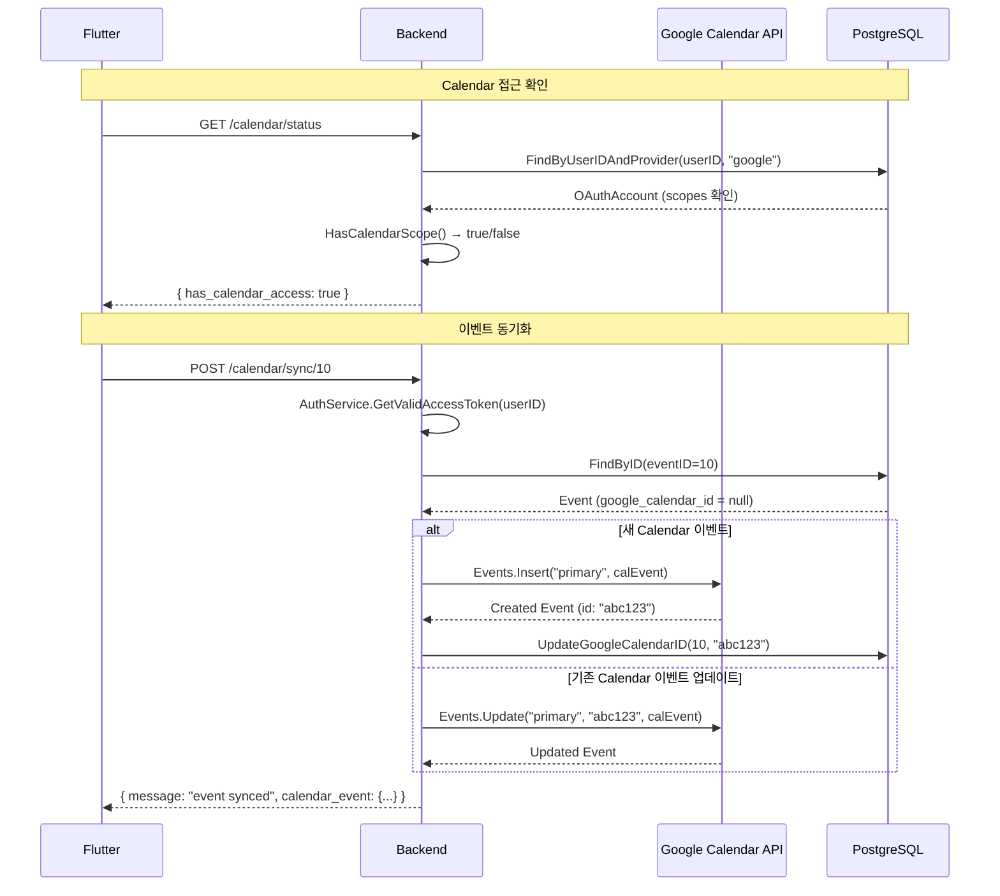

# Google Calendar 연동 서버 코드 분석

> Google Calendar API v3 동기화 전체 분석

---

## 개요

timingle 이벤트를 **Google Calendar에 동기화**하는 시스템입니다.

**핵심 기능:**
- Google Calendar 이벤트 조회 (기간별)
- timingle 이벤트 → Google Calendar 동기화 (생성/업데이트)
- Calendar 접근 권한 확인
- OAuth 토큰 자동 갱신 (AuthService 연동)

**전제조건:** Google Calendar 로그인 완료 (`calendar.events` scope 보유)
→ [Google 로그인](google-login.md) 참조

---

## 파일 구조

| 레이어 | 파일 | 역할 |
|--------|------|------|
| Handler | `internal/handlers/calendar_handler.go` | HTTP 요청 처리 |
| Service | `internal/services/calendar_service.go` | Calendar API 호출 |
| 의존성 | `internal/services/auth_service.go` | OAuth 토큰 관리 |
| 의존성 | `internal/repositories/oauth_repository.go` | OAuth 계정 DB |
| 의존성 | `internal/repositories/event_repository.go` | 이벤트 DB |

---

## API 엔드포인트 (모두 Protected)

| Method | Path | 설명 |
|--------|------|------|
| GET | `/api/v1/calendar/status` | Calendar 접근 권한 확인 |
| GET | `/api/v1/calendar/events` | Google Calendar 이벤트 조회 |
| POST | `/api/v1/calendar/sync/:event_id` | timingle 이벤트 → Calendar 동기화 |

---

## 동기화 흐름



---

## 코드 상세 분석

### Calendar Service

```go
type CalendarService struct {
    authService *AuthService                    // OAuth 토큰 관리
    eventRepo   *repositories.EventRepository   // timingle 이벤트 DB
    oauthRepo   *repositories.OAuthRepository   // OAuth 계정 DB
}

// getCalendarService - Google Calendar API 클라이언트 생성
func (s *CalendarService) getCalendarService(ctx context.Context, userID int64) (*calendar.Service, error) {
    // 1. 유효한 Access Token 가져오기 (만료 시 자동 갱신)
    accessToken, _ := s.authService.GetValidAccessToken(ctx, userID)

    // 2. OAuth2 Token Source 생성
    token := &oauth2.Token{
        AccessToken: accessToken,
        TokenType:   "Bearer",
    }
    tokenSource := oauth2.StaticTokenSource(token)

    // 3. Calendar Service 생성
    return calendar.NewService(ctx, option.WithTokenSource(tokenSource))
}

// GetCalendarEvents - Google Calendar 이벤트 조회
func (s *CalendarService) GetCalendarEvents(ctx context.Context, userID int64, startTime, endTime time.Time) ([]*CalendarEvent, error) {
    calendarService, _ := s.getCalendarService(ctx, userID)

    events, _ := calendarService.Events.List("primary").
        TimeMin(startTime.Format(time.RFC3339)).
        TimeMax(endTime.Format(time.RFC3339)).
        SingleEvents(true).          // 반복 이벤트 개별 처리
        OrderBy("startTime").
        MaxResults(100).
        Do()

    // Google Event → CalendarEvent 변환
    // DateTime (시간 지정) / Date (종일 이벤트) 구분 처리
    for _, item := range events.Items {
        if item.Start.DateTime != "" {
            t, _ := time.Parse(time.RFC3339, item.Start.DateTime)
        } else if item.Start.Date != "" {
            t, _ := time.Parse("2006-01-02", item.Start.Date)
        }
    }
}

// SyncEventToCalendar - timingle 이벤트 → Google Calendar 동기화
func (s *CalendarService) SyncEventToCalendar(ctx context.Context, userID int64, eventID int64) (*CalendarEvent, error) {
    // 1. timingle 이벤트 조회
    event, _ := s.eventRepo.FindByID(eventID)

    // 2. 이미 Google Calendar ID가 있으면 → 업데이트
    if event.GoogleCalendarID != nil && *event.GoogleCalendarID != "" {
        return s.UpdateCalendarEvent(ctx, userID, *event.GoogleCalendarID, event)
    }

    // 3. 없으면 → 새로 생성
    calEvent, _ := s.CreateCalendarEvent(ctx, userID, event)

    // 4. Google Calendar ID를 이벤트에 저장
    s.eventRepo.UpdateGoogleCalendarID(eventID, calEvent.ID)

    return calEvent, nil
}

// CreateCalendarEvent - Google Calendar에 이벤트 생성
func (s *CalendarService) CreateCalendarEvent(ctx context.Context, userID int64, event *models.Event) (*CalendarEvent, error) {
    calEvent := &calendar.Event{
        Summary:     event.Title,
        Description: description,
        Location:    location,
        Start: &calendar.EventDateTime{
            DateTime: event.StartTime.Format(time.RFC3339),
            TimeZone: "Asia/Seoul",
        },
        End: &calendar.EventDateTime{
            DateTime: event.EndTime.Format(time.RFC3339),
            TimeZone: "Asia/Seoul",
        },
    }
    createdEvent, _ := calendarService.Events.Insert("primary", calEvent).Do()
    // ... CalendarEvent 반환
}

// HasCalendarAccess - Calendar 접근 권한 확인
func (s *CalendarService) HasCalendarAccess(ctx context.Context, userID int64) (bool, error) {
    oauthAccount, _ := s.oauthRepo.FindByUserIDAndProvider(userID, models.OAuthProviderGoogle)
    if oauthAccount == nil { return false, nil }
    return oauthAccount.HasCalendarScope(), nil
}
```

### Calendar Handler

```go
// GetCalendarEvents - Google Calendar 이벤트 목록
// GET /api/v1/calendar/events?start_time=...&end_time=...
func (h *CalendarHandler) GetCalendarEvents(c *gin.Context) {
    userID, _ := c.Get("userID")

    // 시간 범위 파싱 (기본값: 이번 달)
    var startTime, endTime time.Time
    if req.StartTime != "" {
        startTime, _ = time.Parse(time.RFC3339, req.StartTime)
    } else {
        now := time.Now()
        startTime = time.Date(now.Year(), now.Month(), 1, 0, 0, 0, 0, now.Location())
    }
    if req.EndTime != "" {
        endTime, _ = time.Parse(time.RFC3339, req.EndTime)
    } else {
        endTime = startTime.AddDate(0, 1, 0).Add(-time.Second)  // 월말
    }

    events, _ := h.calendarService.GetCalendarEvents(ctx, userID, startTime, endTime)
    c.JSON(200, gin.H{"events": events, "start_time": startTime, "end_time": endTime, "count": len(events)})
}

// SyncEventToCalendar - 이벤트 동기화
// POST /api/v1/calendar/sync/:event_id
func (h *CalendarHandler) SyncEventToCalendar(c *gin.Context) {
    userID, _ := c.Get("userID")
    eventID, _ := strconv.ParseInt(c.Param("event_id"), 10, 64)
    calEvent, _ := h.calendarService.SyncEventToCalendar(ctx, userID, eventID)
    c.JSON(200, gin.H{"message": "event synced to Google Calendar", "calendar_event": calEvent})
}

// CheckCalendarAccess - 접근 권한 확인
// GET /api/v1/calendar/status
func (h *CalendarHandler) CheckCalendarAccess(c *gin.Context) {
    hasAccess, _ := h.calendarService.HasCalendarAccess(ctx, userID)
    c.JSON(200, gin.H{"has_calendar_access": hasAccess})
}
```

---

## 데이터 모델

### CalendarEvent (API 응답용)

```go
type CalendarEvent struct {
    ID          string    `json:"id"`           // Google Calendar Event ID
    Summary     string    `json:"summary"`      // 제목
    Description string    `json:"description"`  // 설명
    Location    string    `json:"location"`     // 장소
    StartTime   time.Time `json:"start_time"`   // 시작 시간
    EndTime     time.Time `json:"end_time"`     // 종료 시간
    HtmlLink    string    `json:"html_link"`    // Google Calendar 웹 링크
}
```

### Event.GoogleCalendarID (연동 ID)

```go
type Event struct {
    // ... 기존 필드
    GoogleCalendarID *string  // Google Calendar Event ID (nullable)
}
```

---

## 동기화 전략

```
timingle Event                        Google Calendar
┌─────────────────┐                  ┌─────────────────┐
│ ID: 10          │                  │ ID: "abc123"    │
│ Title: "팀 저녁" │  ←── 동기화 ───→ │ Summary: "팀 저녁"|
│ GoogleCalendar  │                  │                 │
│ ID: "abc123"    │                  │                 │
└─────────────────┘                  └─────────────────┘

동기화 규칙:
1. GoogleCalendarID == null → 새로 생성 (Events.Insert)
2. GoogleCalendarID != null → 업데이트 (Events.Update)
3. 동기화는 사용자가 수동으로 요청 (자동 동기화 없음)
4. Calendar "primary" (기본 캘린더)에만 동기화
5. TimeZone: "Asia/Seoul" 고정
```

---

## Request/Response 예시

### Calendar 접근 확인

```http
GET /api/v1/calendar/status
Authorization: Bearer ...
```

**Response (200):**
```json
{ "has_calendar_access": true }
```

### Calendar 이벤트 조회

```http
GET /api/v1/calendar/events?start_time=2026-03-01T00:00:00Z&end_time=2026-03-31T23:59:59Z
Authorization: Bearer ...
```

**Response (200):**
```json
{
  "events": [
    {
      "id": "abc123",
      "summary": "팀 저녁 식사",
      "description": "분기별 팀 모임",
      "location": "강남역 근처",
      "start_time": "2026-03-01T18:00:00+09:00",
      "end_time": "2026-03-01T20:00:00+09:00",
      "html_link": "https://calendar.google.com/calendar/event?eid=..."
    }
  ],
  "start_time": "2026-03-01T00:00:00Z",
  "end_time": "2026-03-31T23:59:59Z",
  "count": 1
}
```

### 이벤트 동기화

```http
POST /api/v1/calendar/sync/10
Authorization: Bearer ...
```

**Response (200):**
```json
{
  "message": "event synced to Google Calendar",
  "calendar_event": {
    "id": "abc123",
    "summary": "팀 저녁 식사",
    "start_time": "2026-03-01T18:00:00+09:00",
    "end_time": "2026-03-01T20:00:00+09:00",
    "html_link": "https://calendar.google.com/calendar/event?eid=..."
  }
}
```

---

## 토큰 관리 흐름

```
Calendar API 호출 시:
1. CalendarService.getCalendarService(userID)
2. AuthService.GetValidAccessToken(userID)
   ├─ OAuthRepo에서 토큰 조회
   ├─ 만료 확인 (token_expiry < now)
   ├─ 만료 시: Google OAuth 서버에 refresh_token으로 갱신
   ├─ DB에 새 access_token + token_expiry 저장
   └─ 유효한 access_token 반환
3. oauth2.StaticTokenSource(token) 생성
4. calendar.NewService(ctx, option.WithTokenSource(...))
```

---

## 에러 처리

| 상황 | HTTP | 메시지 |
|------|------|--------|
| JWT 없음/만료 | 401 | `unauthorized` |
| start_time 형식 오류 | 400 | `invalid start_time format, use RFC3339` |
| event_id 오류 | 400 | `invalid event_id` |
| Calendar 권한 없음 | 500 | `failed to get access token` |
| Google API 실패 | 500 | `failed to get calendar events` |
| 이벤트 없음 | 500 | `event not found` |
| Calendar ID 저장 실패 | - | 경고 로그만 (동기화 자체는 성공) |

---

## 관련 문서

- [Google 로그인](google-login.md) - OAuth 토큰 발급, Calendar scope
- [이벤트 관리](events.md) - timingle 이벤트 (GoogleCalendarID 필드)
- [전체 인덱스](README.md)

---

**작성일:** 2026-02-19
