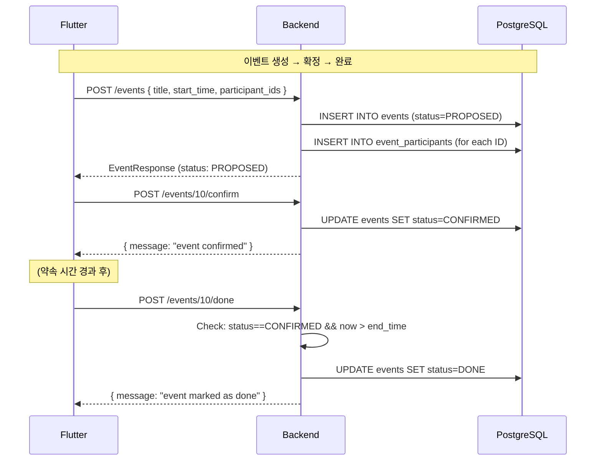

# 이벤트 시스템 서버 코드 분석

> 이벤트 CRUD, 상태 머신, 참가자 관리 전체 분석

---

## 개요

timingle의 핵심 엔티티인 **이벤트(약속)**의 전체 생명주기를 관리합니다.

**핵심 기능:**
- 이벤트 CRUD (생성/조회/수정/삭제)
- 상태 머신: `PROPOSED` → `CONFIRMED` → `DONE` / `CANCELED`
- 참가자 관리 (추가/제거/확인)
- 권한 체크 (생성자 vs 참가자)

---

## 이벤트 상태 머신

```
         ┌─────────────┐
         │   PROPOSED   │  ← 이벤트 생성 시 초기 상태
         └──────┬───────┘
                │
        ┌───────┼────────┐
        │                │
        ▼                ▼
┌──────────────┐  ┌────────────┐
│  CONFIRMED   │  │  CANCELED  │
└──────┬───────┘  └────────────┘
       │
       ├──────────┐
       │          │
       ▼          ▼
┌──────────┐ ┌────────────┐
│   DONE   │ │  CANCELED  │
└──────────┘ └────────────┘
```

| 전환 | 조건 | 권한 |
|------|------|------|
| PROPOSED → CONFIRMED | 없음 | Creator만 |
| PROPOSED → CANCELED | 없음 | Creator만 |
| CONFIRMED → DONE | end_time 경과 | Creator만 |
| CONFIRMED → CANCELED | DONE 상태가 아닌 경우 | Creator만 |

---

## 파일 구조

| 레이어 | 파일 | 역할 |
|--------|------|------|
| Handler | `internal/handlers/event_handler.go` | HTTP 요청 처리 |
| Service | `internal/services/event_service.go` | 비즈니스 로직 |
| Repository | `internal/repositories/event_repository.go` | DB CRUD |
| Model | `internal/models/event.go` | 데이터 구조 |

---

## API 엔드포인트 (모두 Protected)

### 이벤트 CRUD

| Method | Path | 설명 |
|--------|------|------|
| POST | `/api/v1/events` | 이벤트 생성 |
| GET | `/api/v1/events` | 내 이벤트 목록 |
| GET | `/api/v1/events/:id` | 이벤트 상세 |
| PUT | `/api/v1/events/:id` | 이벤트 수정 (Creator) |
| DELETE | `/api/v1/events/:id` | 이벤트 삭제 (Creator) |

### 참가자 관리

| Method | Path | 설명 |
|--------|------|------|
| POST | `/events/:id/participants` | 참가자 추가 (Creator) |
| DELETE | `/events/:id/participants/:pid` | 참가자 제거 (Creator/본인) |
| POST | `/events/:id/confirm-participation` | 참가 확인 (참가자 본인) |

### 상태 변경

| Method | Path | 설명 |
|--------|------|------|
| POST | `/events/:id/confirm` | PROPOSED→CONFIRMED (Creator) |
| POST | `/events/:id/cancel` | →CANCELED (Creator) |
| POST | `/events/:id/done` | CONFIRMED→DONE (Creator, past end_time) |

---

### Request/Response 예시

**이벤트 생성:**
```http
POST /api/v1/events
Authorization: Bearer ...

{
  "title": "팀 저녁 식사",
  "description": "분기별 팀 모임",
  "start_time": "2026-03-01T18:00:00+09:00",
  "end_time": "2026-03-01T20:00:00+09:00",
  "location": "강남역 근처",
  "participant_ids": [2, 3, 5]
}
```

**Response (201):**
```json
{
  "id": 10,
  "title": "팀 저녁 식사",
  "description": "분기별 팀 모임",
  "start_time": "2026-03-01T18:00:00+09:00",
  "end_time": "2026-03-01T20:00:00+09:00",
  "location": "강남역 근처",
  "status": "PROPOSED",
  "creator": { "id": 1, "name": "홍길동", "phone": "010..." },
  "participants": [
    { "id": 2, "name": "김영희" },
    { "id": 3, "name": "이철수" }
  ]
}
```

**이벤트 목록 조회:**
```http
GET /api/v1/events?status=CONFIRMED
Authorization: Bearer ...
```

---

## 코드 상세 분석

### Service Layer 핵심 로직

```go
// CreateEvent - 이벤트 생성
func (s *EventService) CreateEvent(creatorID int64, req *models.CreateEventRequest) (*models.EventResponse, error) {
    // 1. 시간 검증
    if req.EndTime.Before(req.StartTime) {
        return nil, fmt.Errorf("end time must be after start time")
    }
    // 2. 이벤트 생성 (상태: PROPOSED)
    event := &models.Event{
        Title: req.Title, CreatorID: creatorID,
        Status: models.EventStatusProposed, ...
    }
    s.eventRepo.Create(event)
    // 3. 참가자 추가
    for _, pid := range req.ParticipantIDs {
        s.eventRepo.AddParticipant(event.ID, pid)
    }
    // 4. 전체 응답 (Creator + Participants 포함)
    return s.GetEvent(event.ID)
}

// GetEvent - 이벤트 상세 조회
func (s *EventService) GetEvent(eventID int64) (*models.EventResponse, error) {
    event, _ := s.eventRepo.FindByID(eventID)
    creator, _ := s.userRepo.FindByID(event.CreatorID)
    participantIDs, _ := s.eventRepo.FindParticipants(eventID)
    participants, _ := s.userRepo.FindByIDs(participantIDs)
    // EventWithParticipants → EventResponse 변환
    return eventWithParticipants.ToEventResponse(), nil
}

// GetUserEvents - 내 이벤트 목록 (생성 + 참가 합치기)
func (s *EventService) GetUserEvents(userID int64, status string) ([]*models.EventResponse, error) {
    created, _ := s.eventRepo.FindByCreatorID(userID, status)
    participating, _ := s.eventRepo.FindByParticipantID(userID, status)
    // Map으로 중복 제거 → 정렬 (start_time DESC)
}

// ConfirmEvent - 이벤트 확정
func (s *EventService) ConfirmEvent(eventID, userID int64) error {
    event, _ := s.eventRepo.FindByID(eventID)
    if event.CreatorID != userID { return "only creator can confirm" }
    event.Status = models.EventStatusConfirmed
    return s.eventRepo.Update(event)
}

// MarkEventDone - 이벤트 완료
func (s *EventService) MarkEventDone(eventID, userID int64) error {
    event, _ := s.eventRepo.FindByID(eventID)
    if event.CreatorID != userID { return "only creator" }
    if event.Status != EventStatusConfirmed { return "only confirmed events" }
    if time.Now().Before(event.EndTime) { return "event has not ended yet" }
    event.Status = models.EventStatusDone
    return s.eventRepo.Update(event)
}
```

### 권한 모델

| 작업 | Creator | 참가자 |
|------|---------|--------|
| 이벤트 조회 | ✅ | ✅ |
| 이벤트 수정 | ✅ | ❌ |
| 이벤트 삭제 | ✅ | ❌ |
| 상태 변경 | ✅ | ❌ |
| 참가자 추가 | ✅ | ❌ |
| 참가자 제거 | ✅ | 본인만 |
| 참가 확인 | ❌ | ✅ (본인) |

---

## 데이터 모델

```go
type Event struct {
    ID               int64       // PK
    Title            string      // 필수
    Description      *string     // 선택
    StartTime        time.Time   // 필수
    EndTime          time.Time   // 필수
    Location         *string     // 선택
    CreatorID        int64       // FK → users.id
    Status           EventStatus // PROPOSED/CONFIRMED/CANCELED/DONE
    GoogleCalendarID *string     // Google Calendar 연동 ID
}

type EventParticipant struct {
    EventID     int64      // FK → events.id
    UserID      int64      // FK → users.id
    Confirmed   bool       // 참가 확인 여부
    ConfirmedAt *time.Time // 확인 시간
}
```

---

## 시퀀스 다이어그램



---

## 에러 처리

| 상황 | HTTP | 메시지 |
|------|------|--------|
| 잘못된 event ID | 400 | `invalid event ID` |
| 이벤트 없음 | 404 | `event not found` |
| end_time < start_time | 400 | `end time must be after start time` |
| 권한 없음 (수정) | 400 | `only creator can update event` |
| 완료된 이벤트 취소 | 400 | `cannot cancel completed event` |
| 아직 끝나지 않은 이벤트 완료 | 400 | `event has not ended yet` |
| 미확정 이벤트 완료 | 400 | `only confirmed events can be marked as done` |

---

## 관련 문서

- [채팅 시스템](chat.md) - 이벤트별 채팅
- [초대 시스템](invites.md) - 이벤트 초대 링크
- [Calendar 연동](calendar.md) - Google Calendar 동기화
- [전체 인덱스](README.md)

---

**작성일:** 2026-02-19
