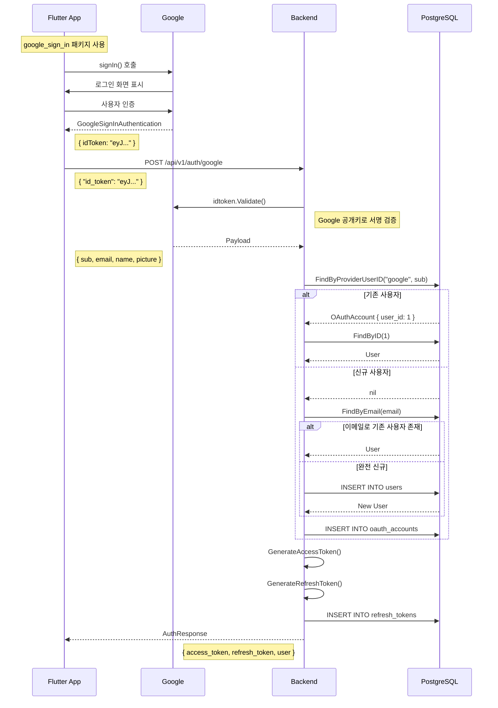
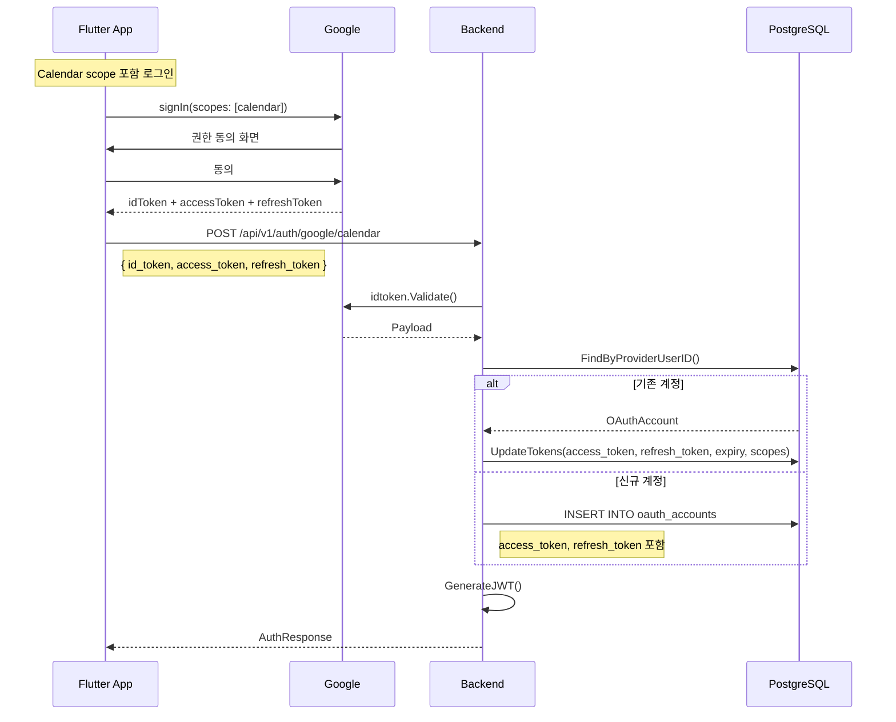
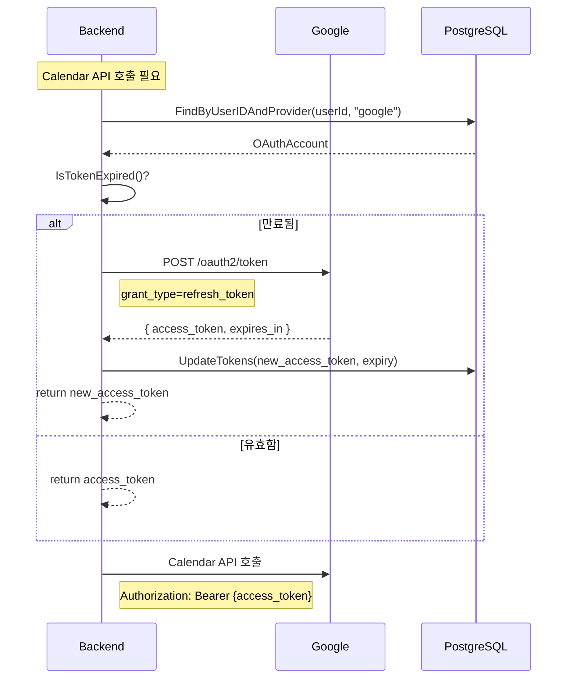

# Google Login 서버 코드 완전 분석

> 이 문서만으로 Google 로그인 기능의 전체 코드를 이해할 수 있도록 작성됨

---

## 목차

1. [개요](#개요)
2. [아키텍처](#아키텍처)
3. [파일 구조](#파일-구조)
4. [API 엔드포인트](#api-엔드포인트)
5. [코드 상세 분석](#코드-상세-분석)
   - [Handler Layer](#1-handler-layer)
   - [Service Layer](#2-service-layer)
   - [Repository Layer](#3-repository-layer)
   - [Model Layer](#4-model-layer)
   - [Utility Layer](#5-utility-layer)
6. [데이터베이스 스키마](#데이터베이스-스키마)
7. [인증 흐름](#인증-흐름)
8. [환경 설정](#환경-설정)
9. [에러 처리](#에러-처리)
10. [보안 고려사항](#보안-고려사항)

---

## 개요

timingle의 Google 로그인은 **두 가지 방식**을 지원합니다:

| 방식 | 엔드포인트 | 용도 |
|------|-----------|------|
| 기본 로그인 | `POST /api/v1/auth/google` | 인증만 수행 |
| Calendar 로그인 | `POST /api/v1/auth/google/calendar` | 인증 + Calendar API 권한 |

**핵심 기능:**
- Google ID Token 검증 (google.golang.org/api/idtoken)
- 멀티 플랫폼 지원 (Android, iOS, Web Client ID)
- 자동 사용자 생성 (이메일 기반)
- OAuth 계정 연동 (users ↔ oauth_accounts)
- JWT Access/Refresh Token 발급
- Google Calendar API 토큰 저장 및 자동 갱신

---

## 아키텍처

### 레이어 구조

```
┌─────────────────────────────────────────────────────────────────────┐
│                         Flutter App                                  │
│   google_sign_in 패키지 → ID Token 획득                             │
└───────────────────────────────┬─────────────────────────────────────┘
                                │ POST /api/v1/auth/google
                                ▼
┌─────────────────────────────────────────────────────────────────────┐
│  HANDLER LAYER                                                       │
│  [auth_handler.go]                                                  │
│  - HTTP 요청 파싱 (JSON → struct)                                   │
│  - 응답 반환 (struct → JSON)                                        │
│  - 에러 핸들링 (400, 401)                                           │
└───────────────────────────────┬─────────────────────────────────────┘
                                │
                                ▼
┌─────────────────────────────────────────────────────────────────────┐
│  SERVICE LAYER                                                       │
│  [auth_service.go]                                                  │
│  - ID Token 검증 (GoogleOAuthVerifier 사용)                         │
│  - 비즈니스 로직 (사용자 생성/조회, OAuth 연동)                      │
│  - JWT 토큰 생성 (JWTManager 사용)                                  │
└───────────────────────────────┬─────────────────────────────────────┘
                                │
                                ▼
┌─────────────────────────────────────────────────────────────────────┐
│  REPOSITORY LAYER                                                    │
│  [oauth_repository.go] [user_repository.go] [auth_repository.go]   │
│  - SQL 쿼리 실행                                                    │
│  - Parameterized Query (SQL Injection 방지)                         │
│  - PostgreSQL 연동                                                  │
└───────────────────────────────┬─────────────────────────────────────┘
                                │
                                ▼
┌─────────────────────────────────────────────────────────────────────┐
│  UTILITY LAYER                                                       │
│  [google_oauth.go] [jwt.go]                                         │
│  - Google ID Token 검증                                             │
│  - Access Token 갱신                                                │
│  - JWT 생성/검증                                                    │
└───────────────────────────────┬─────────────────────────────────────┘
                                │
                                ▼
┌─────────────────────────────────────────────────────────────────────┐
│  DATA LAYER                                                          │
│  [PostgreSQL]                                                       │
│  - users: 사용자 정보                                               │
│  - oauth_accounts: OAuth 연동 정보 + Google 토큰                    │
│  - refresh_tokens: JWT Refresh Token                                │
└─────────────────────────────────────────────────────────────────────┘
```

### 의존성 주입

```
main.go
    │
    ├── NewGoogleOAuthVerifierWithSecret()  → GoogleOAuthVerifier
    ├── NewJWTManager()                     → JWTManager
    │
    ├── NewUserRepository(db)               → UserRepository
    ├── NewAuthRepository(db)               → AuthRepository
    ├── NewOAuthRepository(db)              → OAuthRepository
    │
    ├── NewAuthService(userRepo, authRepo, oauthRepo, jwtManager, googleVerifier)
    │       → AuthService
    │
    └── NewAuthHandler(authService)         → AuthHandler
```

---

## 파일 구조

```
backend/
├── cmd/api/
│   └── main.go                    # 라우팅, DI 설정
│
├── internal/
│   ├── handlers/
│   │   └── auth_handler.go        # HTTP 핸들러 (GoogleLogin, GoogleCalendarLogin)
│   │
│   ├── services/
│   │   └── auth_service.go        # 비즈니스 로직 (GoogleLogin, GoogleLoginWithCalendar)
│   │
│   ├── repositories/
│   │   └── oauth_repository.go    # OAuth 계정 CRUD
│   │
│   └── models/
│       └── oauth.go               # 데이터 구조체
│
├── pkg/utils/
│   └── google_oauth.go            # Google OAuth 유틸리티
│
└── migrations/
    ├── 005_create_oauth_accounts_table.sql
    └── 006_add_oauth_tokens.sql
```

---

## API 엔드포인트

### 1. 기본 Google 로그인

```http
POST /api/v1/auth/google
Content-Type: application/json

{
  "id_token": "eyJhbGciOiJSUzI1NiIsInR5cCI6IkpXVCJ9...",
  "platform": "android"
}
```

| 필드 | 타입 | 필수 | 설명 |
|------|------|------|------|
| id_token | string | ✅ | Flutter google_sign_in에서 받은 ID Token |
| platform | string | - | "web", "android", "ios" |

**성공 응답 (200):**
```json
{
  "access_token": "eyJhbGciOiJIUzI1NiIsInR5cCI6IkpXVCJ9...",
  "refresh_token": "a1b2c3d4e5f6...",
  "expires_in": 3600,
  "user": {
    "id": 1,
    "email": "user@gmail.com",
    "name": "홍길동",
    "profile_image": "https://lh3.googleusercontent.com/..."
  }
}
```

**에러 응답:**
```json
// 400 Bad Request - 요청 형식 오류
{ "error": "Key: 'GoogleLoginRequest.IDToken' Error:Field validation for 'IDToken' failed on the 'required' tag" }

// 401 Unauthorized - ID Token 검증 실패
{ "error": "invalid Google ID token: idtoken: token audience mismatch" }
```

### 2. Google Calendar 로그인

```http
POST /api/v1/auth/google/calendar
Content-Type: application/json

{
  "id_token": "eyJhbGciOiJSUzI1NiIsInR5cCI6IkpXVCJ9...",
  "access_token": "ya29.a0ARrdaM...",
  "refresh_token": "1//0eXXX...",
  "platform": "android"
}
```

| 필드 | 타입 | 필수 | 설명 |
|------|------|------|------|
| id_token | string | ✅ | Google ID Token |
| access_token | string | ✅ | Google Calendar API 호출용 Access Token |
| refresh_token | string | - | Access Token 갱신용 (첫 로그인 시 필수) |
| platform | string | - | "web", "android", "ios" |

**응답:** 기본 로그인과 동일

---

## 코드 상세 분석

### 1. Handler Layer

📁 **backend/internal/handlers/auth_handler.go**

```go
package handlers

import (
    "net/http"

    "github.com/gin-gonic/gin"
    "github.com/khchoi-tnh/timingle/internal/models"
    "github.com/khchoi-tnh/timingle/internal/services"
)

// AuthHandler handles authentication HTTP requests
type AuthHandler struct {
    authService *services.AuthService
}

// NewAuthHandler creates a new auth handler
func NewAuthHandler(authService *services.AuthService) *AuthHandler {
    return &AuthHandler{
        authService: authService,
    }
}

// GoogleLogin handles Google OAuth login
// POST /api/v1/auth/google
// Request body: { "id_token": "..." }
// Response: AuthResponse with access_token, refresh_token, user
func (h *AuthHandler) GoogleLogin(c *gin.Context) {
    // 1. JSON 요청 파싱
    var req models.GoogleLoginRequest
    if err := c.ShouldBindJSON(&req); err != nil {
        // binding:"required" 태그 검증 실패 시
        c.JSON(http.StatusBadRequest, gin.H{"error": err.Error()})
        return
    }

    // 2. Service 레이어 호출
    response, err := h.authService.GoogleLogin(c.Request.Context(), &req)
    if err != nil {
        // ID Token 검증 실패, 사용자 생성 실패 등
        c.JSON(http.StatusUnauthorized, gin.H{"error": err.Error()})
        return
    }

    // 3. 성공 응답
    c.JSON(http.StatusOK, response)
}

// GoogleCalendarLogin handles Google OAuth login with Calendar scope
// POST /api/v1/auth/google/calendar
// Request body: { "id_token": "...", "access_token": "...", "refresh_token": "..." }
// Response: AuthResponse with access_token, refresh_token, user
// This endpoint saves the Google access_token and refresh_token for Calendar API access
func (h *AuthHandler) GoogleCalendarLogin(c *gin.Context) {
    var req models.GoogleCalendarLoginRequest
    if err := c.ShouldBindJSON(&req); err != nil {
        c.JSON(http.StatusBadRequest, gin.H{"error": err.Error()})
        return
    }

    response, err := h.authService.GoogleLoginWithCalendar(c.Request.Context(), &req)
    if err != nil {
        c.JSON(http.StatusUnauthorized, gin.H{"error": err.Error()})
        return
    }

    c.JSON(http.StatusOK, response)
}
```

**핵심 포인트:**
- `c.ShouldBindJSON()`: JSON → struct 변환 + validation 태그 검증
- `c.Request.Context()`: 요청 컨텍스트 전달 (timeout, cancellation 지원)
- 에러 시 401 반환 (인증 실패)

---

### 2. Service Layer

📁 **backend/internal/services/auth_service.go**

```go
package services

import (
    "context"
    "fmt"
    "time"

    "github.com/khchoi-tnh/timingle/internal/models"
    "github.com/khchoi-tnh/timingle/internal/repositories"
    "github.com/khchoi-tnh/timingle/pkg/utils"
)

// CalendarScope is the Google Calendar API scope
const CalendarScope = "https://www.googleapis.com/auth/calendar"

// AuthService handles authentication business logic
type AuthService struct {
    userRepo       *repositories.UserRepository
    authRepo       *repositories.AuthRepository
    oauthRepo      *repositories.OAuthRepository
    jwtManager     *utils.JWTManager
    googleVerifier *utils.GoogleOAuthVerifier
}

// NewAuthService creates a new auth service
func NewAuthService(
    userRepo *repositories.UserRepository,
    authRepo *repositories.AuthRepository,
    oauthRepo *repositories.OAuthRepository,
    jwtManager *utils.JWTManager,
    googleVerifier *utils.GoogleOAuthVerifier,
) *AuthService {
    return &AuthService{
        userRepo:       userRepo,
        authRepo:       authRepo,
        oauthRepo:      oauthRepo,
        jwtManager:     jwtManager,
        googleVerifier: googleVerifier,
    }
}

// GoogleLogin handles Google OAuth login
// Flow:
// 1. Verify Google ID token
// 2. Find or create user based on Google email
// 3. Link/update OAuth account
// 4. Generate JWT tokens
func (s *AuthService) GoogleLogin(ctx context.Context, req *models.GoogleLoginRequest) (*models.AuthResponse, error) {
    // ============================================
    // STEP 1: Google ID Token 검증
    // ============================================
    // Google 공개키로 서명 검증 + Client ID 매칭
    googlePayload, err := s.googleVerifier.VerifyIDToken(ctx, req.IDToken)
    if err != nil {
        return nil, fmt.Errorf("invalid Google ID token: %w", err)
    }
    // googlePayload 내용:
    // - Subject: "123456789012345678901" (Google 고유 사용자 ID)
    // - Email: "user@gmail.com"
    // - Name: "홍길동"
    // - Picture: "https://lh3.googleusercontent.com/..."

    // ============================================
    // STEP 2: 기존 OAuth 계정 확인
    // ============================================
    // provider="google" AND provider_user_id=Subject 로 조회
    oauthAccount, err := s.oauthRepo.FindByProviderUserID(
        models.OAuthProviderGoogle,
        googlePayload.Subject,
    )
    if err != nil {
        return nil, fmt.Errorf("failed to check OAuth account: %w", err)
    }

    var user *models.User

    if oauthAccount != nil {
        // ============================================
        // CASE A: 기존 OAuth 계정이 있는 경우
        // ============================================
        // 연결된 사용자 조회
        user, err = s.userRepo.FindByID(oauthAccount.UserID)
        if err != nil {
            return nil, fmt.Errorf("failed to find user: %w", err)
        }

        // 프로필 정보 변경 시 업데이트 (이름, 사진 등)
        if needsUpdate(oauthAccount, googlePayload) {
            oauthAccount.Email = &googlePayload.Email
            oauthAccount.Name = &googlePayload.Name
            oauthAccount.PictureURL = &googlePayload.Picture
            _ = s.oauthRepo.Update(oauthAccount) // 실패해도 로그인은 진행
        }
    } else {
        // ============================================
        // CASE B: 신규 OAuth 계정인 경우
        // ============================================
        // 이메일로 기존 사용자 확인 (다른 방법으로 가입한 경우)
        user, err = s.userRepo.FindByEmail(googlePayload.Email)
        if err != nil {
            return nil, fmt.Errorf("failed to find user by email: %w", err)
        }

        if user == nil {
            // 완전 신규 사용자: User 생성
            user, err = s.userRepo.CreateOAuthUser(
                googlePayload.Email,
                googlePayload.Name,
                googlePayload.Picture,
            )
            if err != nil {
                return nil, fmt.Errorf("failed to create user: %w", err)
            }
        }

        // OAuth 계정 연동 생성
        newOAuthAccount := &models.OAuthAccount{
            UserID:         user.ID,
            Provider:       models.OAuthProviderGoogle,
            ProviderUserID: googlePayload.Subject,
            Email:          &googlePayload.Email,
            Name:           &googlePayload.Name,
            PictureURL:     &googlePayload.Picture,
        }
        if err := s.oauthRepo.Create(newOAuthAccount); err != nil {
            return nil, fmt.Errorf("failed to link OAuth account: %w", err)
        }
    }

    // ============================================
    // STEP 3: JWT 토큰 발급
    // ============================================
    return s.generateAuthResponse(user)
}

// needsUpdate checks if OAuth account info needs to be updated
func needsUpdate(account *models.OAuthAccount, payload *models.GoogleTokenPayload) bool {
    if account.Email == nil || *account.Email != payload.Email {
        return true
    }
    if account.Name == nil || *account.Name != payload.Name {
        return true
    }
    if account.PictureURL == nil || *account.PictureURL != payload.Picture {
        return true
    }
    return false
}

// GoogleLoginWithCalendar handles Google OAuth login with Calendar scope
// This saves the access token and refresh token for Calendar API access
func (s *AuthService) GoogleLoginWithCalendar(ctx context.Context, req *models.GoogleCalendarLoginRequest) (*models.AuthResponse, error) {
    // ============================================
    // STEP 1: Google ID Token 검증 (기본 로그인과 동일)
    // ============================================
    googlePayload, err := s.googleVerifier.VerifyIDToken(ctx, req.IDToken)
    if err != nil {
        return nil, fmt.Errorf("invalid Google ID token: %w", err)
    }

    // ============================================
    // STEP 2: OAuth 계정 확인
    // ============================================
    oauthAccount, err := s.oauthRepo.FindByProviderUserID(
        models.OAuthProviderGoogle,
        googlePayload.Subject,
    )
    if err != nil {
        return nil, fmt.Errorf("failed to check OAuth account: %w", err)
    }

    var user *models.User

    // Google Access Token 만료 시간 계산 (기본 1시간)
    tokenExpiry := time.Now().Add(1 * time.Hour)
    // Calendar 권한 스코프
    scopes := []string{"https://www.googleapis.com/auth/calendar"}

    if oauthAccount != nil {
        // ============================================
        // CASE A: 기존 계정 - 토큰 업데이트
        // ============================================
        user, err = s.userRepo.FindByID(oauthAccount.UserID)
        if err != nil {
            return nil, fmt.Errorf("failed to find user: %w", err)
        }

        // Refresh Token: 새로 받았으면 업데이트, 없으면 기존 유지
        refreshToken := oauthAccount.RefreshToken
        if req.RefreshToken != "" {
            refreshToken = &req.RefreshToken
        }

        // 토큰 정보 업데이트
        err = s.oauthRepo.UpdateTokens(
            oauthAccount.ID,
            &req.AccessToken,   // Google API 호출용
            refreshToken,       // 토큰 갱신용
            &tokenExpiry,       // 만료 시간
            scopes,             // 권한 스코프
        )
        if err != nil {
            return nil, fmt.Errorf("failed to update OAuth tokens: %w", err)
        }

        // 프로필 정보 업데이트
        if needsUpdate(oauthAccount, googlePayload) {
            oauthAccount.Email = &googlePayload.Email
            oauthAccount.Name = &googlePayload.Name
            oauthAccount.PictureURL = &googlePayload.Picture
            _ = s.oauthRepo.Update(oauthAccount)
        }
    } else {
        // ============================================
        // CASE B: 신규 계정 - 토큰과 함께 생성
        // ============================================
        user, err = s.userRepo.FindByEmail(googlePayload.Email)
        if err != nil {
            return nil, fmt.Errorf("failed to find user by email: %w", err)
        }

        if user == nil {
            user, err = s.userRepo.CreateOAuthUser(
                googlePayload.Email,
                googlePayload.Name,
                googlePayload.Picture,
            )
            if err != nil {
                return nil, fmt.Errorf("failed to create user: %w", err)
            }
        }

        // Refresh Token 처리
        refreshToken := &req.RefreshToken
        if req.RefreshToken == "" {
            refreshToken = nil
        }

        // OAuth 계정 생성 (토큰 포함)
        newOAuthAccount := &models.OAuthAccount{
            UserID:         user.ID,
            Provider:       models.OAuthProviderGoogle,
            ProviderUserID: googlePayload.Subject,
            Email:          &googlePayload.Email,
            Name:           &googlePayload.Name,
            PictureURL:     &googlePayload.Picture,
            AccessToken:    &req.AccessToken,   // ← Calendar 연동의 핵심
            RefreshToken:   refreshToken,
            TokenExpiry:    &tokenExpiry,
            Scopes:         scopes,
        }
        if err := s.oauthRepo.Create(newOAuthAccount); err != nil {
            return nil, fmt.Errorf("failed to link OAuth account: %w", err)
        }
    }

    // ============================================
    // STEP 3: JWT 토큰 발급
    // ============================================
    return s.generateAuthResponse(user)
}

// GetValidAccessToken returns a valid access token for the user's Google account
// If the token is expired, it will be refreshed automatically
func (s *AuthService) GetValidAccessToken(ctx context.Context, userID int64) (string, error) {
    // 1. OAuth 계정 조회
    oauthAccount, err := s.oauthRepo.FindByUserIDAndProvider(userID, models.OAuthProviderGoogle)
    if err != nil {
        return "", fmt.Errorf("failed to find OAuth account: %w", err)
    }
    if oauthAccount == nil {
        return "", fmt.Errorf("no Google account linked")
    }

    // 2. Calendar 권한 확인
    if !oauthAccount.HasCalendarScope() {
        return "", fmt.Errorf("calendar permission not granted")
    }
    if oauthAccount.AccessToken == nil {
        return "", fmt.Errorf("no access token available")
    }

    // 3. 토큰 만료 확인 및 갱신
    if oauthAccount.IsTokenExpired() {
        if oauthAccount.RefreshToken == nil {
            return "", fmt.Errorf("access token expired and no refresh token available")
        }

        // Google OAuth 서버에 토큰 갱신 요청
        tokenResp, err := s.googleVerifier.RefreshAccessToken(ctx, *oauthAccount.RefreshToken)
        if err != nil {
            return "", fmt.Errorf("failed to refresh token: %w", err)
        }

        // DB에 새 토큰 저장
        tokenExpiry := utils.GetTokenExpiry(tokenResp.ExpiresIn)
        refreshToken := oauthAccount.RefreshToken
        if tokenResp.RefreshToken != "" {
            refreshToken = &tokenResp.RefreshToken
        }

        scopes := utils.ParseScopes(tokenResp.Scope)
        if len(scopes) == 0 {
            scopes = oauthAccount.Scopes
        }

        err = s.oauthRepo.UpdateTokens(
            oauthAccount.ID,
            &tokenResp.AccessToken,
            refreshToken,
            &tokenExpiry,
            scopes,
        )
        if err != nil {
            return "", fmt.Errorf("failed to update refreshed tokens: %w", err)
        }

        return tokenResp.AccessToken, nil
    }

    return *oauthAccount.AccessToken, nil
}

// generateAuthResponse generates access and refresh tokens for a user
func (s *AuthService) generateAuthResponse(user *models.User) (*models.AuthResponse, error) {
    // 1. JWT Access Token 생성
    accessToken, err := s.jwtManager.GenerateAccessToken(user)
    if err != nil {
        return nil, fmt.Errorf("failed to generate access token: %w", err)
    }

    // 2. Refresh Token 생성 (랜덤 문자열)
    refreshTokenString, err := s.jwtManager.GenerateRefreshToken()
    if err != nil {
        return nil, fmt.Errorf("failed to generate refresh token: %w", err)
    }

    // 3. Refresh Token DB 저장
    refreshToken := &models.RefreshToken{
        UserID:    user.ID,
        Token:     refreshTokenString,
        ExpiresAt: time.Now().Add(s.jwtManager.GetRefreshExpiry()),
    }

    if err := s.authRepo.SaveRefreshToken(refreshToken); err != nil {
        return nil, fmt.Errorf("failed to save refresh token: %w", err)
    }

    // 4. 응답 구성
    return &models.AuthResponse{
        AccessToken:  accessToken,
        RefreshToken: refreshTokenString,
        ExpiresIn:    int64(s.jwtManager.GetAccessExpiry().Seconds()),
        User:         user.ToUserResponse(),
    }, nil
}
```

---

### 3. Repository Layer

📁 **backend/internal/repositories/oauth_repository.go**

```go
package repositories

import (
    "database/sql"
    "fmt"
    "time"

    "github.com/lib/pq"

    "github.com/khchoi-tnh/timingle/internal/models"
)

// OAuthRepository handles OAuth account data operations
type OAuthRepository struct {
    db *sql.DB
}

// NewOAuthRepository creates a new OAuth repository
func NewOAuthRepository(db *sql.DB) *OAuthRepository {
    return &OAuthRepository{db: db}
}

// ============================================
// 조회 메서드
// ============================================

// FindByProviderUserID finds an OAuth account by provider and provider user ID
// 예: FindByProviderUserID("google", "123456789012345678901")
func (r *OAuthRepository) FindByProviderUserID(provider models.OAuthProvider, providerUserID string) (*models.OAuthAccount, error) {
    query := `
        SELECT id, user_id, provider, provider_user_id, email, name, picture_url,
               access_token, refresh_token, token_expiry, scopes,
               created_at, updated_at
        FROM oauth_accounts
        WHERE provider = $1 AND provider_user_id = $2
    `

    account := &models.OAuthAccount{}
    var scopes pq.StringArray  // PostgreSQL TEXT[] 타입 처리
    err := r.db.QueryRow(query, provider, providerUserID).Scan(
        &account.ID,
        &account.UserID,
        &account.Provider,
        &account.ProviderUserID,
        &account.Email,
        &account.Name,
        &account.PictureURL,
        &account.AccessToken,
        &account.RefreshToken,
        &account.TokenExpiry,
        &scopes,
        &account.CreatedAt,
        &account.UpdatedAt,
    )
    account.Scopes = []string(scopes)

    if err == sql.ErrNoRows {
        return nil, nil  // Not found (에러가 아님)
    }
    if err != nil {
        return nil, fmt.Errorf("failed to find OAuth account: %w", err)
    }

    return account, nil
}

// FindByUserID finds all OAuth accounts linked to a user
func (r *OAuthRepository) FindByUserID(userID int64) ([]*models.OAuthAccount, error) {
    query := `
        SELECT id, user_id, provider, provider_user_id, email, name, picture_url,
               access_token, refresh_token, token_expiry, scopes,
               created_at, updated_at
        FROM oauth_accounts
        WHERE user_id = $1
        ORDER BY created_at ASC
    `

    rows, err := r.db.Query(query, userID)
    if err != nil {
        return nil, fmt.Errorf("failed to find OAuth accounts: %w", err)
    }
    defer rows.Close()

    accounts := []*models.OAuthAccount{}
    for rows.Next() {
        account := &models.OAuthAccount{}
        var scopes pq.StringArray
        err := rows.Scan(
            &account.ID,
            &account.UserID,
            &account.Provider,
            &account.ProviderUserID,
            &account.Email,
            &account.Name,
            &account.PictureURL,
            &account.AccessToken,
            &account.RefreshToken,
            &account.TokenExpiry,
            &scopes,
            &account.CreatedAt,
            &account.UpdatedAt,
        )
        account.Scopes = []string(scopes)
        if err != nil {
            return nil, fmt.Errorf("failed to scan OAuth account: %w", err)
        }
        accounts = append(accounts, account)
    }

    return accounts, nil
}

// FindByUserIDAndProvider finds an OAuth account by user ID and provider
func (r *OAuthRepository) FindByUserIDAndProvider(userID int64, provider models.OAuthProvider) (*models.OAuthAccount, error) {
    query := `
        SELECT id, user_id, provider, provider_user_id, email, name, picture_url,
               access_token, refresh_token, token_expiry, scopes,
               created_at, updated_at
        FROM oauth_accounts
        WHERE user_id = $1 AND provider = $2
    `

    account := &models.OAuthAccount{}
    var scopes pq.StringArray
    err := r.db.QueryRow(query, userID, provider).Scan(
        &account.ID,
        &account.UserID,
        &account.Provider,
        &account.ProviderUserID,
        &account.Email,
        &account.Name,
        &account.PictureURL,
        &account.AccessToken,
        &account.RefreshToken,
        &account.TokenExpiry,
        &scopes,
        &account.CreatedAt,
        &account.UpdatedAt,
    )
    account.Scopes = []string(scopes)

    if err == sql.ErrNoRows {
        return nil, nil
    }
    if err != nil {
        return nil, fmt.Errorf("failed to find OAuth account: %w", err)
    }

    return account, nil
}

// FindAccountsWithCalendarScope finds all OAuth accounts that have Calendar scope
func (r *OAuthRepository) FindAccountsWithCalendarScope() ([]*models.OAuthAccount, error) {
    query := `
        SELECT id, user_id, provider, provider_user_id, email, name, picture_url,
               access_token, refresh_token, token_expiry, scopes,
               created_at, updated_at
        FROM oauth_accounts
        WHERE 'https://www.googleapis.com/auth/calendar' = ANY(scopes)
           OR 'https://www.googleapis.com/auth/calendar.events' = ANY(scopes)
    `

    rows, err := r.db.Query(query)
    if err != nil {
        return nil, fmt.Errorf("failed to find OAuth accounts with calendar scope: %w", err)
    }
    defer rows.Close()

    accounts := []*models.OAuthAccount{}
    for rows.Next() {
        account := &models.OAuthAccount{}
        var scopes pq.StringArray
        err := rows.Scan(
            &account.ID,
            &account.UserID,
            &account.Provider,
            &account.ProviderUserID,
            &account.Email,
            &account.Name,
            &account.PictureURL,
            &account.AccessToken,
            &account.RefreshToken,
            &account.TokenExpiry,
            &scopes,
            &account.CreatedAt,
            &account.UpdatedAt,
        )
        account.Scopes = []string(scopes)
        if err != nil {
            return nil, fmt.Errorf("failed to scan OAuth account: %w", err)
        }
        accounts = append(accounts, account)
    }

    return accounts, nil
}

// ============================================
// 생성/수정 메서드
// ============================================

// Create creates a new OAuth account link
func (r *OAuthRepository) Create(account *models.OAuthAccount) error {
    query := `
        INSERT INTO oauth_accounts (user_id, provider, provider_user_id, email, name, picture_url,
                                    access_token, refresh_token, token_expiry, scopes)
        VALUES ($1, $2, $3, $4, $5, $6, $7, $8, $9, $10)
        RETURNING id, created_at, updated_at
    `

    err := r.db.QueryRow(
        query,
        account.UserID,
        account.Provider,
        account.ProviderUserID,
        account.Email,
        account.Name,
        account.PictureURL,
        account.AccessToken,
        account.RefreshToken,
        account.TokenExpiry,
        pq.Array(account.Scopes),  // []string → PostgreSQL TEXT[]
    ).Scan(&account.ID, &account.CreatedAt, &account.UpdatedAt)

    if err != nil {
        return fmt.Errorf("failed to create OAuth account: %w", err)
    }

    return nil
}

// Update updates an OAuth account's profile information
func (r *OAuthRepository) Update(account *models.OAuthAccount) error {
    query := `
        UPDATE oauth_accounts
        SET email = $1, name = $2, picture_url = $3, updated_at = NOW()
        WHERE id = $4
        RETURNING updated_at
    `

    err := r.db.QueryRow(
        query,
        account.Email,
        account.Name,
        account.PictureURL,
        account.ID,
    ).Scan(&account.UpdatedAt)

    if err != nil {
        return fmt.Errorf("failed to update OAuth account: %w", err)
    }

    return nil
}

// UpdateTokens updates OAuth tokens for an account
func (r *OAuthRepository) UpdateTokens(accountID int64, accessToken, refreshToken *string, tokenExpiry *time.Time, scopes []string) error {
    query := `
        UPDATE oauth_accounts
        SET access_token = $1, refresh_token = $2, token_expiry = $3, scopes = $4, updated_at = NOW()
        WHERE id = $5
    `

    result, err := r.db.Exec(query, accessToken, refreshToken, tokenExpiry, pq.Array(scopes), accountID)
    if err != nil {
        return fmt.Errorf("failed to update OAuth tokens: %w", err)
    }

    rowsAffected, err := result.RowsAffected()
    if err != nil {
        return fmt.Errorf("failed to get rows affected: %w", err)
    }

    if rowsAffected == 0 {
        return fmt.Errorf("OAuth account not found")
    }

    return nil
}

// ============================================
// 삭제 메서드
// ============================================

// Delete removes an OAuth account link
func (r *OAuthRepository) Delete(id int64) error {
    query := `DELETE FROM oauth_accounts WHERE id = $1`

    result, err := r.db.Exec(query, id)
    if err != nil {
        return fmt.Errorf("failed to delete OAuth account: %w", err)
    }

    rowsAffected, err := result.RowsAffected()
    if err != nil {
        return fmt.Errorf("failed to get rows affected: %w", err)
    }

    if rowsAffected == 0 {
        return fmt.Errorf("OAuth account not found")
    }

    return nil
}

// DeleteByUserIDAndProvider removes a specific OAuth provider link for a user
func (r *OAuthRepository) DeleteByUserIDAndProvider(userID int64, provider models.OAuthProvider) error {
    query := `DELETE FROM oauth_accounts WHERE user_id = $1 AND provider = $2`

    result, err := r.db.Exec(query, userID, provider)
    if err != nil {
        return fmt.Errorf("failed to delete OAuth account: %w", err)
    }

    rowsAffected, err := result.RowsAffected()
    if err != nil {
        return fmt.Errorf("failed to get rows affected: %w", err)
    }

    if rowsAffected == 0 {
        return fmt.Errorf("OAuth account not found")
    }

    return nil
}
```

---

### 4. Model Layer

📁 **backend/internal/models/oauth.go**

```go
package models

import (
    "time"
)

// OAuthProvider represents supported OAuth providers
type OAuthProvider string

const (
    OAuthProviderGoogle OAuthProvider = "google"
    OAuthProviderApple  OAuthProvider = "apple"
)

// OAuthAccount represents a linked OAuth account in the database
type OAuthAccount struct {
    ID             int64         `json:"id" db:"id"`
    UserID         int64         `json:"user_id" db:"user_id"`
    Provider       OAuthProvider `json:"provider" db:"provider"`
    ProviderUserID string        `json:"provider_user_id" db:"provider_user_id"`
    Email          *string       `json:"email,omitempty" db:"email"`
    Name           *string       `json:"name,omitempty" db:"name"`
    PictureURL     *string       `json:"picture_url,omitempty" db:"picture_url"`

    // Google Calendar 연동용 토큰 필드
    // json:"-" → API 응답에 노출되지 않음 (보안)
    AccessToken  *string    `json:"-" db:"access_token"`  // Google API 호출용
    RefreshToken *string    `json:"-" db:"refresh_token"` // 토큰 갱신용
    TokenExpiry  *time.Time `json:"-" db:"token_expiry"`  // Access Token 만료 시간
    Scopes       []string   `json:"-" db:"scopes"`        // 부여된 OAuth Scope 목록

    CreatedAt time.Time `json:"created_at" db:"created_at"`
    UpdatedAt time.Time `json:"updated_at" db:"updated_at"`
}

// HasCalendarScope checks if this OAuth account has Calendar API access
func (o *OAuthAccount) HasCalendarScope() bool {
    for _, scope := range o.Scopes {
        if scope == "https://www.googleapis.com/auth/calendar" ||
            scope == "https://www.googleapis.com/auth/calendar.events" {
            return true
        }
    }
    return false
}

// IsTokenExpired checks if the access token is expired
// 5분 여유를 두고 만료 체크 (API 호출 중 만료 방지)
func (o *OAuthAccount) IsTokenExpired() bool {
    if o.TokenExpiry == nil {
        return true
    }
    return time.Now().Add(5 * time.Minute).After(*o.TokenExpiry)
}

// ============================================
// Request 모델
// ============================================

// GoogleLoginRequest represents Google OAuth login request from Flutter
// Flutter sends the ID Token obtained from google_sign_in package
type GoogleLoginRequest struct {
    IDToken  string `json:"id_token" binding:"required"`  // 필수
    Platform string `json:"platform"`                     // 선택: web, android, ios
}

// GoogleCalendarLoginRequest represents Google OAuth login with Calendar scope
// Flutter sends both ID Token and Access Token when Calendar permission is granted
type GoogleCalendarLoginRequest struct {
    IDToken      string `json:"id_token" binding:"required"`      // 필수
    AccessToken  string `json:"access_token" binding:"required"`  // 필수
    RefreshToken string `json:"refresh_token,omitempty"`          // 선택 (첫 로그인 시만 제공됨)
    Platform     string `json:"platform"`                         // 선택
}

// ============================================
// Google Token Payload (ID Token 디코딩 결과)
// ============================================

// GoogleTokenPayload represents the decoded Google ID Token payload
type GoogleTokenPayload struct {
    Issuer        string `json:"iss"`            // "https://accounts.google.com"
    Audience      string `json:"aud"`            // Client ID
    Subject       string `json:"sub"`            // Google 고유 사용자 ID (21자리)
    Email         string `json:"email"`          // 이메일
    EmailVerified bool   `json:"email_verified"` // 이메일 인증 여부
    Name          string `json:"name"`           // 전체 이름
    Picture       string `json:"picture"`        // 프로필 사진 URL
    GivenName     string `json:"given_name"`     // 이름 (이름)
    FamilyName    string `json:"family_name"`    // 성
    Locale        string `json:"locale"`         // 로케일 (예: "ko")
    IssuedAt      int64  `json:"iat"`            // 발급 시간 (Unix timestamp)
    Expiration    int64  `json:"exp"`            // 만료 시간 (Unix timestamp)
}

// ============================================
// Response 모델
// ============================================

// OAuthAccountResponse represents OAuth account info in API responses
type OAuthAccountResponse struct {
    Provider   OAuthProvider `json:"provider"`
    Email      *string       `json:"email,omitempty"`
    Name       *string       `json:"name,omitempty"`
    PictureURL *string       `json:"picture_url,omitempty"`
    LinkedAt   time.Time     `json:"linked_at"`
}

// ToResponse converts OAuthAccount to OAuthAccountResponse
func (o *OAuthAccount) ToResponse() *OAuthAccountResponse {
    return &OAuthAccountResponse{
        Provider:   o.Provider,
        Email:      o.Email,
        Name:       o.Name,
        PictureURL: o.PictureURL,
        LinkedAt:   o.CreatedAt,
    }
}
```

---

### 5. Utility Layer

📁 **backend/pkg/utils/google_oauth.go**

```go
package utils

import (
    "context"
    "encoding/json"
    "fmt"
    "io"
    "net/http"
    "net/url"
    "strings"
    "time"

    "google.golang.org/api/idtoken"

    "github.com/khchoi-tnh/timingle/internal/models"
)

// GoogleOAuthVerifier verifies Google ID tokens and manages OAuth tokens
type GoogleOAuthVerifier struct {
    clientIDs    []string // All valid client IDs (Android, iOS, Web)
    clientID     string   // Web client ID (for token refresh)
    clientSecret string   // Web client secret (for token refresh)
}

// NewGoogleOAuthVerifier creates a new Google OAuth verifier
// 기본 생성자: ID Token 검증만 필요할 때
func NewGoogleOAuthVerifier(clientIDs ...string) *GoogleOAuthVerifier {
    // 빈 Client ID 필터링
    validIDs := make([]string, 0, len(clientIDs))
    for _, id := range clientIDs {
        if id != "" {
            validIDs = append(validIDs, id)
        }
    }

    return &GoogleOAuthVerifier{
        clientIDs: validIDs,
    }
}

// NewGoogleOAuthVerifierWithSecret creates a verifier with client secret for token refresh
// 확장 생성자: 토큰 갱신까지 필요할 때
func NewGoogleOAuthVerifierWithSecret(clientID, clientSecret string, clientIDs ...string) *GoogleOAuthVerifier {
    verifier := NewGoogleOAuthVerifier(clientIDs...)
    verifier.clientID = clientID
    verifier.clientSecret = clientSecret
    return verifier
}

// VerifyIDToken verifies a Google ID token and returns the payload
// Google 공개키로 서명 검증 + Client ID audience 매칭
func (v *GoogleOAuthVerifier) VerifyIDToken(ctx context.Context, idToken string) (*models.GoogleTokenPayload, error) {
    if len(v.clientIDs) == 0 {
        return nil, fmt.Errorf("no Google client IDs configured")
    }

    // 등록된 모든 Client ID로 검증 시도
    // (Android, iOS, Web 각각 다른 Client ID를 가짐)
    var lastErr error
    for _, clientID := range v.clientIDs {
        payload, err := idtoken.Validate(ctx, idToken, clientID)
        if err != nil {
            lastErr = err
            continue  // 다음 Client ID로 시도
        }

        // 검증 성공 → payload 추출
        return v.extractPayload(payload)
    }

    return nil, fmt.Errorf("failed to verify Google ID token: %w", lastErr)
}

// extractPayload extracts GoogleTokenPayload from idtoken.Payload
func (v *GoogleOAuthVerifier) extractPayload(payload *idtoken.Payload) (*models.GoogleTokenPayload, error) {
    claims := payload.Claims

    result := &models.GoogleTokenPayload{
        Issuer:     payload.Issuer,    // "https://accounts.google.com"
        Audience:   payload.Audience,  // Client ID
        Subject:    payload.Subject,   // Google 사용자 ID
        Expiration: payload.Expires,
        IssuedAt:   payload.IssuedAt,
    }

    // Optional claims 추출
    if email, ok := claims["email"].(string); ok {
        result.Email = email
    }

    if emailVerified, ok := claims["email_verified"].(bool); ok {
        result.EmailVerified = emailVerified
    }

    if name, ok := claims["name"].(string); ok {
        result.Name = name
    }

    if picture, ok := claims["picture"].(string); ok {
        result.Picture = picture
    }

    if givenName, ok := claims["given_name"].(string); ok {
        result.GivenName = givenName
    }

    if familyName, ok := claims["family_name"].(string); ok {
        result.FamilyName = familyName
    }

    if locale, ok := claims["locale"].(string); ok {
        result.Locale = locale
    }

    // 필수 필드 검증
    if result.Subject == "" {
        return nil, fmt.Errorf("missing subject in Google ID token")
    }

    if result.Email == "" {
        return nil, fmt.Errorf("missing email in Google ID token")
    }

    return result, nil
}

// TokenResponse represents Google OAuth token response
type TokenResponse struct {
    AccessToken  string `json:"access_token"`
    RefreshToken string `json:"refresh_token,omitempty"`
    ExpiresIn    int    `json:"expires_in"`  // seconds until expiration
    TokenType    string `json:"token_type"`  // "Bearer"
    Scope        string `json:"scope"`       // space-separated scopes
}

// RefreshAccessToken refreshes an access token using a refresh token
// Google OAuth 서버에 토큰 갱신 요청
func (v *GoogleOAuthVerifier) RefreshAccessToken(ctx context.Context, refreshToken string) (*TokenResponse, error) {
    if v.clientID == "" || v.clientSecret == "" {
        return nil, fmt.Errorf("client ID and secret required for token refresh")
    }

    // POST 요청 데이터
    data := url.Values{
        "client_id":     {v.clientID},
        "client_secret": {v.clientSecret},
        "refresh_token": {refreshToken},
        "grant_type":    {"refresh_token"},
    }

    // Google OAuth 토큰 엔드포인트
    req, err := http.NewRequestWithContext(
        ctx,
        "POST",
        "https://oauth2.googleapis.com/token",
        strings.NewReader(data.Encode()),
    )
    if err != nil {
        return nil, fmt.Errorf("failed to create refresh request: %w", err)
    }
    req.Header.Set("Content-Type", "application/x-www-form-urlencoded")

    resp, err := http.DefaultClient.Do(req)
    if err != nil {
        return nil, fmt.Errorf("failed to refresh token: %w", err)
    }
    defer resp.Body.Close()

    body, err := io.ReadAll(resp.Body)
    if err != nil {
        return nil, fmt.Errorf("failed to read response: %w", err)
    }

    if resp.StatusCode != http.StatusOK {
        return nil, fmt.Errorf("token refresh failed: %s", string(body))
    }

    var tokenResp TokenResponse
    if err := json.Unmarshal(body, &tokenResp); err != nil {
        return nil, fmt.Errorf("failed to parse token response: %w", err)
    }

    return &tokenResp, nil
}

// GetTokenExpiry calculates token expiry time from expires_in seconds
func GetTokenExpiry(expiresIn int) time.Time {
    return time.Now().Add(time.Duration(expiresIn) * time.Second)
}

// ParseScopes splits a space-separated scope string into a slice
func ParseScopes(scopeString string) []string {
    if scopeString == "" {
        return []string{}
    }
    return strings.Split(scopeString, " ")
}
```

---

## 데이터베이스 스키마

### oauth_accounts 테이블

📁 **backend/migrations/005_create_oauth_accounts_table.sql**

```sql
-- OAuth 계정 연동 테이블
-- Google, Apple 등 소셜 로그인 계정 연동 정보 저장
CREATE TABLE IF NOT EXISTS oauth_accounts (
  id BIGSERIAL PRIMARY KEY,
  user_id BIGINT REFERENCES users(id) ON DELETE CASCADE,
  provider VARCHAR(50) NOT NULL,           -- 'google', 'apple', etc.
  provider_user_id VARCHAR(255) NOT NULL,  -- Provider's unique user ID
  email VARCHAR(255),                      -- Provider's email
  name VARCHAR(100),                       -- Provider's display name
  picture_url TEXT,                        -- Provider's profile picture URL
  created_at TIMESTAMPTZ DEFAULT NOW(),
  updated_at TIMESTAMPTZ DEFAULT NOW(),
  UNIQUE(provider, provider_user_id)       -- 동일 Provider의 동일 ID 중복 방지
);

-- 인덱스
CREATE INDEX idx_oauth_accounts_user_id ON oauth_accounts(user_id);
CREATE INDEX idx_oauth_accounts_provider ON oauth_accounts(provider);
CREATE INDEX idx_oauth_accounts_provider_user_id ON oauth_accounts(provider, provider_user_id);
CREATE INDEX idx_oauth_accounts_email ON oauth_accounts(email);
```

📁 **backend/migrations/006_add_oauth_tokens.sql**

```sql
-- Google Calendar 연동을 위한 OAuth 토큰 저장 필드 추가
ALTER TABLE oauth_accounts ADD COLUMN IF NOT EXISTS access_token TEXT;
ALTER TABLE oauth_accounts ADD COLUMN IF NOT EXISTS refresh_token TEXT;
ALTER TABLE oauth_accounts ADD COLUMN IF NOT EXISTS token_expiry TIMESTAMPTZ;
ALTER TABLE oauth_accounts ADD COLUMN IF NOT EXISTS scopes TEXT[];

-- 토큰 만료 시간 인덱스 (갱신 대상 조회용)
CREATE INDEX IF NOT EXISTS idx_oauth_accounts_token_expiry ON oauth_accounts(token_expiry);

COMMENT ON COLUMN oauth_accounts.access_token IS 'Google API 호출용 Access Token';
COMMENT ON COLUMN oauth_accounts.refresh_token IS 'Access Token 갱신용 Refresh Token';
COMMENT ON COLUMN oauth_accounts.token_expiry IS 'Access Token 만료 시간';
COMMENT ON COLUMN oauth_accounts.scopes IS '부여된 OAuth Scope 목록 (예: calendar, email)';
```

### 테이블 관계

```
┌─────────────────┐     ┌──────────────────────┐
│     users       │     │   oauth_accounts     │
├─────────────────┤     ├──────────────────────┤
│ id (PK)         │←────│ user_id (FK)         │
│ email           │     │ provider             │
│ name            │     │ provider_user_id     │
│ ...             │     │ access_token         │
└─────────────────┘     │ refresh_token        │
                        │ token_expiry         │
                        │ scopes               │
                        └──────────────────────┘

관계: users 1 ── N oauth_accounts
(한 사용자가 Google, Apple 등 여러 OAuth 계정 연동 가능)
```

---

## 인증 흐름

### 기본 Google 로그인 시퀀스



### Calendar 로그인 추가 흐름



### 토큰 갱신 흐름



---

## 환경 설정

### 환경 변수

```bash
# Google OAuth 설정
GOOGLE_CLIENT_ID_WEB=xxxx.apps.googleusercontent.com
GOOGLE_CLIENT_ID_ANDROID=yyyy.apps.googleusercontent.com
GOOGLE_CLIENT_ID_IOS=zzzz.apps.googleusercontent.com
GOOGLE_CLIENT_SECRET=your-client-secret

# JWT 설정
JWT_SECRET=your-jwt-secret
JWT_ACCESS_EXPIRY=1h      # Access Token 만료 시간
JWT_REFRESH_EXPIRY=720h   # Refresh Token 만료 시간 (30일)

# 데이터베이스
DB_HOST=localhost
DB_PORT=5432
DB_NAME=timingle
DB_USER=postgres
DB_PASSWORD=password
```

### main.go 초기화

```go
// Google OAuth Verifier 생성
googleVerifier := utils.NewGoogleOAuthVerifierWithSecret(
    os.Getenv("GOOGLE_CLIENT_ID_WEB"),
    os.Getenv("GOOGLE_CLIENT_SECRET"),
    os.Getenv("GOOGLE_CLIENT_ID_WEB"),
    os.Getenv("GOOGLE_CLIENT_ID_ANDROID"),
    os.Getenv("GOOGLE_CLIENT_ID_IOS"),
)

// 라우트 등록
auth := r.Group("/api/v1/auth")
{
    auth.POST("/google", authHandler.GoogleLogin)
    auth.POST("/google/calendar", authHandler.GoogleCalendarLogin)
}
```

---

## 에러 처리

### 에러 케이스 및 응답

| 상황 | HTTP 코드 | 에러 메시지 |
|------|----------|-------------|
| id_token 누락 | 400 | `Key: 'GoogleLoginRequest.IDToken' Error:...` |
| ID Token 검증 실패 | 401 | `invalid Google ID token: idtoken: token audience mismatch` |
| ID Token 만료 | 401 | `invalid Google ID token: idtoken: token expired` |
| Client ID 미설정 | 401 | `invalid Google ID token: no Google client IDs configured` |
| DB 연결 실패 | 401 | `failed to check OAuth account: connection refused` |
| 사용자 생성 실패 | 401 | `failed to create user: duplicate key...` |

### 에러 처리 패턴

```go
// 에러 래핑으로 원인 추적
if err != nil {
    return nil, fmt.Errorf("failed to verify Google ID token: %w", err)
}

// 클라이언트에서 에러 구분
response, err := authService.GoogleLogin(ctx, &req)
if err != nil {
    if strings.Contains(err.Error(), "token audience mismatch") {
        // Client ID 불일치 → 앱 설정 확인 필요
    }
    if strings.Contains(err.Error(), "token expired") {
        // 토큰 만료 → 재로그인 필요
    }
}
```

---

## 보안 고려사항

### 1. Token 보안

| 항목 | 구현 | 설명 |
|------|------|------|
| ID Token 검증 | ✅ | `idtoken.Validate()` - Google 공개키 서명 검증 |
| Multi-Client ID | ✅ | Android/iOS/Web 각각의 Client ID 지원 |
| Token JSON 노출 차단 | ✅ | `json:"-"` 태그로 API 응답에서 제외 |
| Refresh Token DB 저장 | ✅ | 메모리가 아닌 DB에 안전하게 저장 |
| Token 만료 체크 | ✅ | 5분 여유를 두고 사전 만료 처리 |

### 2. SQL Injection 방지

```go
// ✅ 안전: Parameterized Query
query := `SELECT * FROM oauth_accounts WHERE provider = $1 AND provider_user_id = $2`
r.db.QueryRow(query, provider, providerUserID)

// ❌ 위험: 문자열 결합 (절대 사용 금지)
query := fmt.Sprintf("SELECT * FROM oauth_accounts WHERE provider = '%s'", provider)
```

### 3. 민감 정보 보호

```go
// OAuthAccount 모델에서 토큰 필드는 JSON 직렬화 제외
AccessToken  *string `json:"-" db:"access_token"`
RefreshToken *string `json:"-" db:"refresh_token"`

// → API 응답에 토큰이 노출되지 않음
```

### 4. HTTPS 필수

- 모든 OAuth 통신은 HTTPS 필수
- Flutter ↔ Backend 통신도 HTTPS 사용

---

## 테스트 방법

### cURL로 테스트

```bash
# 1. 기본 Google 로그인
curl -X POST http://localhost:8080/api/v1/auth/google \
  -H "Content-Type: application/json" \
  -d '{"id_token": "YOUR_GOOGLE_ID_TOKEN"}'

# 2. Calendar 로그인
curl -X POST http://localhost:8080/api/v1/auth/google/calendar \
  -H "Content-Type: application/json" \
  -d '{
    "id_token": "YOUR_GOOGLE_ID_TOKEN",
    "access_token": "YOUR_GOOGLE_ACCESS_TOKEN",
    "refresh_token": "YOUR_GOOGLE_REFRESH_TOKEN"
  }'
```

### 성공 응답 예시

```json
{
  "access_token": "eyJhbGciOiJIUzI1NiIsInR5cCI6IkpXVCJ9.eyJ1c2VyX2lkIjoxLCJleHAiOjE3MDk4OTk2MDB9.xxx",
  "refresh_token": "a1b2c3d4e5f6g7h8i9j0",
  "expires_in": 3600,
  "user": {
    "id": 1,
    "email": "user@gmail.com",
    "name": "홍길동",
    "profile_image": "https://lh3.googleusercontent.com/a/xxx",
    "timezone": "UTC",
    "language": "ko"
  }
}
```

---

## 관련 문서

- [Google OAuth 다이어그램](../mermaid/auth_google_oauth.md)
- [Google Calendar 다이어그램](../mermaid/auth_google_calendar.md)
- [API 명세](../API.md)
- [아키텍처 문서](../ARCHITECTURE.md)

---

**작성일:** 2026-02-02
**분석 대상:** Backend Go 코드
**버전:** v1.0
