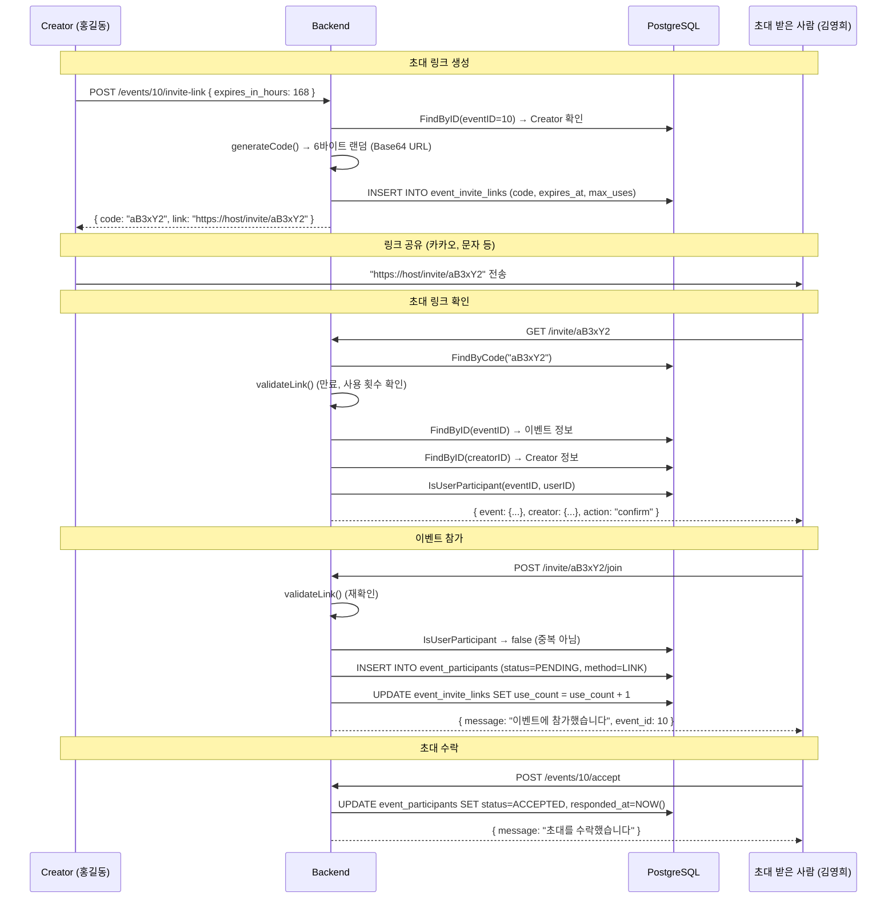

# 초대 시스템 서버 코드 분석

> 초대 링크 생성, 참가 수락/거절, 링크 기반 참가 전체 분석

---

## 개요

timingle의 **초대 링크 시스템**은 이벤트 Creator가 링크를 생성하고, 다른 사용자가 해당 링크로 이벤트에 참가하는 기능입니다.

**핵심 기능:**
- 초대 링크 생성 (만료 기간, 최대 사용 횟수 설정)
- 초대 링크 정보 조회 (이벤트 요약, Creator 정보)
- 링크를 통한 이벤트 참가
- 초대 수락/거절
- 참가자 상태 관리 (PENDING → ACCEPTED / DECLINED)

---

## 파일 구조

| 레이어 | 파일 | 역할 |
|--------|------|------|
| Handler | `internal/handlers/invite_handler.go` | HTTP 요청 처리 |
| Service | `internal/services/invite_service.go` | 비즈니스 로직 |
| Repository | `internal/repositories/invite_repository.go` | DB CRUD |
| Model | `internal/models/invite.go` | 데이터 구조 |

---

## API 엔드포인트 (모두 Protected)

### 초대 링크

| Method | Path | 설명 |
|--------|------|------|
| POST | `/api/v1/events/:id/invite-link` | 초대 링크 생성 (Creator) |
| GET | `/api/v1/invite/:code` | 초대 링크 정보 조회 |
| POST | `/api/v1/invite/:code/join` | 링크로 이벤트 참가 |

### 초대 응답

| Method | Path | 설명 |
|--------|------|------|
| POST | `/api/v1/events/:id/accept` | 초대 수락 (참가자) |
| POST | `/api/v1/events/:id/decline` | 초대 거절 (참가자) |

---

## 초대 흐름



---

## 코드 상세 분석

### Invite Service

```go
type InviteService struct {
    inviteRepo *repositories.InviteRepository
    eventRepo  *repositories.EventRepository
    userRepo   *repositories.UserRepository
    baseURL    string   // 링크 생성용 기본 URL
}

// CreateInviteLink - 초대 링크 생성
func (s *InviteService) CreateInviteLink(eventID, userID int64, req *models.CreateInviteLinkRequest) (*models.InviteLinkResponse, error) {
    // 1. 이벤트 존재 확인
    event, _ := s.eventRepo.FindByID(eventID)

    // 2. Creator만 링크 생성 가능
    if event.CreatorID != userID {
        return nil, fmt.Errorf("only event creator can create invite links")
    }

    // 3. CANCELED/DONE 이벤트는 초대 불가
    if event.Status == "CANCELED" || event.Status == "DONE" {
        return nil, fmt.Errorf("cannot create invite link for %s event", event.Status)
    }

    // 4. 만료 시간 계산 (기본: 7일)
    var expiresAt *time.Time
    if req.ExpiresInHours > 0 {
        exp := time.Now().Add(time.Duration(req.ExpiresInHours) * time.Hour)
        expiresAt = &exp
    } else {
        exp := time.Now().Add(168 * time.Hour)  // 7일
        expiresAt = &exp
    }

    // 5. DB에 링크 생성 (랜덤 코드)
    link, _ := s.inviteRepo.Create(eventID, userID, expiresAt, req.MaxUses)

    return &models.InviteLinkResponse{
        Code:      link.Code,
        Link:      fmt.Sprintf("%s/invite/%s", s.baseURL, link.Code),
        ExpiresAt: link.ExpiresAt,
        MaxUses:   link.MaxUses,
    }, nil
}

// GetInviteInfo - 초대 링크 정보 조회
func (s *InviteService) GetInviteInfo(code string, userID int64) (*models.InviteInfoResponse, error) {
    link, _ := s.inviteRepo.FindByCode(code)
    s.validateLink(link)            // 유효성 검증
    event, _ := s.eventRepo.FindByID(link.EventID)
    creator, _ := s.userRepo.FindByID(event.CreatorID)

    // 이미 참가자인지 확인
    isParticipant, _ := s.inviteRepo.IsUserParticipant(link.EventID, userID)
    action := "confirm"
    if isParticipant {
        action = "already_joined"
    }

    return &models.InviteInfoResponse{
        Event:   &models.EventSummary{...},
        Creator: &models.UserSummary{...},
        Action:  action,                     // "confirm" or "already_joined"
    }, nil
}

// JoinViaInvite - 초대 링크로 참가
func (s *InviteService) JoinViaInvite(code string, userID int64) (*models.JoinEventResponse, error) {
    link, _ := s.inviteRepo.FindByCode(code)
    s.validateLink(link)

    // 중복 참가 방지
    isParticipant, _ := s.inviteRepo.IsUserParticipant(link.EventID, userID)
    if isParticipant {
        return nil, fmt.Errorf("you are already a participant of this event")
    }

    // 참가자 추가 (status=PENDING, method=LINK)
    s.inviteRepo.AddParticipantWithDetails(link.EventID, userID, link.CreatedBy, models.InviteMethodLink)

    // 사용 횟수 증가
    s.inviteRepo.IncrementUseCount(link.ID)

    return &models.JoinEventResponse{
        Message: "이벤트에 참가했습니다",
        EventID: link.EventID,
    }, nil
}

// AcceptInvite / DeclineInvite - 초대 수락/거절
func (s *InviteService) AcceptInvite(eventID, userID int64) error {
    isParticipant, _ := s.inviteRepo.IsUserParticipant(eventID, userID)
    if !isParticipant { return fmt.Errorf("you are not invited to this event") }
    return s.inviteRepo.UpdateParticipantStatus(eventID, userID, models.ParticipantStatusAccepted)
}

// validateLink - 초대 링크 유효성 검증
func (s *InviteService) validateLink(link *models.InviteLink) error {
    if !link.IsActive { return fmt.Errorf("invite link is no longer active") }
    if link.ExpiresAt != nil && time.Now().After(*link.ExpiresAt) {
        return fmt.Errorf("invite link has expired")
    }
    if link.MaxUses > 0 && link.UseCount >= link.MaxUses {
        return fmt.Errorf("invite link has reached maximum uses")
    }
    return nil
}
```

### Invite Repository

```go
// generateCode - 랜덤 초대 코드 생성
func generateCode() (string, error) {
    bytes := make([]byte, 6)              // 6바이트 = 8자 base64
    rand.Read(bytes)
    return base64.RawURLEncoding.EncodeToString(bytes), nil
}

// Create - 초대 링크 DB 생성
func (r *InviteRepository) Create(eventID, createdBy int64, expiresAt *time.Time, maxUses int) (*models.InviteLink, error) {
    code, _ := generateCode()
    query := `INSERT INTO event_invite_links (event_id, code, created_by, expires_at, max_uses)
              VALUES ($1, $2, $3, $4, $5) RETURNING id, created_at`
    // ...
}

// AddParticipantWithDetails - 참가자 추가 (초대 경로 포함)
func (r *InviteRepository) AddParticipantWithDetails(eventID, userID, invitedBy int64, method string) error {
    query := `INSERT INTO event_participants (event_id, user_id, status, invited_by, invited_at, invite_method)
              VALUES ($1, $2, $3, $4, NOW(), $5)
              ON CONFLICT (event_id, user_id) DO NOTHING`
    // status = PENDING, method = LINK/FRIEND/QR/CREATOR
}

// UpdateParticipantStatus - 참가자 상태 변경
func (r *InviteRepository) UpdateParticipantStatus(eventID, userID int64, status string) error {
    query := `UPDATE event_participants SET status = $1, responded_at = NOW()
              WHERE event_id = $2 AND user_id = $3`
    // ...
}

// IsUserParticipant - 참가자 여부 확인
func (r *InviteRepository) IsUserParticipant(eventID, userID int64) (bool, error) {
    query := `SELECT EXISTS(SELECT 1 FROM event_participants WHERE event_id = $1 AND user_id = $2)`
    // ...
}
```

---

## 데이터 모델

### InviteLink

```go
type InviteLink struct {
    ID        int64      // PK
    EventID   int64      // FK → events.id
    Code      string     // 랜덤 코드 (6바이트 base64, ~8자)
    CreatedBy int64      // FK → users.id (링크 생성자)
    ExpiresAt *time.Time // 만료 시간 (nullable)
    MaxUses   int        // 최대 사용 횟수 (0 = 무제한)
    UseCount  int        // 현재 사용 횟수
    IsActive  bool       // 활성 상태
    CreatedAt time.Time  // 생성 시간
}
```

### 참가자 상태

```go
const (
    ParticipantStatusPending  = "PENDING"   // 대기 중
    ParticipantStatusAccepted = "ACCEPTED"  // 수락
    ParticipantStatusDeclined = "DECLINED"  // 거절
)
```

### 초대 방법

```go
const (
    InviteMethodFriend  = "FRIEND"   // 친구 추가
    InviteMethodLink    = "LINK"     // 초대 링크
    InviteMethodQR      = "QR"       // QR 코드
    InviteMethodCreator = "CREATOR"  // Creator 직접 추가
)
```

---

## 참가자 상태 머신

```
                 ┌──────────┐
   링크 참가 ───→│ PENDING  │← Creator 직접 추가
                 └────┬─────┘
                      │
              ┌───────┼────────┐
              ▼                ▼
       ┌──────────┐    ┌──────────┐
       │ ACCEPTED │    │ DECLINED │
       └──────────┘    └──────────┘
```

---

## DB 스키마

### event_invite_links

```sql
CREATE TABLE event_invite_links (
    id          SERIAL PRIMARY KEY,
    event_id    INTEGER NOT NULL REFERENCES events(id),
    code        VARCHAR(20) UNIQUE NOT NULL,
    created_by  INTEGER NOT NULL REFERENCES users(id),
    expires_at  TIMESTAMPTZ,
    max_uses    INTEGER DEFAULT 0,      -- 0 = 무제한
    use_count   INTEGER DEFAULT 0,
    is_active   BOOLEAN DEFAULT true,
    created_at  TIMESTAMPTZ DEFAULT NOW()
);
```

### event_participants (확장 필드)

```sql
-- Migration 010_alter_event_participants.sql에서 추가
ALTER TABLE event_participants ADD COLUMN status VARCHAR(20) DEFAULT 'PENDING';
ALTER TABLE event_participants ADD COLUMN invited_by INTEGER REFERENCES users(id);
ALTER TABLE event_participants ADD COLUMN invited_at TIMESTAMPTZ;
ALTER TABLE event_participants ADD COLUMN invite_method VARCHAR(20);
ALTER TABLE event_participants ADD COLUMN responded_at TIMESTAMPTZ;
```

---

## 링크 유효성 검증

```
초대 링크 접근 시 3가지 검증:

1. is_active == true       → 비활성 링크 차단
2. expires_at > now        → 만료 링크 차단
3. use_count < max_uses    → 사용 횟수 초과 차단 (max_uses > 0일 때)
```

---

## Request/Response 예시

### 초대 링크 생성

```http
POST /api/v1/events/10/invite-link
Authorization: Bearer ...
Content-Type: application/json

{ "expires_in_hours": 72, "max_uses": 5 }
```

**Response (200):**
```json
{
  "code": "aB3xY2kL",
  "link": "https://timingle.app/invite/aB3xY2kL",
  "expires_at": "2026-02-22T14:00:00Z",
  "max_uses": 5
}
```

### 초대 링크 정보 조회

```http
GET /api/v1/invite/aB3xY2kL
Authorization: Bearer ...
```

**Response (200):**
```json
{
  "event": {
    "id": 10,
    "title": "팀 저녁 식사",
    "start_time": "2026-03-01T18:00:00+09:00",
    "location": "강남역 근처"
  },
  "creator": {
    "id": 1,
    "name": "홍길동"
  },
  "action": "confirm"
}
```

### 링크로 참가

```http
POST /api/v1/invite/aB3xY2kL/join
Authorization: Bearer ...
```

**Response (200):**
```json
{
  "message": "이벤트에 참가했습니다",
  "event_id": 10
}
```

### 초대 수락/거절

```http
POST /api/v1/events/10/accept
Authorization: Bearer ...
```

**Response (200):**
```json
{ "message": "초대를 수락했습니다" }
```

---

## 에러 처리

| 상황 | HTTP | 메시지 |
|------|------|--------|
| event ID 오류 | 400 | `invalid event ID` |
| invite code 누락 | 400 | `invite code is required` |
| Creator가 아님 | 400 | `only event creator can create invite links` |
| CANCELED/DONE 이벤트 | 400 | `cannot create invite link for CANCELED event` |
| 링크 없음 | 400 | `invite link not found` |
| 링크 비활성 | 400 | `invite link is no longer active` |
| 링크 만료 | 400 | `invite link has expired` |
| 사용 횟수 초과 | 400 | `invite link has reached maximum uses` |
| 이미 참가 중 | 400 | `you are already a participant of this event` |
| 초대받지 않음 | 400 | `you are not invited to this event` |

---

## 권한 모델

| 작업 | Creator | 참가자 | 비참가자 |
|------|---------|--------|----------|
| 초대 링크 생성 | ✅ | ❌ | ❌ |
| 초대 링크 정보 조회 | ✅ | ✅ | ✅ (링크 보유 시) |
| 링크로 참가 | ❌ (이미 Creator) | ❌ (이미 참가) | ✅ |
| 초대 수락 | ❌ | ✅ | ❌ |
| 초대 거절 | ❌ | ✅ | ❌ |

---

## 관련 문서

- [이벤트 관리](events.md) - 이벤트 참가자 관리
- [인증 시스템](auth.md) - JWT 인증
- [전체 인덱스](README.md)

---

**작성일:** 2026-02-19
