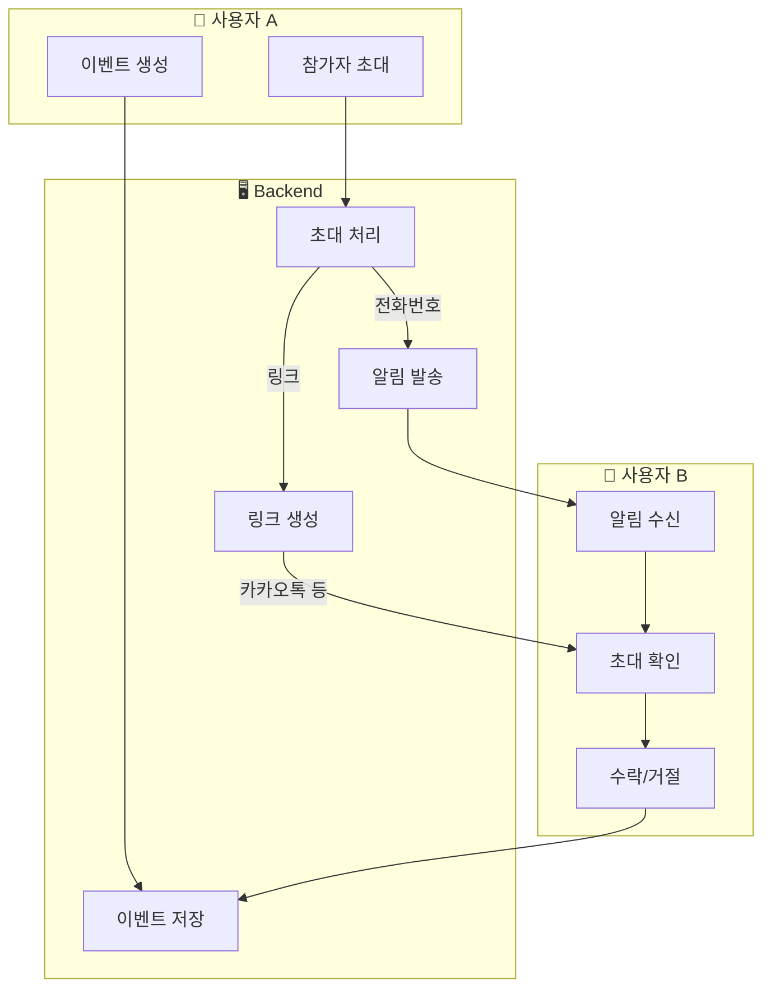
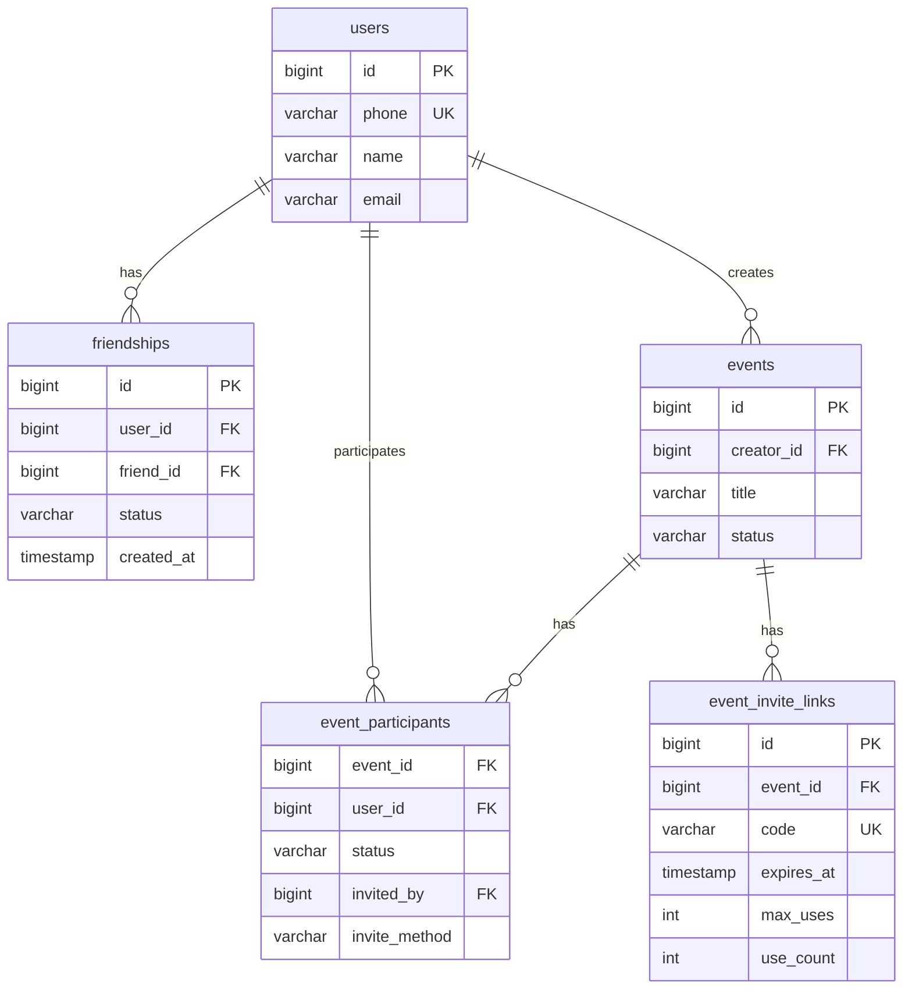
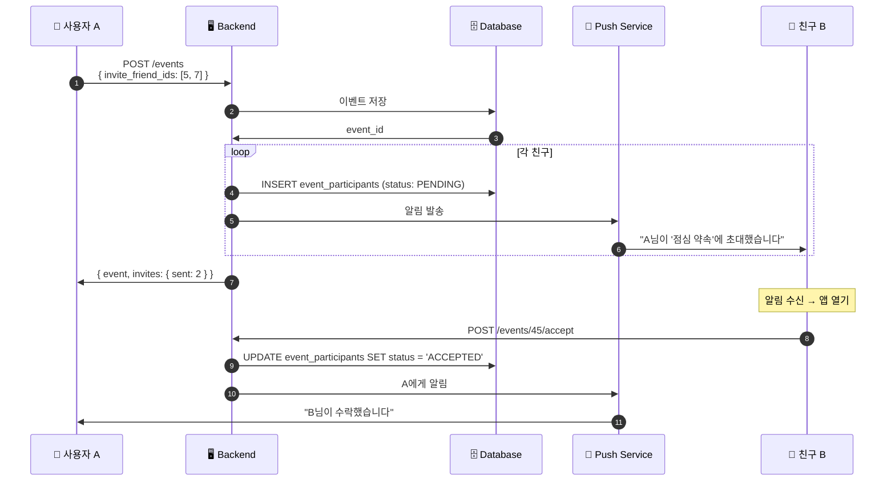
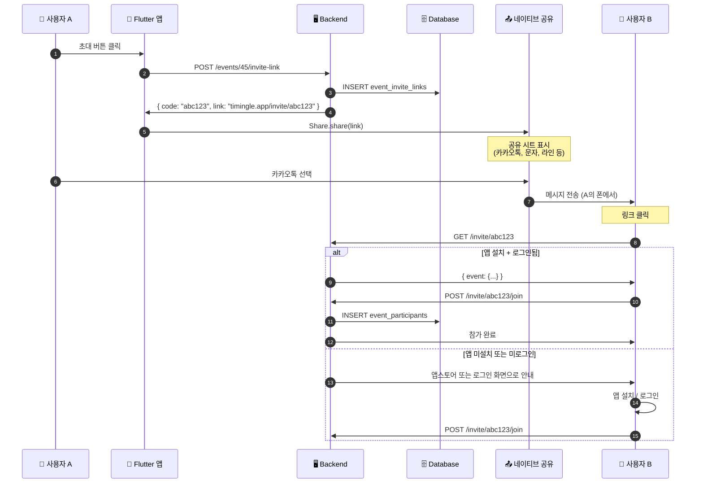

# 친구 및 참가자 시스템 설계

## 1. 현재 상태 분석

### 문제점

```
현재 이벤트 생성:
POST /events
{
  "title": "점심 약속",
  "participant_ids": [2, 3]  ← 문제: user_id를 어떻게 아나?
}
```

| 문제 | 설명 |
|------|------|
| **사용자 검색 없음** | 개인정보 보호를 위해 검색 기능 제거 |
| **친구 목록 없음** | 관계 관리 시스템 미구현 |
| **초대 메커니즘 없음** | 이벤트에 참가자를 추가할 방법 없음 |
| **participant_ids 의미 없음** | ID를 알 수 없으므로 사용 불가 |

### 현재 DB 스키마

```sql
-- users 테이블
CREATE TABLE users (
  id BIGSERIAL PRIMARY KEY,
  phone VARCHAR(50) UNIQUE NOT NULL,
  name VARCHAR(100),
  email VARCHAR(255),
  ...
);

-- events 테이블
CREATE TABLE events (
  id BIGSERIAL PRIMARY KEY,
  creator_id BIGINT REFERENCES users(id),
  title VARCHAR(200),
  ...
);

-- event_participants 테이블
CREATE TABLE event_participants (
  event_id BIGINT REFERENCES events(id),
  user_id BIGINT REFERENCES users(id),
  status VARCHAR(20),  -- 'PENDING', 'ACCEPTED', 'DECLINED'
  ...
);
```

---

## 2. 설계 원칙

### 핵심 원칙

1. **개인정보 보호**: 전화번호/이메일로 무분별한 검색 불가
2. **명시적 동의**: 친구 관계는 양방향 동의 필요
3. **최소 정보 노출**: 관계가 없는 사용자 정보는 숨김
4. **유연한 초대**: 앱 미설치 사용자도 초대 가능

### timingle 철학 반영

> "약속이 대화가 되는 앱"

- 친구 관계 없이도 이벤트 초대 가능
- 이벤트를 통해 자연스럽게 관계 형성
- 노쇼 방지를 위한 참가 확정 시스템

---

## 3. 시스템 아키텍처

### 전체 흐름



### 초대 방식 비교

| 방식 | 흐름 | 장점 | 단점 | 사용 시점 |
|------|------|------|------|----------|
| **초대 링크 + 공유** | 링크 생성 → 네이티브 공유 | 플랫폼 무관, 비용 없음 | - | **기본 방식** |
| **초대 링크 + SMS** | 링크 생성 → SMS 앱 열기 | 직접적, 신뢰도 높음 | - | 문자 선호 시 |
| **QR 코드** | QR 생성 → 스캔 | 오프라인 편리 | 앱 필요 | 대면 상황 |
| **친구 목록** | 목록에서 선택 → 앱 알림 | 간편 | 친구 등록 필요 | 자주 만나는 사람 |

### 핵심 원칙: 시스템이 문자를 보내지 않음

```
❌ 기존 방식 (사용 안 함):
   사용자 → Backend → SMS Provider → 상대방
   - 비용 발생
   - 스팸 인식 가능
   - 전화번호 수집 필요

✅ 권장 방식:
   사용자 → 초대 링크 생성 → 사용자 폰에서 직접 공유 → 상대방
   - 비용 없음
   - 친구 번호라 신뢰도 높음
   - 서버에 전화번호 저장 불필요
```

---

## 4. 데이터베이스 설계

### 새로운 테이블

```sql
-- 친구 관계 테이블
CREATE TABLE friendships (
  id BIGSERIAL PRIMARY KEY,
  user_id BIGINT REFERENCES users(id) ON DELETE CASCADE,
  friend_id BIGINT REFERENCES users(id) ON DELETE CASCADE,
  status VARCHAR(20) DEFAULT 'PENDING',  -- 'PENDING', 'ACCEPTED', 'BLOCKED'
  created_at TIMESTAMPTZ DEFAULT NOW(),
  updated_at TIMESTAMPTZ DEFAULT NOW(),
  UNIQUE(user_id, friend_id)
);

-- 친구 요청은 단방향, 수락 시 양방향 레코드 생성
-- user_id=1, friend_id=2, status='PENDING'  (1이 2에게 요청)
-- 수락 시:
-- user_id=1, friend_id=2, status='ACCEPTED'
-- user_id=2, friend_id=1, status='ACCEPTED'

CREATE INDEX idx_friendships_user ON friendships(user_id);
CREATE INDEX idx_friendships_friend ON friendships(friend_id);
CREATE INDEX idx_friendships_status ON friendships(status);


-- 이벤트 초대 테이블 (기존 event_participants 확장)
ALTER TABLE event_participants ADD COLUMN invited_by BIGINT REFERENCES users(id);
ALTER TABLE event_participants ADD COLUMN invited_at TIMESTAMPTZ DEFAULT NOW();
ALTER TABLE event_participants ADD COLUMN responded_at TIMESTAMPTZ;
ALTER TABLE event_participants ADD COLUMN invite_method VARCHAR(20);  -- 'PHONE', 'LINK', 'QR', 'FRIEND'


-- 초대 링크 테이블
CREATE TABLE event_invite_links (
  id BIGSERIAL PRIMARY KEY,
  event_id BIGINT REFERENCES events(id) ON DELETE CASCADE,
  code VARCHAR(20) UNIQUE NOT NULL,  -- 짧은 고유 코드
  created_by BIGINT REFERENCES users(id),
  expires_at TIMESTAMPTZ,
  max_uses INT DEFAULT 0,  -- 0 = 무제한
  use_count INT DEFAULT 0,
  is_active BOOLEAN DEFAULT true,
  created_at TIMESTAMPTZ DEFAULT NOW()
);

CREATE INDEX idx_invite_links_code ON event_invite_links(code);
CREATE INDEX idx_invite_links_event ON event_invite_links(event_id);


-- ❌ pending_invites 테이블은 사용하지 않음
-- 미가입자 초대는 초대 링크 + 네이티브 공유로 처리
-- 서버에 전화번호를 저장할 필요 없음
```

### ERD



---

## 5. API 설계

### 5.1 친구 관리 API

```yaml
# 친구 요청 (전화번호로)
POST /api/v1/friends/request
Authorization: Bearer {token}
{
  "phone": "01012345678"
}

Response 200:
{
  "message": "친구 요청을 보냈습니다",
  "friendship_id": 123,
  "status": "PENDING"
}

Response 404:
{
  "error": "해당 전화번호로 가입된 사용자가 없습니다"
}

---

# 친구 요청 목록 (받은 요청)
GET /api/v1/friends/requests
Authorization: Bearer {token}

Response 200:
{
  "requests": [
    {
      "id": 123,
      "user": {
        "id": 5,
        "name": "김철수",
        "profile_image_url": "..."
      },
      "created_at": "2026-01-24T12:00:00Z"
    }
  ]
}

---

# 친구 요청 수락/거절
POST /api/v1/friends/requests/{id}/accept
POST /api/v1/friends/requests/{id}/decline
Authorization: Bearer {token}

Response 200:
{
  "message": "친구 요청을 수락했습니다"
}

---

# 친구 목록
GET /api/v1/friends
Authorization: Bearer {token}

Response 200:
{
  "friends": [
    {
      "id": 5,
      "name": "김철수",
      "profile_image_url": "...",
      "friendship_since": "2026-01-20T12:00:00Z"
    }
  ],
  "total": 15
}

---

# 친구 삭제
DELETE /api/v1/friends/{user_id}
Authorization: Bearer {token}

Response 200:
{
  "message": "친구를 삭제했습니다"
}
```

### 5.2 이벤트 초대 API

```yaml
# 이벤트 생성 (기본)
POST /api/v1/events
Authorization: Bearer {token}
{
  "title": "점심 약속",
  "description": "맛있는 거 먹자",
  "proposed_times": ["2026-01-25T12:00:00Z"],
  "location": "강남역",

  # 친구 초대 (선택, 가입된 친구만)
  "invite_friend_ids": [5, 7, 12]
}

Response 201:
{
  "event": { ... },
  "invites": {
    "sent": 3,        # 앱 알림 발송됨
    "failed": 0
  }
}

# ⚠️ invite_phones는 사용하지 않음
# 미가입자 초대는 초대 링크 → 네이티브 공유로 처리

---

# 기존 이벤트에 친구 초대 (앱 내 알림)
POST /api/v1/events/{id}/invite
Authorization: Bearer {token}
{
  "friend_ids": [5, 7]  # 가입된 친구만
}

Response 200:
{
  "invited": 2,
  "already_participant": 0
}

---

# 초대 링크 생성
POST /api/v1/events/{id}/invite-link
Authorization: Bearer {token}
{
  "expires_in_hours": 72,  # 선택, 기본 168 (7일)
  "max_uses": 10           # 선택, 기본 0 (무제한)
}

Response 200:
{
  "code": "abc123",
  "link": "https://timingle.app/invite/abc123",
  "expires_at": "2026-01-31T12:00:00Z"
}

---

# 초대 링크로 참가
GET /api/v1/invite/{code}
Authorization: Bearer {token}  # 로그인 필요

Response 200:
{
  "event": {
    "id": 45,
    "title": "점심 약속",
    "creator": {
      "name": "홍길동"
    }
  },
  "action": "confirm"  # 참가 확인 필요
}

POST /api/v1/invite/{code}/join
Authorization: Bearer {token}

Response 200:
{
  "message": "이벤트에 참가했습니다",
  "event_id": 45
}

---

# 초대 수락/거절
POST /api/v1/events/{id}/accept
POST /api/v1/events/{id}/decline
Authorization: Bearer {token}

Response 200:
{
  "message": "초대를 수락했습니다"
}
```

### 5.3 알림 관련

```yaml
# 알림 목록
GET /api/v1/notifications
Authorization: Bearer {token}

Response 200:
{
  "notifications": [
    {
      "id": 1,
      "type": "EVENT_INVITE",
      "title": "홍길동님이 '점심 약속'에 초대했습니다",
      "data": {
        "event_id": 45,
        "inviter_id": 3
      },
      "read": false,
      "created_at": "2026-01-24T12:00:00Z"
    },
    {
      "id": 2,
      "type": "FRIEND_REQUEST",
      "title": "김철수님이 친구 요청을 보냈습니다",
      "data": {
        "friendship_id": 123,
        "requester_id": 5
      },
      "read": true,
      "created_at": "2026-01-24T11:00:00Z"
    }
  ]
}
```

---

## 6. 시퀀스 다이어그램

### 6.1 친구 초대 (앱 내 알림)

가입된 친구에게 앱 내 알림으로 초대합니다.



### 6.2 초대 링크 + 네이티브 공유 (핵심 흐름)

미가입자 포함 누구에게나 초대할 수 있는 방식입니다.
**시스템이 문자를 보내지 않고, 사용자 폰에서 직접 공유합니다.**



### 6.3 Flutter 앱에서 공유 구현

```dart
// 초대 링크 생성 및 공유
Future<void> inviteToEvent(int eventId) async {
  // 1. 서버에서 초대 링크 생성
  final response = await api.post('/events/$eventId/invite-link');
  final inviteLink = response.data['link'];

  // 2. 네이티브 공유 시트 열기
  await Share.share(
    '같이 약속 잡자! 🗓️\n$inviteLink',
    subject: 'timingle 초대',
  );
}

// SMS 앱으로 직접 열기 (선택)
Future<void> inviteViaSMS(String phone, String inviteLink) async {
  final message = Uri.encodeComponent('timingle에서 약속 잡자! $inviteLink');
  final uri = Uri.parse('sms:$phone?body=$message');
  await launchUrl(uri);
}
```

---

## 7. 구현 계획

### Phase 1: MVP - 초대 링크 (1주)

```
├─ [ ] DB 마이그레이션 (event_invite_links 테이블)
├─ [ ] 초대 링크 생성 API (POST /events/:id/invite-link)
├─ [ ] 초대 링크로 참가 API (GET/POST /invite/:code)
├─ [ ] 초대 수락/거절 API
├─ [ ] Flutter: 초대 링크 생성 + Share.share() 연동
└─ [ ] Flutter: 딥링크 처리 (초대 링크 클릭 시)
```

### Phase 2: 친구 시스템 (1주)

```
├─ [ ] DB 마이그레이션 (friendships 테이블)
├─ [ ] 친구 요청 API (전화번호로 요청)
├─ [ ] 친구 수락/거절/목록 API
├─ [ ] 친구에게 이벤트 초대 (invite_friend_ids)
├─ [ ] Flutter UI: 친구 관리 화면
└─ [ ] Flutter UI: 친구 선택해서 초대
```

### Phase 3: 고도화 (1주)

```
├─ [ ] 푸시 알림 (FCM)
├─ [ ] QR 코드 초대
├─ [ ] 초대 링크 미리보기 (Open Graph 메타태그)
├─ [ ] 앱 미설치 시 앱스토어 연결 (Universal Links / App Links)
└─ [ ] 분석/통계
```

### 제거된 기능

```
❌ invite_phones (서버에서 SMS 발송)
❌ pending_invites 테이블 (미가입자 전화번호 저장)
   → 초대 링크로 대체, 서버에 전화번호 저장 불필요
```

---

## 8. 보안 고려사항

### 초대 링크

```yaml
보안 요소:
  - 코드 길이: 최소 8자 (영숫자)
  - 만료 시간: 기본 7일, 최대 30일
  - 사용 횟수 제한: 설정 가능
  - 비활성화: 생성자가 언제든 비활성화 가능
  - Rate Limit: IP당 분당 10회 조회 제한

코드 생성:
  - crypto/rand 사용 (예측 불가)
  - Base62 인코딩 (URL-safe)
```

### 친구 요청

```yaml
보안 요소:
  - Rate Limit: 시간당 20건
  - 차단한 사용자 요청 불가
  - 요청 취소 가능
  - 48시간 후 자동 만료 (선택)
```

---

## 9. Postman 컬렉션 업데이트 계획

```yaml
6_friends.json (새로 추가):
  - 6-1. 친구 요청 (전화번호로)
  - 6-2. 받은 친구 요청 목록
  - 6-3. 친구 요청 수락/거절
  - 6-4. 친구 목록
  - 6-5. 친구 삭제

4_events.json 수정:
  - Create Event: invite_friend_ids 추가 (친구만)
  - Create Invite Link: POST /events/:id/invite-link
  - Get Invite Info: GET /invite/:code
  - Join via Link: POST /invite/:code/join
  - Accept/Decline Invite: POST /events/:id/accept, /decline
```

---

## 10. 다음 단계

1. **이 문서 검토/승인**
2. **DB 마이그레이션 파일 생성**
3. **Backend API 구현**
4. **Postman 컬렉션 업데이트**
5. **Flutter UI 구현**

---

**작성일**: 2026-01-24
**상태**: 설계 검토 중
