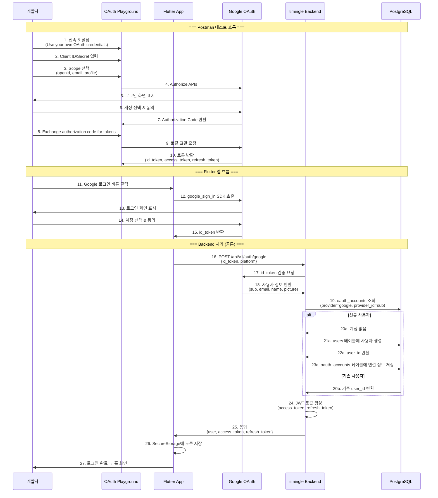

# Google OAuth 인증 흐름 다이어그램

## 전체 인증 흐름 (Postman 테스트 포함)



## 데이터 흐름 요약

| 단계 | 구간 | 데이터 |
|------|------|--------|
| 1-10 | Playground ↔ Google | OAuth 인증 → `id_token` 획득 |
| 11-15 | Flutter ↔ Google | google_sign_in → `id_token` 획득 |
| 16 | Flutter → Backend | `{id_token, platform}` |
| 17-18 | Backend ↔ Google | 토큰 검증 → `{sub, email, name, picture}` |
| 19-23 | Backend ↔ DB | 사용자 조회/생성 |
| 24-25 | Backend → Flutter | `{user, access_token, refresh_token}` |

## Google ID Token 필드 설명

Google에서 반환하는 `id_token`을 디코딩하면 다음 정보가 포함됩니다:

| 필드 | 예시 | 설명 |
|------|------|------|
| **`iss`** | `https://accounts.google.com` | 토큰 발급자 (Issuer). 항상 Google |
| **`azp`** | `412931718610-...` | Authorized Party. 토큰을 요청한 클라이언트 ID |
| **`aud`** | `412931718610-...` | Audience. 토큰 수신 대상. **Backend 검증 필수** |
| **`sub`** | `101068601798018619646` | Subject. **Google 사용자 고유 ID**. `provider_id`로 저장 |
| **`email`** | `user@gmail.com` | 사용자 이메일 |
| **`email_verified`** | `true` | 이메일 인증 여부 |
| **`at_hash`** | `jHz1jTGAq3v47eXDk0xzIg` | Access Token 해시 (토큰 바인딩 검증용) |
| **`name`** | `Mando` | 사용자 전체 이름 |
| **`picture`** | `https://lh3.googleusercontent.com/...` | 프로필 이미지 URL |
| **`given_name`** | `Mando` | 이름 (First name) |
| **`iat`** | `1768430563` | Issued At. 토큰 발급 시간 (Unix timestamp) |
| **`exp`** | `1768434163` | Expiration. 토큰 만료 시간 (약 1시간 후) |

### Backend 검증 포인트

| 검증 항목 | 조건 | 설명 |
|----------|------|------|
| `aud` | == Client ID | 토큰이 우리 앱용인지 확인 |
| `iss` | == `accounts.google.com` | 토큰 발급자 확인 |
| `exp` | > 현재시간 | 토큰 만료 여부 |
| `email_verified` | == `true` | 이메일 인증된 사용자만 허용 (선택) |

### DB 저장 매핑

```
oauth_accounts 테이블:
├── provider_id  ← sub ("101068601798018619646")
└── provider     ← "google"

users 테이블:
├── email         ← email
├── name          ← name
└── profile_image ← picture
```

## Backend 코드 흐름

### 파일 구조

```
backend/
├── internal/
│   ├── handlers/
│   │   └── auth_handler.go      ← HTTP 요청 처리
│   ├── services/
│   │   └── auth_service.go      ← 비즈니스 로직
│   ├── repositories/
│   │   ├── user_repository.go   ← users 테이블 접근
│   │   └── oauth_repository.go  ← oauth_accounts 테이블 접근
│   └── models/
│       └── oauth.go             ← GoogleTokenPayload 정의
└── pkg/utils/
    └── google_oauth.go          ← Google ID Token 검증
```

### 코드 흐름 시퀀스

```
┌─────────────────────────────────────────────────────────────────────────────┐
│  POST /api/v1/auth/google  {id_token, platform}                             │
└─────────────────────────────────────────────────────────────────────────────┘
                                    │
                                    ▼
┌─────────────────────────────────────────────────────────────────────────────┐
│  auth_handler.go:GoogleLogin()                                              │
│  ├── JSON 바인딩: req.IDToken, req.Platform                                 │
│  └── authService.GoogleLogin(ctx, req) 호출                                 │
└─────────────────────────────────────────────────────────────────────────────┘
                                    │
                                    ▼
┌─────────────────────────────────────────────────────────────────────────────┐
│  auth_service.go:GoogleLogin()  [Line 124-194]                              │
│                                                                             │
│  1. googleVerifier.VerifyIDToken(ctx, req.IDToken)                          │
│     └── google_oauth.go:VerifyIDToken() 호출                                │
└─────────────────────────────────────────────────────────────────────────────┘
                                    │
                                    ▼
┌─────────────────────────────────────────────────────────────────────────────┐
│  google_oauth.go:VerifyIDToken()  [Line 33-52]                              │
│                                                                             │
│  for _, clientID := range v.clientIDs {                                     │
│      payload, err := idtoken.Validate(ctx, idToken, clientID)               │
│      ├── aud 검증 (Client ID 일치 확인)                                     │
│      ├── iss 검증 (accounts.google.com)                                     │
│      ├── exp 검증 (만료시간)                                                │
│      └── 서명 검증 (Google 공개키)                                          │
│  }                                                                          │
│  return extractPayload(payload)                                             │
└─────────────────────────────────────────────────────────────────────────────┘
                                    │
                                    ▼
┌─────────────────────────────────────────────────────────────────────────────┐
│  google_oauth.go:extractPayload()  [Line 55-105]                            │
│                                                                             │
│  GoogleTokenPayload {                                                       │
│      Subject:       payload.Subject,      // sub (Google 고유 ID)           │
│      Email:         claims["email"],                                        │
│      EmailVerified: claims["email_verified"],                               │
│      Name:          claims["name"],                                         │
│      Picture:       claims["picture"],                                      │
│      GivenName:     claims["given_name"],                                   │
│      FamilyName:    claims["family_name"],                                  │
│  }                                                                          │
└─────────────────────────────────────────────────────────────────────────────┘
                                    │
                                    ▼
┌─────────────────────────────────────────────────────────────────────────────┐
│  auth_service.go:GoogleLogin() 계속  [Line 137-190]                         │
│                                                                             │
│  2. oauthRepo.FindByProviderUserID("google", googlePayload.Subject)         │
│     └── oauth_accounts 테이블에서 기존 연결 조회                            │
│                                                                             │
│  ┌─────────────────────┬────────────────────────────────────────────────┐   │
│  │   기존 사용자       │   신규 사용자                                  │   │
│  ├─────────────────────┼────────────────────────────────────────────────┤   │
│  │ userRepo.FindByID() │ userRepo.FindByEmail()                         │   │
│  │ needsUpdate() 체크  │   └── 없으면 userRepo.CreateOAuthUser()        │   │
│  │ oauthRepo.Update()  │ oauthRepo.Create() (OAuth 연결 생성)           │   │
│  └─────────────────────┴────────────────────────────────────────────────┘   │
└─────────────────────────────────────────────────────────────────────────────┘
                                    │
                                    ▼
┌─────────────────────────────────────────────────────────────────────────────┐
│  auth_service.go:generateAuthResponse()  [Line 211-241]                     │
│                                                                             │
│  3. JWT 토큰 생성                                                           │
│     ├── jwtManager.GenerateAccessToken(user)   → access_token              │
│     ├── jwtManager.GenerateRefreshToken()      → refresh_token             │
│     └── authRepo.SaveRefreshToken()            → DB 저장                   │
│                                                                             │
│  return AuthResponse {                                                      │
│      AccessToken:  accessToken,                                             │
│      RefreshToken: refreshToken,                                            │
│      ExpiresIn:    3600,                                                    │
│      User:         user.ToUserResponse(),                                   │
│  }                                                                          │
└─────────────────────────────────────────────────────────────────────────────┘
                                    │
                                    ▼
┌─────────────────────────────────────────────────────────────────────────────┐
│  HTTP 응답                                                                  │
│  {                                                                          │
│    "access_token": "eyJhbGciOiJIUzI1NiIs...",                               │
│    "refresh_token": "eyJhbGciOiJIUzI1NiIs...",                              │
│    "expires_in": 3600,                                                      │
│    "user": { "id": "...", "email": "...", "name": "..." }                   │
│  }                                                                          │
└─────────────────────────────────────────────────────────────────────────────┘
```

### 주요 함수 요약

| 파일 | 함수 | 역할 |
|------|------|------|
| `auth_handler.go` | `GoogleLogin()` | HTTP 요청 파싱, 응답 반환 |
| `auth_service.go` | `GoogleLogin()` | 전체 비즈니스 로직 조율 |
| `auth_service.go` | `generateAuthResponse()` | JWT 토큰 생성 및 저장 |
| `google_oauth.go` | `VerifyIDToken()` | Google ID Token 검증 |
| `google_oauth.go` | `extractPayload()` | 토큰에서 사용자 정보 추출 |
| `oauth_repository.go` | `FindByProviderUserID()` | 기존 OAuth 연결 조회 |
| `oauth_repository.go` | `Create()` | 신규 OAuth 연결 생성 |
| `user_repository.go` | `CreateOAuthUser()` | OAuth 기반 신규 사용자 생성 |

## 참고

- [GOOGLE_OAUTH_SETUP.md](../GOOGLE_OAUTH_SETUP.md) - 설정 가이드
- [API.md](../API.md) - API 명세
