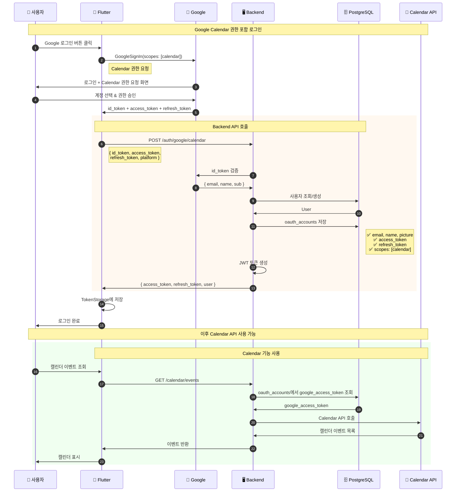
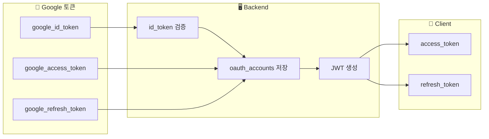

# Google Calendar 권한 포함 로그인

Calendar API 접근 권한을 포함한 Google OAuth 로그인 흐름입니다.

## 엔드포인트
- `POST /api/v1/auth/google/calendar`

## 기본 로그인과의 차이점

| 항목 | /auth/google | /auth/google/calendar |
|-----|--------------|----------------------|
| id_token | ✅ 필수 | ✅ 필수 |
| access_token | ❌ 없음 | ✅ 필수 |
| refresh_token | ❌ 없음 | ✅ 필수 |
| Calendar API | ❌ 사용 불가 | ✅ 사용 가능 |

## 시퀀스 다이어그램



## 요청/응답 예시

### Request
```json
POST /api/v1/auth/google/calendar
Content-Type: application/json

{
  "id_token": "eyJhbGciOiJSUzI1NiIs...",
  "access_token": "ya29.a0AfH6SMB...",
  "refresh_token": "1//0eXyz...",
  "platform": "android"
}
```

### Response
```json
{
  "access_token": "eyJhbGciOiJIUzI1NiIs...",
  "refresh_token": "abc123...",
  "expires_in": 3600,
  "user": {
    "id": 1,
    "email": "user@gmail.com",
    "name": "홍길동"
  }
}
```

## 토큰 저장 구조



## 관련 파일
- Flutter: `lib/features/auth/data/repositories/auth_repository_impl.dart`
- Backend: `internal/handlers/auth_handler.go` → `GoogleCalendarLogin()`
- Backend: `internal/services/auth_service.go` → `GoogleLoginWithCalendar()`
