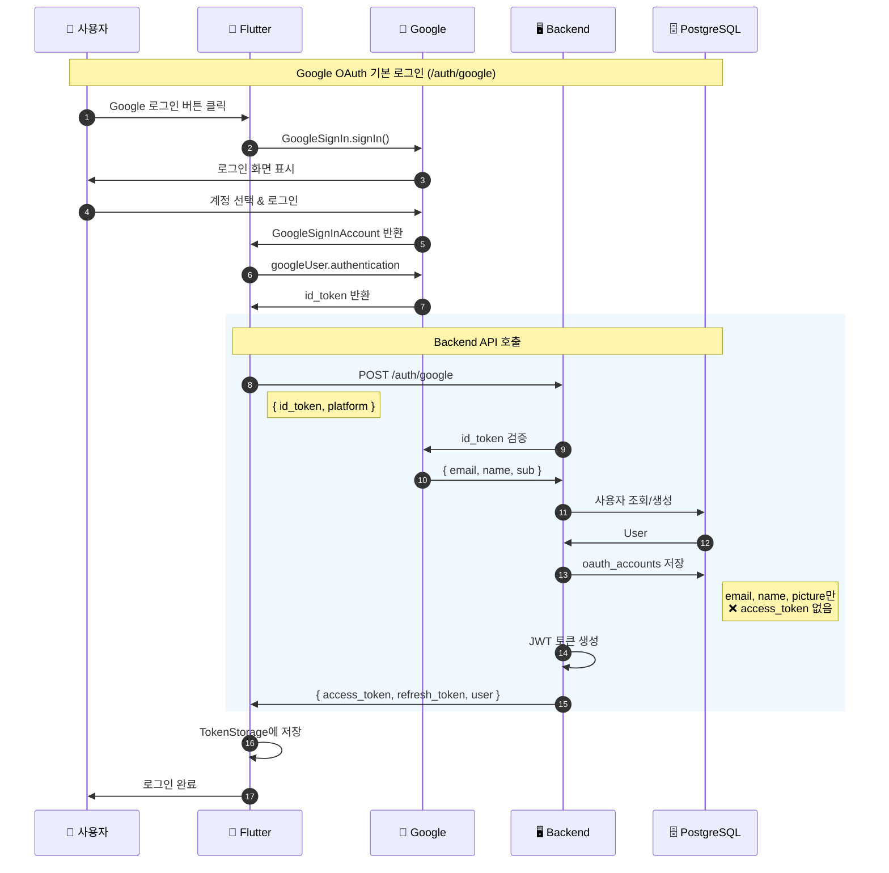

# Google OAuth 기본 로그인

Flutter 앱에서 Google OAuth로 로그인하는 전체 흐름입니다.

## 엔드포인트
- `POST /api/v1/auth/google`

## 시퀀스 다이어그램



## 요청/응답 예시

### Request
```json
POST /api/v1/auth/google
Content-Type: application/json

{
  "id_token": "eyJhbGciOiJSUzI1NiIs...",
  "platform": "android"
}
```

### Response
```json
{
  "access_token": "eyJhbGciOiJIUzI1NiIs...",
  "refresh_token": "abc123...",
  "expires_in": 3600,
  "user": {
    "id": 1,
    "email": "user@gmail.com",
    "name": "홍길동"
  }
}
```

## 관련 파일
- Flutter: `lib/features/auth/data/repositories/auth_repository_impl.dart`
- Backend: `internal/handlers/auth_handler.go` → `GoogleLogin()`
- Backend: `internal/services/auth_service.go` → `GoogleLogin()`
