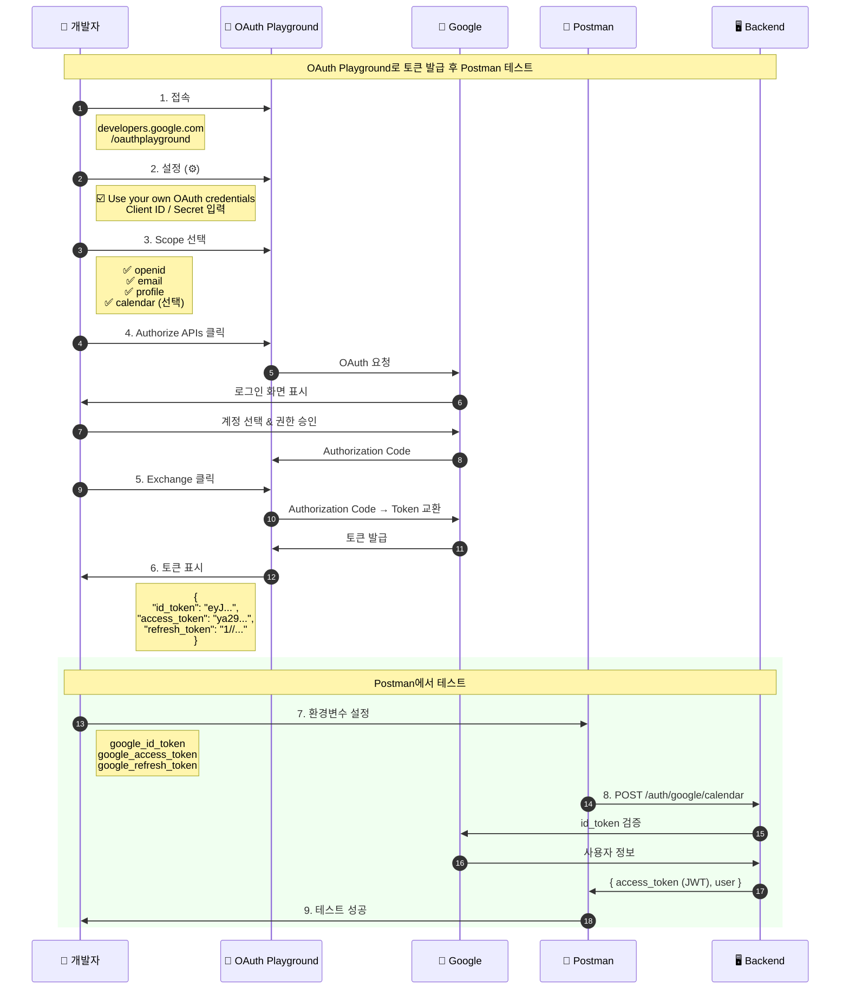
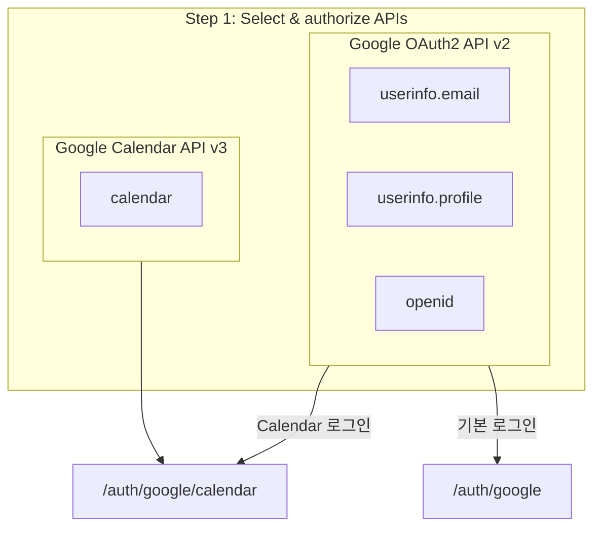
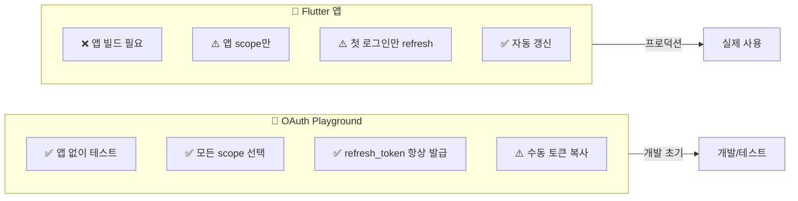

# OAuth Playground로 토큰 발급

Postman에서 Google OAuth API를 테스트하기 위해 OAuth Playground에서 토큰을 발급받는 흐름입니다.

## OAuth Playground URL
- https://developers.google.com/oauthplayground

## 시퀀스 다이어그램



## Step-by-Step 가이드

### Step 1: OAuth Playground 접속
```
https://developers.google.com/oauthplayground
```

### Step 2: 설정 (우측 상단 ⚙️)
```
☑️ Use your own OAuth credentials

OAuth Client ID: [backend/.env의 GOOGLE_CLIENT_ID]
OAuth Client secret: [backend/.env의 GOOGLE_CLIENT_SECRET]
```

### Step 3: Scope 선택 (왼쪽 패널)



### Step 4: Authorize APIs 클릭
- Google 로그인 화면 표시
- 계정 선택 및 권한 승인

### Step 5: Exchange authorization code for tokens 클릭
```json
{
  "access_token": "ya29.a0AfH6SMB...",
  "id_token": "eyJhbGciOiJSUzI1NiIs...",
  "refresh_token": "1//0eXyz...",
  "expires_in": 3599,
  "token_type": "Bearer"
}
```

### Step 6: Postman 환경변수 설정
| 변수명 | 값 |
|-------|-----|
| `google_id_token` | eyJhbGciOiJSUzI1NiIs... |
| `google_access_token` | ya29.a0AfH6SMB... |
| `google_refresh_token` | 1//0eXyz... |

### Step 7: Postman에서 테스트
- `2_auth.json` → `2-3. Google OAuth` → 요청 실행

## OAuth Playground vs Flutter 비교



## 주의사항

1. **Client ID/Secret**: `backend/.env`의 값과 동일해야 함
2. **토큰 만료**: access_token은 1시간 후 만료, refresh_token으로 갱신 가능
3. **Scope 일치**: Backend에서 기대하는 scope와 일치해야 함
