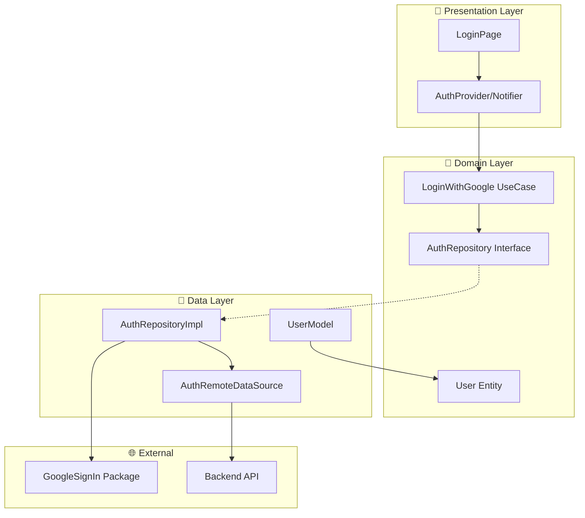
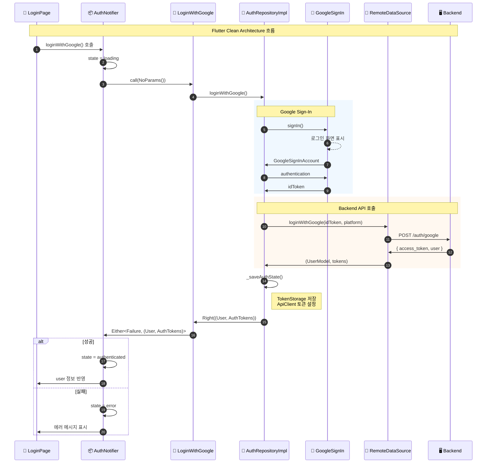
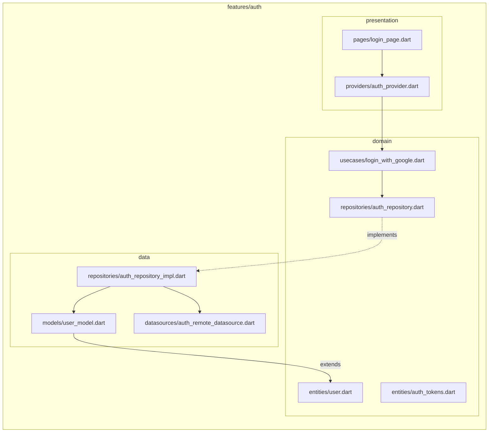
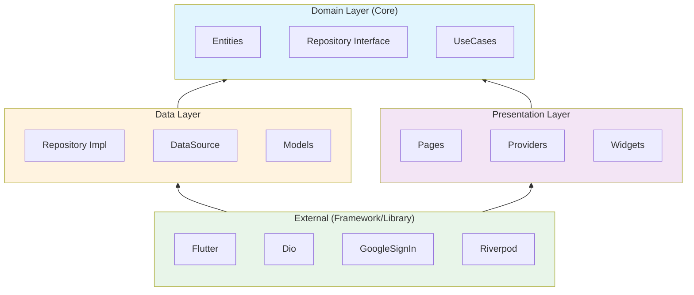
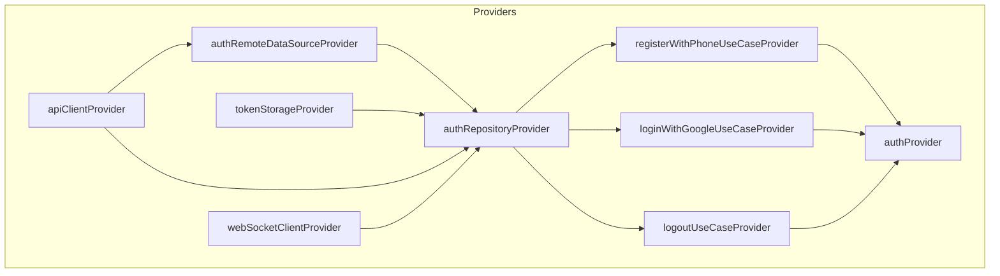
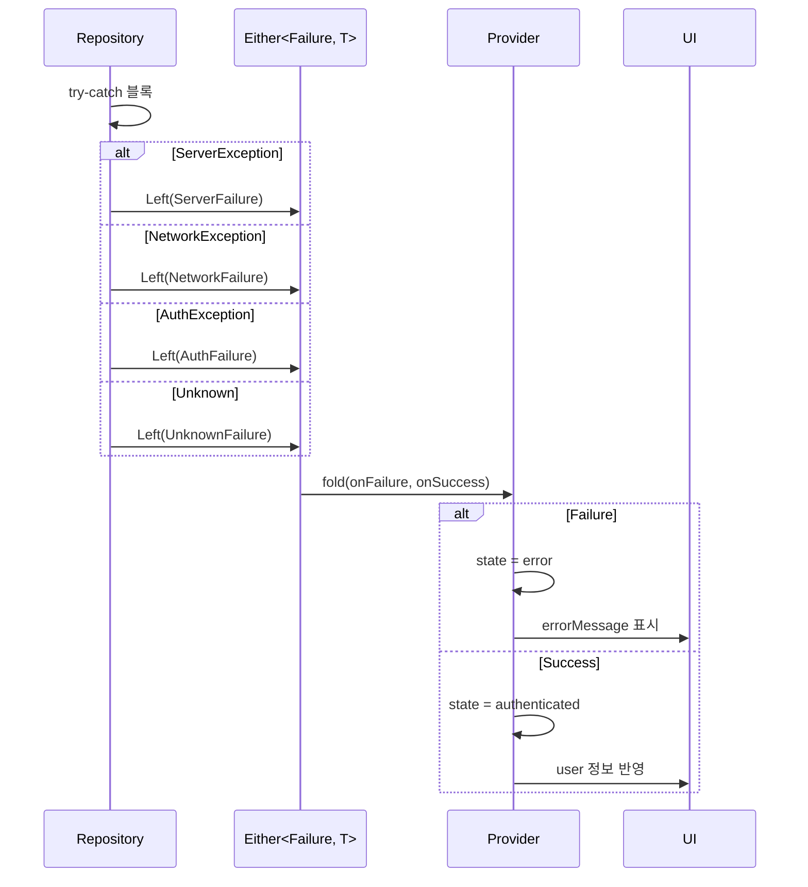

# Flutter Clean Architecture 레이어 흐름

Flutter 앱의 Clean Architecture 구조와 Google OAuth 로그인 시 각 레이어의 역할입니다.

## 레이어 구조

## Google 로그인 시퀀스

## 파일 구조

## 의존성 방향

## Provider 의존성

## 에러 처리 흐름

## 관련 파일

| 레이어 | 파일 |
|-------|------|
| Presentation | `lib/features/auth/presentation/providers/auth_provider.dart` |
| Domain | `lib/features/auth/domain/usecases/login_with_google.dart` |
| Domain | `lib/features/auth/domain/repositories/auth_repository.dart` |
| Data | `lib/features/auth/data/repositories/auth_repository_impl.dart` |
| Data | `lib/features/auth/data/datasources/auth_remote_datasource.dart` |
