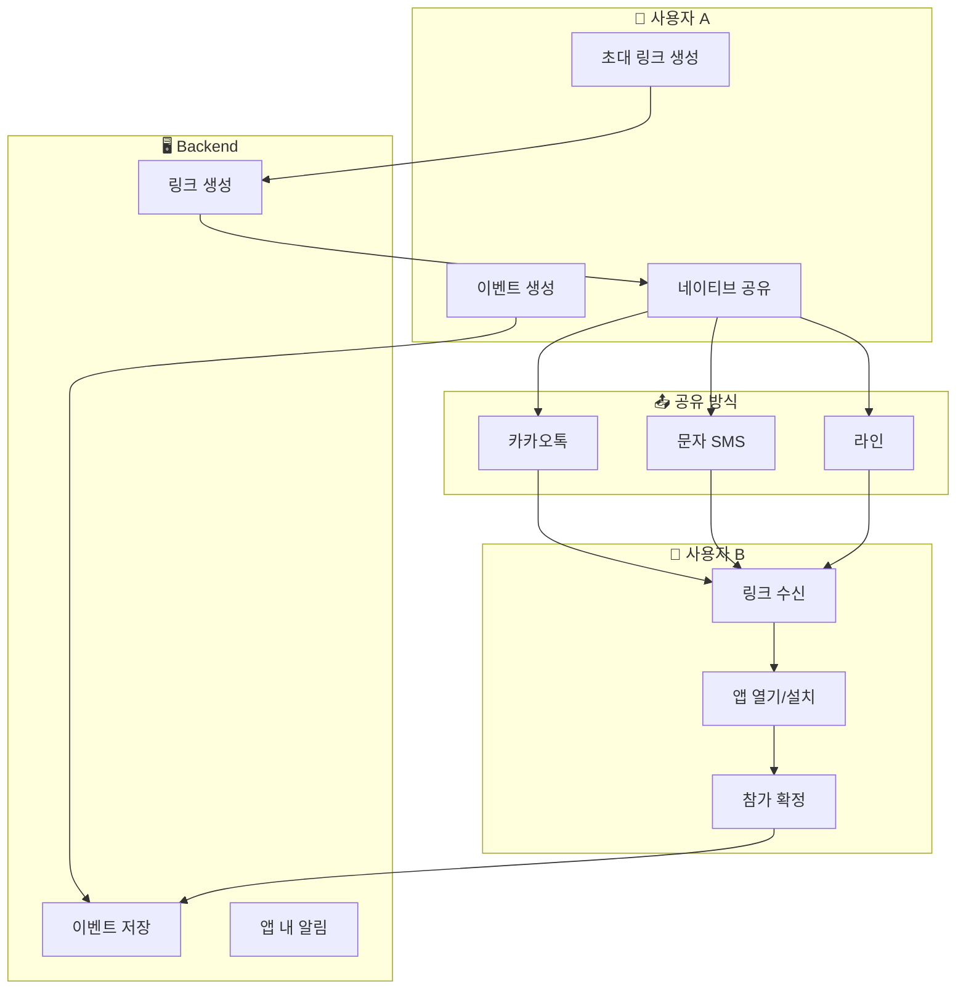
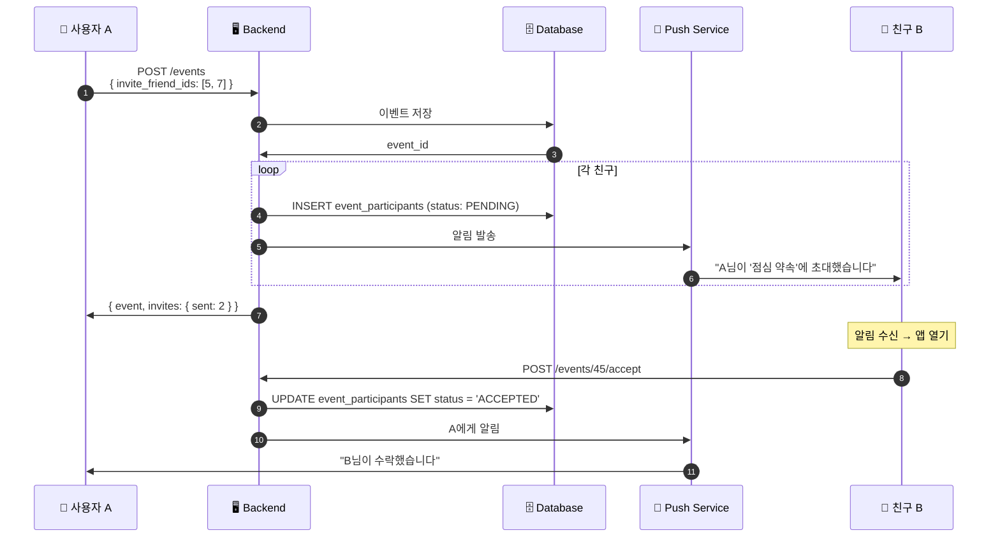
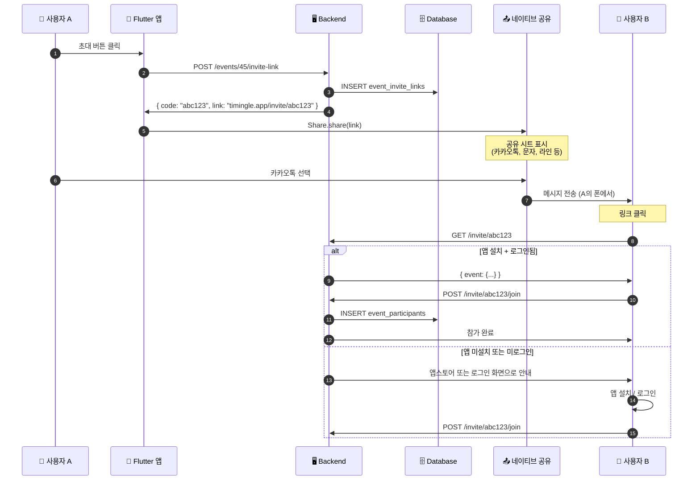
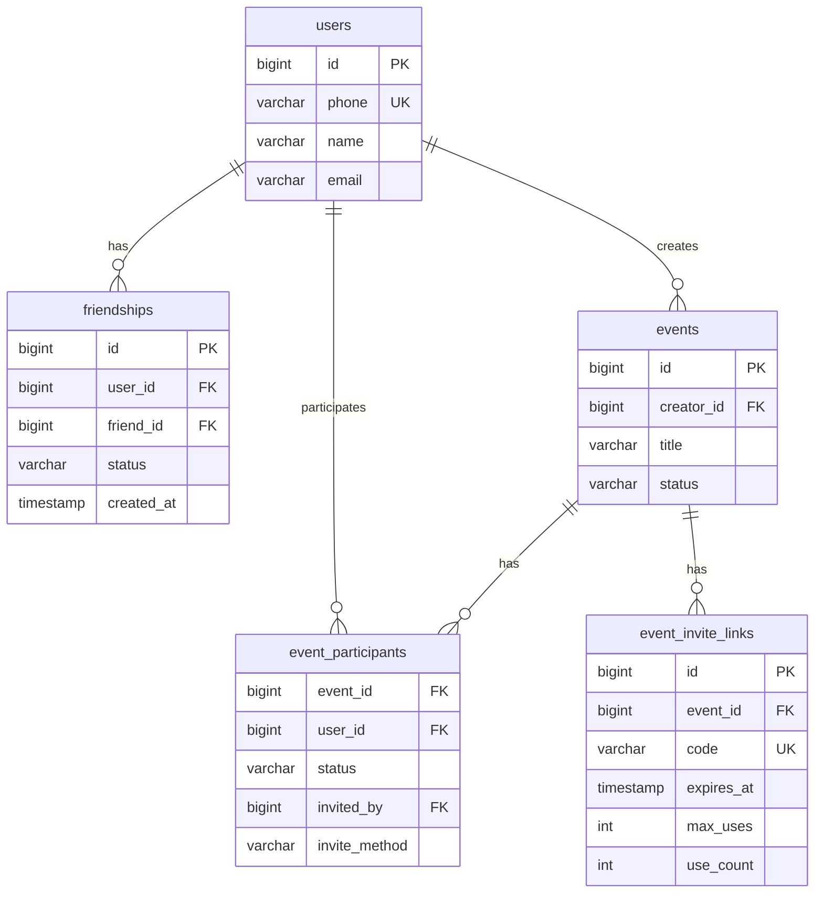

# 친구/초대 시스템 다이어그램

## 핵심 원칙

**시스템이 문자를 보내지 않음** - 사용자 폰에서 직접 공유

```
❌ Backend → SMS Provider → 상대방 (사용 안 함)
✅ 사용자 폰 → 네이티브 공유 (카카오톡, 문자 등) → 상대방
```

## 전체 흐름



## 친구 초대 (앱 내 알림)

가입된 친구에게 앱 내 알림으로 초대합니다.



## 초대 링크 + 네이티브 공유 (핵심)

미가입자 포함 누구에게나 초대할 수 있는 방식입니다.



## ERD



## 관련 문서

- [친구/참가자 시스템 설계](../design/FRIEND_PARTICIPANT_SYSTEM.md) - 전체 설계 문서
